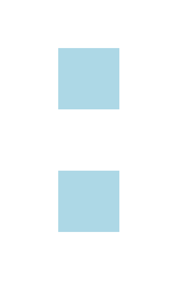
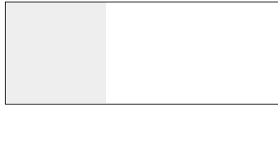

# 块级格式化上下文(BFC)

## 常见定位方案

在讲 BFC 之前，我们先来了解一下常见的定位方案，定位方案是控制元素的布局，有三种常见方案:

- 普通流 (normal flow)

在普通流中，元素按照其在 HTML 中的先后位置至上而下布局，在这个过程中，行内元素水平排列，直到当行被占满然后换行，块级元素则会被渲染为完整的一个新行，除非另外指定，否则所有元素默认都是普通流定位，也可以说，普通流中元素的位置由该元素在 HTML 文档中的位置决定。

- 浮动 (float)

在浮动布局中，元素首先按照普通流的位置出现，然后根据浮动的方向尽可能的向左边或右边偏移，其效果与印刷排版中的文本环绕相似。

- 绝对定位 (absolute positioning)

在绝对定位布局中，元素会整体脱离普通流，因此绝对定位元素不会对其兄弟元素造成影响，而元素具体的位置由绝对定位的坐标决定。

## Box

Box 是 CSS 布局的对象和基本单位， 直观点来说，就是一个页面是由很多个 Box 组成的。元素的类型和 display 属性，决定了这个 Box 的类型。 不同类型的 Box， 会参与不同的 Formatting Context（一个决定如何渲染文档的容器），因此 Box 内的元素会以不同的方式渲染。让我们看看有哪些盒子：

**block-level box**

display 属性为 block, list-item, table 的元素，会生成 block-level box。并且参与 `block fomatting context`；

**inline-level box**

display 属性为 inline, inline-block, inline-table 的元素，会生成 inline-level box。并且参与 `inline formatting context`；

**run-in box**

## BFC 介绍

Formatting context(格式化上下文) 是 W3C CSS2.1 规范中的一个概念。它是页面中的一块渲染区域，并且有一套渲染规则，它决定了其子元素将如何定位，以及和其他元素的关系和相互作用。最常见的 Formatting context 有 Block fomatting context (简称 BFC)和 Inline formatting context (简称 IFC)。

块级格式上下文 Block Formatting Context（简称 BFC ）属于普通流，里面的元素按文档流中的顺序垂直排列，并且发生垂直方向上的 margin 折叠，同时这个区域内的元素布局不会对外面的元素有任何影响，反过来外面元素也一样不会影响这个区域，具有 BFC 特性的元素可以看作是隔离了的独立容器，

## BFC 产生条件

- html 根元素是一个 BFC

- float 属性取值为“left”，“right”（除了“none”）

- overflow 属性取值为“hidden”，“scroll”，“auto”（除了“visible”）

- display 的值为 “flex”，“inline-flex”，“inline-table”，“table”，“table-cell”，“table-caption”，或者 “inline-block”中的任何一个

- position 的值为 “absolute” 或 “fixed”中的任何一个

## BFC 的布局规则

- 内部的 Box 会在垂直方向，一个接一个地放置。

- Box 垂直方向的距离由 margin 决定。属于同一个 BFC 的两个相邻 Box 的 margin 会发生重叠。

- 每个盒子（块盒与行盒）的 margin box 的左边，与包含块 border box 的左边相接触(对于从左往右的格式化，否则相反)。即使存在浮动也是如此。

- BFC 的区域不会与 float box 重叠。

- BFC 就是页面上的一个隔离的独立容器，容器里面的子元素不会影响到外面的元素。反之也如此。

- 计算 BFC 的高度时，浮动元素也参与计算。

## BFC 应用

### 避免 margin 重叠

属于同一个 BFC 的两个相邻的 Box 会发生 margin 重叠



我们可以设置两个不同的 BFC 避免 margin 重叠。下面例子把第二个 p 用 div 包起来，然后激活它使其成为一个 BFC

```html
<body>
  <p></p>
  <div class="container">
    <p></p>
  </div>
</body>
<style>
  p {
    width: 100px;
    height: 100px;
    background: lightblue;
    margin: 100px;
  }
  .container {
    overflow: hidden;
  }
</style>
```


### BFC 可以包含浮动的元素（清除浮动）

触发容器的 BFC，那么容器将会包裹着浮动元素。

```html
<div style="border: 1px solid #000;overflow: hidden">
  <div style="width: 100px;height: 100px;background: #eee;float: left;"></div>
</div>
```



### 自适应两栏布局(阻止元素被浮动元素覆盖)

right 会自动的适应宽度，这时候就形成了一个两栏自适应的布局。

```html
<body>
  <div class="left"></div>
  <div class="right"></div>
</body>
<style>
  .left {
    height: 100px;
    width: 100px;
    float: left;
    background: lightblue;
  }
  .right {
    overflow: hidden;
    height: 300px;
    background: green;
  }
</style>
```


## 总结

- 因为 BFC 内部的元素和外部的元素绝对不会互相影响，因此， 当 BFC 外部存在浮动时，它不应该影响 BFC 内部 Box 的布局，BFC 会通过变窄，而不与浮动有重叠。同样的，当 BFC 内部有浮动时，为了不影响外部元素的布局，BFC 计算高度时会包括浮动的高度。避免 margin 重叠也是这样的一个道理。

- BFC 属于普通流，但还需要结合 CSS 属性本身，比如 position:absolute/fixed 这些优先级高于 BFC 规则，即通过设置 position 创建 BFC 时元素并不在普通流中。

- BFC 可解决两栏自适应、清除浮动、消除 margin 折叠等问题

> 参考链接
>
> [什么是 BFC？看这一篇就够了](https://blog.csdn.net/sinat_36422236/article/details/88763187)
>
> [10 分钟理解 BFC 原理](https://zhuanlan.zhihu.com/p/25321647)
