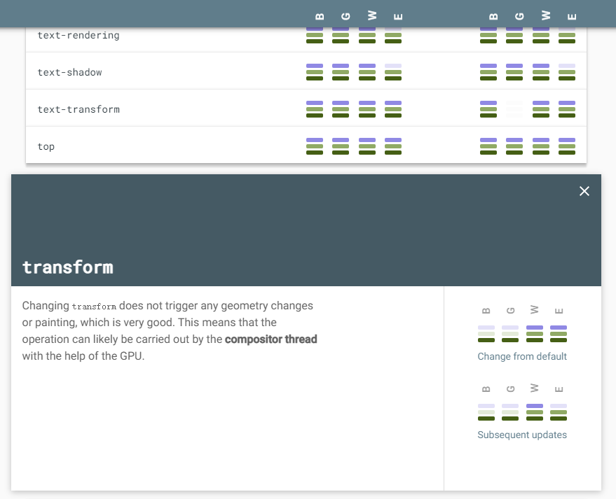

# 合成层

## 浏览器渲染流程

- 浏览器下载并解析 HTML。
- 构建 CSSOM 树和 DOM 树。
- DOM 与 CSSOM 合并成一个 Render 树。
- 有了 Render Tree，浏览器可以知道各个节点的 CSS 定义以及他们的从属关系，从而去计算出每个节点在屏幕中的位置，生成一个足够大的画布来容纳所有元素。
- 根据浏览器提供各层的信息合成图层，显示到屏幕上，合成图层中一些特殊的图层被认为是**合成层（Compositing Layers）**

## 什么是合成层

首先合成就是将页面的各个部分分成多个层、单独光栅化（浏览器根据文档的结构、每个元素的样式、页面的几何形状和绘制顺序转换为屏幕上的像素的过程）它们并在合成器线程中合成为一个页面的技术。

在 Chrome 开发工具中打开自定义菜单，然后在 More tools 中选择 Layers 选项可以看到当前页面的图层结构

一些特定属性的渲染层，会被浏览器自动提升为合成层。合成层拥有单独的图层（GraphicsLayer），和其他图层之间无不影响。而其它不是合成层的渲染层，则和第一个拥有图层的父层共用一个，也就是普通文档流中的内容

下面是一些常见的提升为合成层的属性：

- 设置 `transform: translateZ(0)`，注意它必须是 `translateZ`，因为它使用 GPU 来计算 `perspective distortion`（透视失真）。`perspective` 在 3D 设计中是一个重要的属性，如果你使用 `translateX` 或 `translateY`，元素将会被绘制在普通文档流中
- `backface-visibility: hidden` 指定当元素背面朝向观察者时是否可见。
- `will-change` 该属性告诉浏览器该元素会有哪些变化，这样浏览器可以提前做好对应的优化准备工作。当该属性的值为 `opacity`、`transform`、`top`、`left`、`bottom`、`right` 时。
- `video`、`canvas`、`iframe` 等元素。

## 关于隐式合成

一个或多个非合成元素应出现在堆叠顺序上的合成元素之上，会被提升为合成层。如果多个渲染层同一个合成层重叠时，这些渲染层会被压缩到一个图层中，以防止由于重叠原因导致出现的层爆炸

如下面的示例，#C 设置了 will-change 被提升为合成层，#A 和#B 的 index 属性比#C 大并且与其重叠，#A 和#B 会提升为一个合成层

```html
<!DOCTYPE html>
<html>
  <head>
    <style type="text/css">
      #A,
      #B,
      #C {
        width: 100px;
        height: 100px;
        position: absolute;
      }
      #C {
        left: 60px;
        top: 60px;
        z-index: 100;
        will-change: left;
        animation: move 1s linear;
        background-color: red;
      }
      #A {
        z-index: 200;
        background-color: blue;
      }
      #B {
        left: 40px;
        top: 40px;
        z-index: 200;
        background-color: yellow;
      }
      @keyframes move {
        form {
          left: 40px;
        }
        to {
          left: 150px;
        }
      }
    </style>
  </head>
  <body>
    <div id="A">A</div>
    <div id="B">B</div>
    <div id="C">C</div>
  </body>
</html>
```

## 合成层的利弊

渲染层的提示带来的好处：

- 开启硬件加速，合成层的位图会交由 GPU 合成，相比 CPU 处理要快。
- 合成层发生 repaint 的时候，不会影响其他图层。
- 对于 transform 和 opacity 效果，不会触发 layout 和 paint。

当然合成层也存在一些问题：

- 如果我们把所有渲染工作都交给 GPU，在现有的优化下，它会导致渲染内存占用比大幅度提升，反而出现负面的效果。
- 另外隐式合成容易产生大量我们意料之外的合成层，过大的内存占用，会让页面变的卡顿，性能优化适得其反。

## 合成层的使用

### 使用 transform 实现动画

在我们日常开发中经常会实现一些动画，有时候我们可能会选择改变 `top/left` 去实现，那么这个节点的渲染会发生在普通文档流中。而使用 `transform` 和 `opacity` 实现动画能够让节点被放置到一个独立合成层中进行渲染绘制，动画不会影响其他图层，并且 GPU 渲染相比 CPU 能够更快，这会让你的动画变的更加流畅

如果你无法确定使用这个属性是否合理，在你将任何 CSS 属性用于实现动画之前，你可以在 [csstriggers](https://csstriggers.com/) 上查看该属性对渲染管道的影响。



### 谨慎使用 will-change

除非你的元素的真的存在某个属性马上会发生变化，例如 `transform`，你可以使用 `will-change: transform` 告知浏览器，根据您打算更改的元素，浏览器可能可以预先安排，元素的改变和渲染速度都会变得更快。

可是这些属性可能会给你带来一些副作用，**任何带有 `position: fixed` 或者 `position: absolute` 的子元素将会相对于设置了 `will-change: transform` 的元素进行相对定位。**除此之外浏览器用来为 `will-change` 属性做的更进一步的优化常常会耗费更多的资源，如果你将它施加在过多属性上显然是一个浪费，更甚者非常过度的使用可能会造成页面相应速度的变慢或者直接崩溃。

### 减小合成层绘制区域

合成层的绘制区域大小，很大程度上影响了它的内存占用。
我们可以设置小的尺寸，通过 `transform: scale()`在用户看不到任何区别的前提下节省大量的内存。

> 参考链接：[浏览器渲染魔法之合成层](https://mp.weixin.qq.com/s?__biz=MzI1NTg3NzcwNQ==&mid=2247485354&idx=1&sn=32bbe6790588f0d5cdc438a4402cbd55&scene=21#wechat_redirect)
