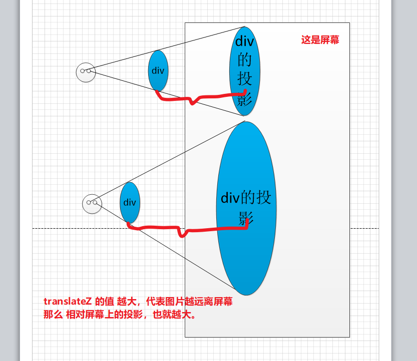
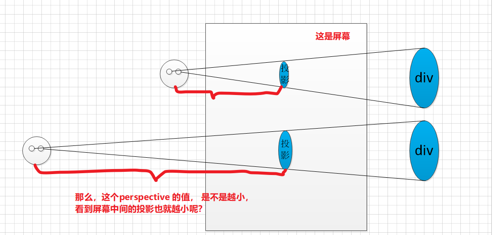

# 知识点

## perspective

perspective 属性定义 3D 元素距视图的距离，以像素计。该属性允许您改变 3D 元素查看 3D 元素的视图。

当为元素定义 perspective 属性时，其子元素会获得透视效果，而不是元素本身。perspective 属性只影响 3D 转换元素。

我们在屏幕上看到元素的大小不是元素本身，而是元素的投影

- `translateZ` 表示元素相对屏幕的距离



- perspective 是人和屏幕的距离



> 参考链接：[css3 系列之详解 perspective](https://www.cnblogs.com/yanggeng/p/11285856.html)

## flex 撑出父容器探索

当 flex-item 的宽度由子元素决定时，Flex 容器可能会被撑大，如下所示

```html
<div class="container">
  <div class="item">
    <div class="child"></div>
  </div>
  <div class="item">
    <div class="child"></div>
  </div>
  <div class="item">
    <div class="child"></div>
  </div>
</div>
```

```css
.container {
  display: flex;
  width: 500px;
  height: 50px;
  background: green;
}
.item {
  border: 1px solid olive;
}
.child {
  width: 250px;
}
```


[flex 的规范](https://www.w3.org/TR/css-flexbox-1/#min-size-auto)中说到在非滚动容器中，主轴方向 Flex Item 的最小尺寸是基于内容的最小尺寸，此时 min-width 的值是 auto。对于滚动容器，min-width 的值是 0（默认讨论水平布局）

当 item 的内容 child 宽度是 250px 时，此时也不能按照预期缩小。我们给 item 设置 `min-width:0` ，这个时候，item 会按照预期缩小，平分 500px 的大小。另外，规范也说明了在滚动容器中，min-width 也是 0，所以，给 item 增加 `overflow: auto` 或者 `overflow: hidden` 也一样可以达到目的。

> 参考链接：[Flex 布局中一个不为人知的特性](https://mp.weixin.qq.com/s/24asWcdumoysdytvCNblNA)

## opacity: 0、visibility: hidden、display: none

**结构**：

- `display:none`: 会让元素完全从渲染树中消失，渲染的时候不占据任何空间, 不能点击，
- `visibility: hidden`:不会让元素从渲染树消失，渲染元素继续占据空间，只是内容不可见，不能点击
- `opacity: 0`: 不会让元素从渲染树消失，渲染元素继续占据空间，只是内容不可见，可以点击

**继承：**
`display: none` 和 `opacity: 0`：是非继承属性，子孙节点消失由于元素从渲染树消失造成，通过修改子孙节点属性无法显示。
`visibility: hidden`：是继承属性，子孙节点消失由于继承了 hidden，通过设置 visibility: visible;可以让子孙节点显式。

**性能：**
`display:none` : 修改元素会造成文档回流,读屏器不会读取 display: none 元素内容，性能消耗较大
`visibility:hidden`: 修改元素只会造成本元素的重绘,性能消耗较少，读屏器读取 visibility: hidden 元素内容
`opacity: 0` ：修改元素会造成重绘，性能消耗较少

联系：它们都能让元素不可见

## link 与@import

- `link` 是 HTML 方式， `@import` 是 CSS 方式
- `link` 最大限度支持并行下载，`@import` 过多嵌套导致串行下载，出现 FOUC
- `link` 可以通过 `rel="alternate stylesheet"`指定候选样式
- 浏览器对 `link` 支持早于`@import`，可以使用`@import` 对老浏览器隐藏样式
- `@import` 必须在样式规则之前，可以在 css 文件中引用其他文件

总体来说：`link` 优于`@import`

## 可替换元素和不可替换元素

**可替换元素**
可替换元素就是浏览器根据元素的标签和属性，来决定元素的具体显示内容。

例如浏览器会根据``标签的 `src` 属性的值来读取图片信息并显示出来，而如果查看 html 代码，则看不到图片的实际内容；又例如根据`<input>`标签的 `type` 属性来决定是显示输入框，还是单选按钮等。

html 中的``、`<input>`、`<textarea>`、`<select>`都是替换元素。这些元素往往没有实际的内容，即是一个空元素。

**不可替换元素**
html 的大多数元素是不可替换元素，即其内容直接表现给用户端（例如浏览器）。

例如：`<p>段落的内容</p>`

段落`<p>`是一个不可替换元素，文字“段落的内容”全被显示。

## display: block 和 display: inline

**block**

- 处于常规流中时，如果 `width` 没有设置，会自动填充满父容器
- 可以应用 `margin/padding`
- 在没有设置高度的情况下会扩展高度以包含常规流中的子元素
- 处于常规流中时布局时在前后元素位置之间（独占一个水平空间）
- 忽略 `vertical-align`

**inline**

- 水平方向上根据 `direction` 依次布局
- 不会在元素前后进行换行
- 受 `white-space` 控制
- `margin/padding` 在竖直方向上无效，水平方向上有效
- `width/height` 属性对非替换行内元素无效，宽度由元素内容决定
- 非替换行内元素的行框高由`line-height` 确定，替换行内元素的行框高由 `height`,`margin`,`padding`,`border` 决定
- 浮动或绝对定位时会转换为 `block`
- `vertical-align` 属性生效

## 修改滚动条样式

隐藏 div 元素的滚动条

```css
div::-webkit-scrollbar {
  display: none;
}
```

`div::-webkit-scrollbar` 滚动条整体部分
`div::-webkit-scrollbar-thumb` 滚动条里面的小方块，能向上向下移动（或往左往右移动，取决于是垂直滚动条还是水平滚动条
`div::-webkit-scrollbar-track` 滚动条的轨道（里面装有 Thumb
`div::-webkit-scrollbar-button` 滚动条的轨道的两端按钮，允许通过点击微调小方块的位置
`div::-webkit-scrollbar-track-piece` 内层轨道，滚动条中间部分（除去
`div::-webkit-scrollbar-corner` 边角，即两个滚动条的交汇处
`div::-webkit-resizer` 两个滚动条的交汇处上用于通过拖动调整元素大小的小控件注意此方案有兼容性问题，一般需要隐藏滚动条时我都是用一个色块通过定位盖上去，或者将子级元素调大，父级元素使用 overflow-hidden 截掉滚动条部分。暴力且直接。
