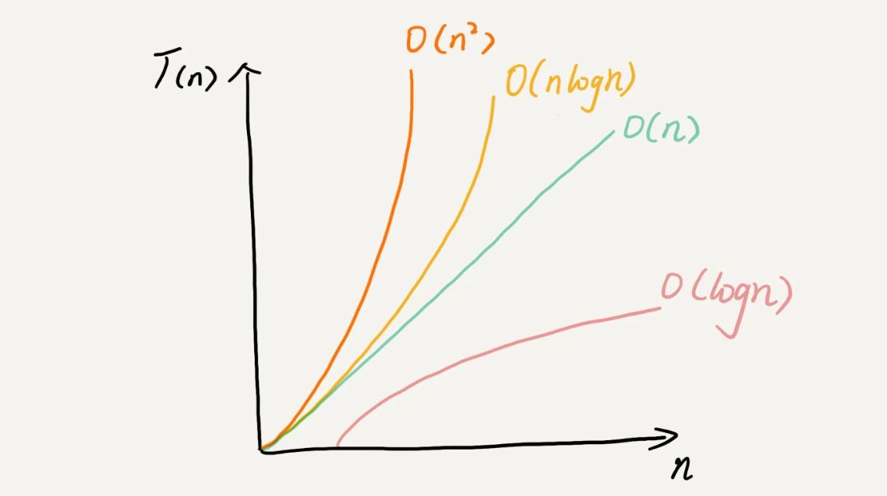

# 复杂度分析

数据结构和算法本身解决的是“快”和“省”的问题，即如何让代码运行得更快，如何让代码更省存储空间。执行效率是算法一个非常重要的考量指标，我们使用**时间、空间复杂度分析**来衡量算法代码的执行效率。**时间、空间复杂度分析**不用具体的测试数据来测试，就可以粗略地估计算法的执行效率。

## 大 O 复杂度表示法

```
 T(n) = O(f(n))
```

这个公式表示执行时间 T(n) 与每行代码的执行次数 f(n) 成正比，大 O 时间复杂度实际上并不具体表示代码真正的执行时间，而是表示**代码执行时间随数据规模增长的变化趋势**，所以，也叫作渐进时间复杂度（asymptotic time complexity），简称时间复杂度。

## 时间复杂度分析

以下介绍如何分析一段代码的时间复杂度

1. 只关注循环执行次数最多的一段代码

大 O 这种复杂度表示方法只是表示一种变化趋势。**我们通常会忽略掉公式中的常量、低阶、系数，只需要记录一个最大阶的量级就可以了**。

2. 加法法则：总复杂度等于量级最大的那段代码的复杂度

如果 T1(n)=O(f(n))，T2(n)=O(g(n))；那么 T(n)=T1(n)+T2(n)=max(O(f(n)), O(g(n))) =O(max(f(n), g(n))).

3. 乘法法则：嵌套代码的复杂度等于嵌套内外代码复杂度的乘积

如果 T1(n)=O(f(n))，T2(n)=O(g(n))；那么 T(n)=T1(n)*T2(n)=O(f(n))*O(g(n))=O(f(n)\*g(n)).

## 常见时间复杂度

复杂度量级可以粗略地分为两类，多项式量级和非多项式量级。其中，非多项式量级只有两个：O(2^n) 和 O(n!)。

时间复杂度为非多项式量级的算法问题叫作 NP（Non-Deterministic Polynomial，非确定多项式）问题，当数据规模 n 越来越大时，非多项式量级算法的执行时间会急剧增加。所以，非多项式时间复杂度的算法其实是非常低效的算法。

下面是常见的多项式时间复杂度

1. O(1)

O(1) 只是常量级时间复杂度的一种表示方法，并不是指只执行了一行代码，一般情况下，只要算法中不存在循环语句、递归语句，即使有成千上万行的代码，其时间复杂度也是 Ο(1)。

2. O(logn)、O(nlogn)

```javascript
i = 1;
while (i <= n) {
  i = i * 2;
}
```

通过 2^x=n 求解 x，x=log2n，所以，这段代码的时间复杂度就是 O(log2n)。

实际上，不管是以 2 为底、以 3 为底，还是以 10 为底，我们可以把所有对数阶的时间复杂度都记为 O(logn)，对数之间是可以互相转换的，log3n 就等于 log32 _ log2n，所以 O(log3n) = O(C _ log2n)，其中 C=log32 是一个常量。基于我们前面的一个理论：在采用大 O 标记复杂度的时候，可以忽略系数，即 O(Cf(n)) = O(f(n))。因此，在对数阶时间复杂度的表示方法里，我们忽略对数的“底”，统一表示为 O(logn)。

3. O(m+n)、O(m\*n)

代码的复杂度由两个数据的规模来决定时，我们无法事先评估 m 和 n 谁的量级大，所以我们在表示复杂度的时候，就不能简单地利用加法法则省略掉其中一个，加法规则改为：T1(m) + T2(n) = O(f(m) + g(n))

## 空间复杂度分析

空间复杂度全称就是**渐进空间复杂度**（asymptotic space complexity），**表示算法的存储空间与数据规模之间的增长关系**

```javascript
void print(int n) {
 int i = 0;
//  申请了一个大小为 n 的 int 类型数组，除此之外，剩下的代码都没有占用更多的空间，所以整段代码的空间复杂度就是 O(n)
 int[] a = new int[n];
 for (i; i <n; ++i) {
  a[i] = i * i;
 }
}
```

我们常见的空间复杂度就是 O(1)、O(n)、O(n^2)，像 O(logn)、O(nlogn) 这样的对数阶复杂度平时都用不到。

## 最好、最坏时间复杂度

顾名思义，最好情况时间复杂度就是在最理想的情况下，执行这段代码的时间复杂度。最坏情况时间复杂度就是在最糟糕的情况下，执行这段代码的时间复杂度。

以下面代码为例

```javascript
// n表示数组array的长度
int find(int[] array, int n, int x) {
 int i = 0;
 int pos = -1;
 for (; i < n; ++i) {
  if (array[i] == x) {
    pos = i;
    break;
  }
 }
 return pos;
}

```

要查找的变量 x 可能出现在数组的任意位置。如果数组中第一个元素正好是要查找的变量 x，那就不需要继续遍历剩下的 n-1 个数据了，那时间复杂度就是 O(1)。但如果数组中不存在变量 x，那我们就需要把整个数组都遍历一遍，时间复杂度就成了 O(n)。所以，不同的情况下，这段代码的时间复杂度是不一样的。

## 总结

- 复杂度也叫渐进复杂度，包括时间复杂度和空间复杂度，用来分析算法执行效率与数据规模之间的增长关系
- 越高阶复杂度的算法，执行效率越低。常见的复杂度并不多，从低阶到高阶有：O(1)、O(logn)、O(n)、O(nlogn)、O(n^2)。
  
