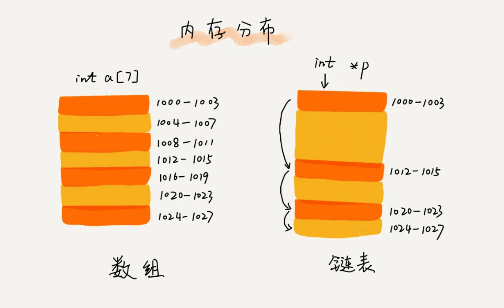
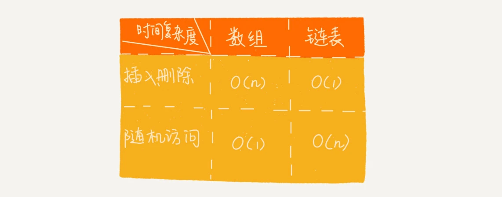

# 链表

## 链表结构

数组需要一块连续的内存空间来存储，而链表恰恰相反，它并不需要一块连续的内存空间，它通过“指针”将一组零散的内存块串联起来使用



链表结构五花八门，三种最常见的链表结构分别是：**单链表、双向链表和循环链表**

### 单链表

链表通过指针将一组零散的内存块串联在一起。其中，我们把内存块称为链表的“结点”。为了将所有的结点串起来，每个链表的结点除了存储数据之外，还需要记录链上的下一个结点的地址，我们把这个记录下个结点地址的指针叫作**后继指针 next**。单链表的尾结点指针指向空地址

与数组一样，链表也支持数据的查找、插入和删除操作。数组的插入、删除操作需要做大量的数据搬移，所以时间复杂度是 O(n)，链表的插入和删除操作，我们只需要考虑相邻结点的指针改变，所以对应的时间复杂度是 O(1)。

但是，链表要想随机访问元素就没有数组那么高效了。因为链表中的数据并非连续存储的，所以无法像数组那样，根据首地址和下标，通过寻址公式就能直接计算出对应的内存地址，而是需要根据指针一个结点一个结点地依次遍历，直到找到相应的结点，链表随机访问的性能没有数组好，需要 O(n) 的时间复杂度。

### 循环链表

循环链表是一种特殊的单链表，单链表的尾结点指针指向空地址，而循环链表的尾结点指针是指向链表的头结点。

### 双向链表

单向链表只有一个方向，结点只有一个**后继指针 next** 指向后面的结点。而双向链表，顾名思义，它支持两个方向，每个结点不止有一个后继指针 next 指向后面的结点，还有一个**前驱指针 prev** 指向前面的结点。双向链表需要额外的两个空间来存储后继结点和前驱结点的地址。所以，如果存储同样多的数据，双向链表要比单链表占用更多的内存空间。

双向链表可以支持 O(1) 时间复杂度的情况下找到前驱结点，正是这样的特点，也使双向链表在某些情况下的插入、删除等操作都要比单链表简单、高效。例如删除给定指针指向的结点，因为双向链表中的结点已经保存了前驱结点的指针，不需要像单链表那样遍历，单链表删除操作需要 O(n) 的时间复杂度，而双向链表只需要在 O(1) 的时间复杂度内就搞定了！

实际上，这里有一个更加重要的知识点需要你掌握，那就是用空间换时间的设计思想。当内存空间充足的时候，如果我们更加追求代码的执行速度，我们就可以选择空间复杂度相对较高、但时间复杂度相对很低的算法或者数据结构。相反，如果内存比较紧缺，比如代码跑在手机或者单片机上，这个时候，就要反过来用时间换空间的设计思路。

### 链表 VS 数组

数组和链表是两种截然不同的内存组织方式，它们插入、删除、随机访问操作的时间复杂度正好相反。



数组和链表的对比，并不能局限于时间复杂度，数组简单易用，在实现上使用的是连续的内存空间，可以借助 CPU 的缓存机制，预读数组中的数据，所以访问效率更高。而链表在内存中并不是连续存储，所以对 CPU 缓存不友好，没办法有效预读。

数组的缺点是大小固定，链表本身没有大小的限制，天然地支持动态扩容。如果代码对内存的使用非常苛刻，那数组就更适合。而且对链表进行频繁的插入、删除操作，还会导致频繁的内存申请和释放，容易造成内存碎片

## 经典应用场景-LRU 缓存淘汰算法

缓存是一种提高数据读取性能的技术，缓存的大小有限，当缓存被用满时，哪些数据应该被清理出去由缓存淘汰策略来决定。常见的策略有三种：先进先出策略 FIFO（First In，First Out）、最少使用策略 LFU（Least Frequently Used）、最近最少使用策略 LRU（Least Recently Used）。

基于链表实现 LRU 缓存淘汰算法：我们维护一个有序单链表，越靠近链表尾部的结点是越早之前访问的。当有一个新的数据被访问时，我们从链表头开始顺序遍历链表。

1. 如果此数据之前已经被缓存在链表中了，我们遍历得到这个数据对应的结点，并将其从原来的位置删除，然后再插入到链表的头部。
2. 如果此数据没有在缓存链表中，又可以分为两种情况：
   - 如果此时缓存未满，则将此结点直接插入到链表的头部；
   - 如果此时缓存已满，则链表尾结点删除，将新的数据结点插入链表的头部。

不管缓存有没有满，我们都需要遍历一遍链表，所以这种基于链表的实现思路，缓存访问的时间复杂度为 O(n)。

我们可以引入散列表（Hash table）来记录每个数据的位置，将缓存访问的时间复杂度降到 O(1)。

## 链表代码

### 警惕指针丢失和内存泄漏

我们希望在结点 a 和相邻的结点 b 之间插入结点 x，假设当前指针 p 指向结点 a。如果我们将代码实现变成下面这个样子，就会发生指针丢失和内存泄露。

```
p->next = x; // 将p的next指针指向x结点；
x->next = p->next; // 将x的结点的next指针指向b结点；
```

p->next 指针在完成第一步操作之后，已经不再指向结点 b 了，而是指向结点 x。第 2 行代码相当于将 x 赋值给 x->next，自己指向自己。因此，整个链表也就断成了两半，从结点 b 往后的所有结点都无法访问到了。

我们插入结点时，一定要注意操作的顺序，要先将结点 x 的 next 指针指向结点 b，再把结点 a 的 next 指针指向结点 x，这样才不会丢失指针，导致内存泄漏。

### 哨兵简化

针对链表的插入、删除操作，需要对插入第一个结点和删除最后一个结点的情况进行特殊处理。我们可以引入**哨兵结点**，链表中的“哨兵”节点是解决边界问题的，不参与业务逻辑。在任何时候，不管链表是不是空，head 指针都会一直指向这个哨兵结点。我们也把这种有哨兵结点的链表叫**带头链表**。相反，没有哨兵结点的链表就叫作**不带头链表**。

这种利用哨兵简化编程难度的技巧，在很多代码实现中都有用到，比如插入排序、归并排序、动态规划等。
