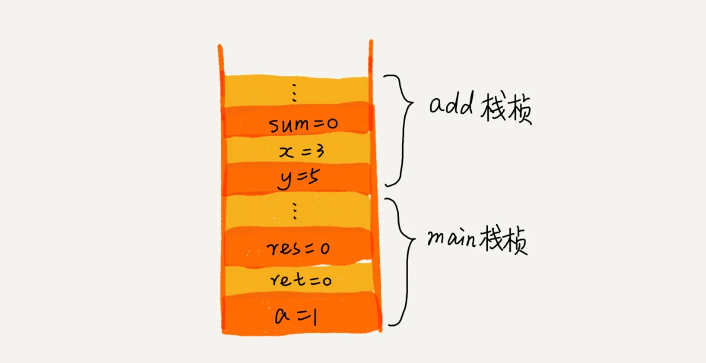
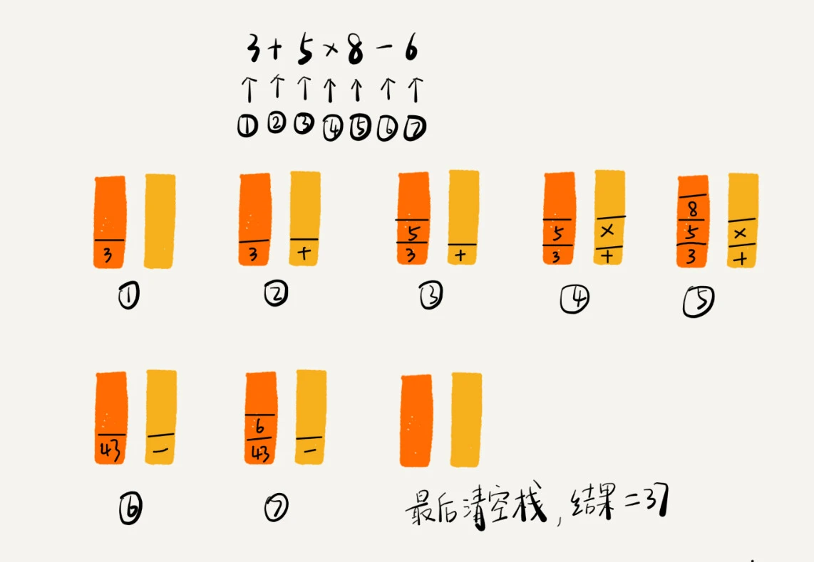

# 栈

## 为什么需要栈？

**后进者先出，先进者后出**，这就是典型的“栈”结构。从栈的操作特性上来看，**栈是一种“操作受限”的线性表**，只允许在一端插入和删除数据。

任何数据结构都是对特定应用场景的抽象，数组和链表虽然使用起来更加灵活，但却暴露了几乎所有的操作，难免会引发错误操作的风险。

所以当某个数据集合只涉及在某端插入和删除数据，且满足后进者先出，先进者后出的操作特性时，我们应该首选栈这种数据结构。

## 栈的实现

栈既可以用数组来实现，也可以用链表来实现。用数组实现的栈，我们叫作顺序栈，用链表实现的栈，我们叫作链式栈。

栈入栈、出栈的时间复杂度都为 O(1)。

## 栈的应用

### 栈在函数调用中的应用

操作系统给每个线程分配了一块独立的内存空间，这块内存被组织成“栈”这种结构, 用来存储函数调用时的临时变量。每进入一个函数，就会将临时变量作为一个栈帧入栈，当被调用函数执行完成，返回之后，将这个函数对应的栈帧出栈。

### 栈在表达式求值中的应用

实际上，编译器就是通过两个栈来实现的。其中一个保存操作数的栈，另一个是保存运算符的栈。我们从左向右遍历表达式，当遇到数字，我们就直接压入操作数栈；当遇到运算符，就与运算符栈的栈顶元素进行比较。

如果比运算符栈顶元素的优先级高，就将当前运算符压入栈；如果比运算符栈顶元素的优先级低或者相同，从运算符栈中取栈顶运算符，从操作数栈的栈顶取 2 个操作数，然后进行计算，再把计算完的结果压入操作数栈，继续比较。

### 栈在括号匹配中的应用

我们用栈来保存未匹配的左括号，从左到右依次扫描字符串。当扫描到左括号时，则将其压入栈中；当扫描到右括号时，从栈顶取出一个左括号。如果能够匹配，比如“(”跟“)”匹配，“[”跟“]”匹配，“{”跟“}”匹配，则继续扫描剩下的字符串。如果扫描的过程中，遇到不能配对的右括号，或者栈中没有数据，则说明为非法格式。

当所有的括号都扫描完成之后，如果栈为空，则说明字符串为合法格式；否则，说明有未匹配的左括号，为非法格式。

## 内存管理和数据结构的栈

内存管理中的堆栈和数据结构堆栈不是一个概念，可以说内存中的堆栈是真实存在的物理区，数据结构中的堆栈是抽象的数据存储结构。内存管理上的“栈”符合数据结构的“栈”的特点，即后进先出
