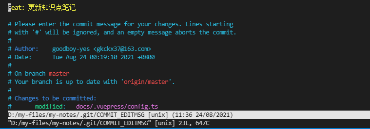

# git commit --amend

修改提交的内容分为 2 种情况：

- 提交了代码之后，又有新的改动，不想创建两个 commit
- 之前 commit message 的描述有误

这时可以使用`git commit --amend`命令把新的内容添加到之前的 commit 里面，这个命令没有添加新的提交，而是用新提交取代了原始提交。

**操作**

- 如果是重写 commit message，可以直接使用`git commit --amend -m <message>`

- 在原有 message 上修改，执行`git commit --amend`，键入`:i`，此时进入了输入模式，可对 message 信息进行修改。修改完成后，按下 Esc 键退出编辑模式，再键入 `:wq` 回车退出并保存修改，完成提交。该操作会改变原来的 commit id。键入 `:q!` 回车不保存退出修改



- 当修改前几次提交时需要先分离 HEAD 到指定的节点，使用`git rebase`

  ```bash
  // 最后的数字指的是显示到倒数第几次提交
  git rebase -i HEAD~2

  // 想修改哪条注释，就把哪条注释前面的 pick 换成 edit

  // 然后
  git commit --amend

  // 修改注释，保存并退出后，输入：
  git rebase --continue
  ```

**注意**

- `git commit --amend`会把暂存区的文件自动加入

- `git commit -a --amend`会自动将所有已跟踪文件中的更改添加到新的提交中。这意味着无需使用 git add 命令将更改添加到暂存区，而是可以直接对这些更改进行提交。

- 上一次提交需要还未 push 到远程分支，不然修改完后需要强制 push。`git push --force`
