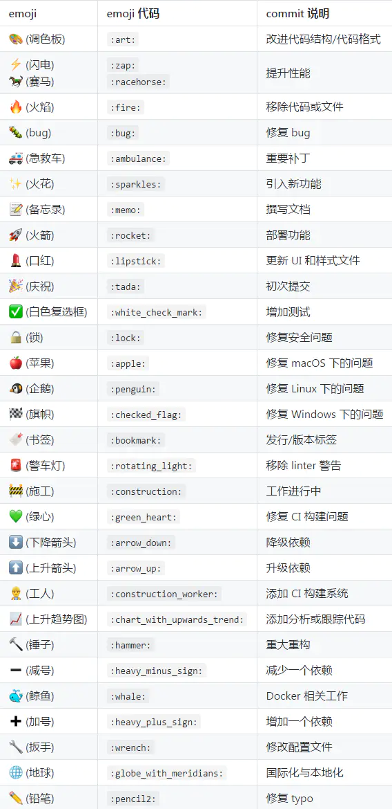

# commit 规范

现在主流的 commit message 规范就是 Angular 团队所用的准则，很多工具也是基于此规范。

## 为什么我们需要 commit 规范？

- 格式统一的提交信息可以帮助自动化生成 changelog，版本库不只是存放代码的仓库, 也记录项目的开发记录。
- 这些记录可以帮助后来者快速地学习和回顾代码。也方便其他协作者 review 你的代码

## commit message 的内容

- 为什么进行这次提交？提交改变了什么, 让其他 reviewer 更容易审核代码和忽略无关的改变，一个提交不应该做超过 2 个功能的变动
- 如何解决的问题？问题是什么导致的？简短说明使用什么方式、策略修复了问题，变化可能影响哪些地方

## commit message 的格式

每次提交，Commit message 都包括三个部分：header，body 和 footer，其中 header 有一个特殊的格式，包括了 type、scope、subject。

header 是必选的，但是 header 里的 scope 是可选的

```bash
<type>(<scope>): <subject>
<body>
<footer>
```

### header

**type**

type 指明 git commit 的类别，应该使用以下类型

- 『feat』: 新增功能
- 『fix』: 修复 bug
- 『docs』: 仅仅修改了文档，比如 README, CHANGELOG 等等
- 『test』: 增加/修改测试用例，包括单元测试、集成测试等
- 『style』: 修改了空行、缩进格式、引用包排序、优化项目结构等等（不改变代码逻辑），注意不是 css 修改
- 『perf』: 优化相关内容，比如提升性能、体验、算法等
- 『refactor』: 代码重构，「没有新功能或者 bug 修复」
- 『chore』: 改变构建流程、或者增加依赖库、工具等
- 『revert』: 回滚到上一个版本
- 『merge』: 代码合并
- 『Build 或 Release』: 构建或发布版本
- 『CI』: 持续集成
- 『Safe』: 修复安全问题
- 『workflow』: 工作流相关文件修改

**scope（可选）**

scope 用于说明 commit 影响的范围，根据不同项目有不同层次描述。若没有特殊规定，也可以描述影响的哪些功能等，例如样式, 后端接口, 逻辑层等等，route, component, utils, build...

**subject**

subject 是 commit 目的的简短描述，不超过 50/80 个字符，结尾不加标点符号

### body

可选. 对本次提交的详细描述. 如果变动很简单, 可以省略

### footer

可选. 只用于说明不兼容变动(break change)和关闭 Issue(如果使用 gitlab 上的 Issuse，#1542)或禅道 BUG 号(#zentao203)

## 在 commit message 里用 emoji

在 git commit 上使用 emoji 提供了一种简单的方法，仅通过查看所使用的表情符号来确定提交的目的或意图

```bash
$ git commit -m ':tada: init commit'
```

[gitmoji 指南](https://gitmoji.dev/)

**各种表情代码代表的含义**



## 集成 Commitizen 实现规范提交

上面介绍了 Angular 规范提交的格式，初次接触会觉得复杂，记不住不同的类型到底是用来定义什么，我们可以使用 Commitizen 工具来帮助我们自动生成 commit message 格式，从而实现规范提交。

> Commitizen 是一个帮助撰写规范 commit message 的工具。它有一个命令行工具 cz-cli。

**安装 Commitizen**

```bash
npm install commitizen -D
```

**初始化项目**

成功安装 Commitizen 后，我们用 `cz-conventional-changelog` 适配器来初始化项目：

```bash
npx commitizen init cz-conventional-changelog --save-dev --save-exact
```

这行命令做了两件事：

- 安装 `cz-conventional-changelog` 到开发依赖（devDependencies）
- 在 package.json 中增加了 config.commitizen

```bash
"config": {
    "commitizen": {
        "path": "./node_modules/cz-conventional-changelog"
    }
}
```

**使用 Commitizen**

以前我们提交代码都是 `git commit -m "xxx"`，现在改为 `git cz`，然后按照终端操作提示，逐步填入信息，就能自动生成规范的 commit message。

**自定义配置提交说明**

git cz 终端操作提示都是英文的，如果想改成中文的或者自定义这些配置选项，我们使用 cz-customizable 适配器

运行如下命令使用 cz-customizable 初始化项目，注意之前已经初始化过一次，这次再初始化，需要加 --force 覆盖。

```bash
npx commitizen init cz-customizable --save-dev --save-exact --force
```

这行命令做了两件事：

- 安装 cz-customizable 到开发依赖（devDependencies）

- 修改 package.json 中的 config.commitizen 字段为：

```bash
"config": {
  "commitizen": {
    "path": "./node_modules/cz-customizable"
  }
}
```

**使用 cz-customizable**

在项目根目录下创建 .cz-config.js 文件，然后按照官方提供的[示例](https://github.com/leoforfree/cz-customizable/blob/master/cz-config-EXAMPLE.js)来配置

```js
module.exports = {
  // type 类型（定义之后，可通过上下键选择）
  types: [
    { value: 'feat', name: 'feat:     新增功能' },
    { value: 'fix', name: 'fix:      修复 bug' },
    { value: 'docs', name: 'docs:     文档变更' },
    { value: 'style', name: 'style:    代码格式（不影响功能，例如空格、分号等格式修正）' },
    { value: 'refactor', name: 'refactor: 代码重构（不包括 bug 修复、功能新增）' },
    { value: 'perf', name: 'perf:     性能优化' },
    { value: 'test', name: 'test:     添加、修改测试用例' },
    { value: 'build', name: 'build:    构建流程、外部依赖变更（如升级 npm 包、修改 webpack 配置等）' },
    { value: 'ci', name: 'ci:       修改 CI 配置、脚本' },
    { value: 'chore', name: 'chore:    对构建过程或辅助工具和库的更改（不影响源文件、测试用例）' },
    { value: 'revert', name: 'revert:   回滚 commit' }
  ],

  // scope 类型（定义之后，可通过上下键选择）
  scopes: [
    ['components', '组件相关'],
    ['hooks', 'hook 相关'],
    ['utils', 'utils 相关'],
    ['element-ui', '对 element-ui 的调整'],
    ['styles', '样式相关'],
    ['deps', '项目依赖'],
    ['auth', '对 auth 修改'],
    ['other', '其他修改'],
    // 如果选择 custom，后面会让你再输入一个自定义的 scope。也可以不设置此项，把后面的 allowCustomScopes 设置为 true
    ['custom', '以上都不是？我要自定义']
  ].map(([value, description]) => {
    return {
      value,
      name: `${value.padEnd(30)} (${description})`
    }
  }),

  // 是否允许自定义填写 scope，在 scope 选择的时候，会有 empty 和 custom 可以选择。
  // allowCustomScopes: true,

  // allowTicketNumber: false,
  // isTicketNumberRequired: false,
  // ticketNumberPrefix: 'TICKET-',
  // ticketNumberRegExp: '\\d{1,5}',


  // 针对每一个 type 去定义对应的 scopes，例如 fix
  /*
  scopeOverrides: {
    fix: [
      { name: 'merge' },
      { name: 'style' },
      { name: 'e2eTest' },
      { name: 'unitTest' }
    ]
  },
  */

  // 交互提示信息
  messages: {
    type: '确保本次提交遵循 Angular 规范！\n选择你要提交的类型：',
    scope: '\n选择一个 scope（可选）：',
    // 选择 scope: custom 时会出下面的提示
    customScope: '请输入自定义的 scope：',
    subject: '填写简短精炼的变更描述：\n',
    body:
      '填写更加详细的变更描述（可选）。使用 "|" 换行：\n',
    breaking: '列举非兼容性重大的变更（可选）：\n',
    footer: '列举出所有变更的 ISSUES CLOSED（可选）。 例如: #31, #34：\n',
    confirmCommit: '确认提交？'
  },

  // 设置只有 type 选择了 feat 或 fix，才询问 breaking message
  allowBreakingChanges: ['feat', 'fix'],

  // 跳过要询问的步骤
  skipQuestions: ['body', 'footer'],

  // subject 限制长度
  subjectLimit: 100
  breaklineChar: '|', // 支持 body 和 footer
  // footerPrefix : 'ISSUES CLOSED:'
  // askForBreakingChangeFirst : true,
}
```

结合项目实际情况来自定义配置提交规则

## 集成 commitlint 验证提交规范

在多人协作的项目中，会有些人不按规范提交，我们可以在提交代码这个环节加以限制：只让符合 Angular 规范的 commit message 通过，我们借助 `@commitlint/config-conventional` 和 `@commitlint/cli` 来实现。

**配置 commitlint**

在项目根目录下创建 `commitlint.config.js` 文件，并填入以下内容：

```js
module.exports = { extends: ["@commitlint/config-conventional"] };
```

**使用 husky 的 commit-msg hook 触发验证提交信息的命令**

我们使用 husky 命令在 .husky 目录下创建 commit-msg 文件，并在此执行 commit message 的验证命令。

```bash
npx husky add .husky/commit-msg "npx --no-install commitlint --edit $1"
```

这时不符合规范的提交信息会提交失败

---

> 参考链接
>
> [从 0 开始手把手带你搭建一套规范的 Vue3.x 项目工程环境](https://juejin.cn/post/6951649464637636622#heading-28)
