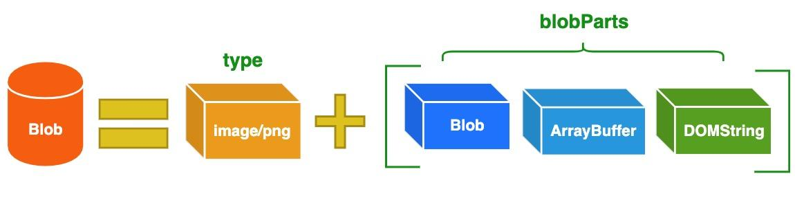

# 文件操作

## Blob

### 定义

Blob（Binary Large Object）表示二进制类型的大对象。在数据库管理系统中，将二进制数据存储为一个单一个体的集合。Blob 通常是影像、声音或多媒体文件。

在 JavaScript 中 Blob 类型的对象表示不可变的类似文件对象的原始数据。

Blob 由一个可选的字符串 type（通常是 MIME 类型）和 blobParts 组成：



> MIME（Multipurpose Internet Mail Extensions）多用途互联网邮件扩展类型，是设定某种扩展名的文件用一种应用程序来打开的方式类型，当该扩展名文件被访问的时候，浏览器会自动使用指定应用程序来打开。多用于指定一些客户端自定义的文件名，以及一些媒体文件打开方式。
>
> 常见的 MIME 类型有：超文本标记语言文本 .html text/html、PNG 图像 .png image/png、普通文本 .txt text/plain 等。

### Blob URL/Object URL

Blob URL/Object URL 是一种伪协议，允许 Blob 和 File 对象用作图像，下载二进制数据链接等的 URL 源。

浏览器内部为每个通过 `URL.createObjectURL` 生成的 URL 存储了一个 URL → Blob 映射。生成的 URL 仅在当前文档打开的状态下才有效。但如果你访问的 Blob URL 不再存在，则会从浏览器中收到 404 错误。

映射在文档卸载时自动清除，因此 Blob 对象随后被释放。但是，如果应用程序寿命很长，那不会很快发生。因此，如果我们创建一个 Blob URL，即使不再需要该 Blob，它也会存在内存中。

针对这个问题，我们可以调用 `URL.revokeObjectURL(url)` 方法，从内部映射中删除引用，从而允许删除 Blob（如果没有其他引用），并释放内存。

### Blob vs ArrayBuffer

ArrayBuffer 对象用于表示通用的，固定长度的原始二进制数据缓冲区。你不能直接操纵 ArrayBuffer 的内容，而是需要创建一个 TypedArray 对象或 DataView 对象，该对象以特定格式表示缓冲区，并使用该对象读取和写入缓冲区的内容。

Blob 对象与 ArrayBuffer 对象拥有各自的特点，它们之间的区别如下：

- ArrayBuffer 提供写入/编辑的能力，Blob 对象是不可变的，而 ArrayBuffer 是可以通过 TypedArrays 或 DataView 来操作。
- ArrayBuffer 是存在内存中的，可以直接操作。而 Blob 可以位于磁盘、高速缓存内存和其他不可用的位置。
- 虽然 Blob 可以直接作为参数传递给其他函数，比如 window.URL.createObjectURL()。但是，你可能仍需要 FileReader 之类的 File API 才能与 Blob 一起使用。
- Blob 与 ArrayBuffer 对象之间是可以相互转化的：
  - 使用 FileReader 的 `readAsArrayBuffer()` 方法，可以把 Blob 对象转换为 ArrayBuffer 对象；
  - 使用 Blob 构造函数，如 `new Blob([new Uint8Array(data])`;，可以把 ArrayBuffer 对象转换为 Blob 对象。

在 AJAX 场景下可以通过 xhr.responseType 设置不同的数据类型

```js
function GET(url, callback) {
  let xhr = new XMLHttpRequest();
  xhr.open("GET", url, true);
  xhr.responseType = "arraybuffer"; // or xhr.responseType = "blob";
  xhr.send();

  xhr.onload = function (e) {
    if (xhr.status != 200) {
      alert("Unexpected status code " + xhr.status + " for " + url);
      return false;
    }
    callback(new Uint8Array(xhr.response)); // or new Blob([xhr.response]);
  };
}
```
