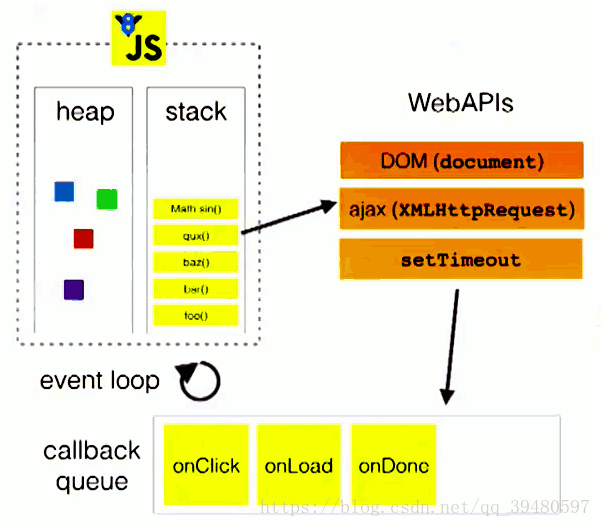

# 原理分析

## JS 执行机制

### 单线程

js 运作在浏览器中是单线程的，即 js 代码始终在一个线程上执行，js 同时只能执行一个任务，其它的任务则会排队等待执行。但更确切的说 JS 只有一个主线程，其实他还有一些其他线程的，当然所有函数任务只可以在主线程执行。

JS 作为浏览器的脚本，其最根本的作用就是实现用户与浏览器的交互行为，当一个用户要删除一个 A，又同时向 A 中添加内容的时候，若是多线程，应该怎么样去处理？没有办法处理，若是单线程就很简单了，用户先执行那个操作，我们主线程就进行哪一个，不会出现任何冲突！

### 异步

JS 明明单线程，但又同时可进行异步操作，这两者不是完全相反的嘛？

没错，JS 是单线程，但是 JS 是在浏览器中运行的脚本语言，它的宿主，浏览器可不是单线程的，除了主线程，它还有：

- UI 渲染线程
- 浏览器事件触发线程
- http 请求线程
- EventLoop 轮询的处理线程
  ……

这些线程的作用：

- **UI 线程**用于渲染页面
- **js 线程**用于执行 js 任务
- **浏览器事件触发线程**用于控制交互，响应用户
- **http 线程**用于处理请求，ajax 是委托给浏览器新开一个 http 线程
- **EventLoop 处理线程**用于轮询消息队列

#### 任务队列

单线程只有前一个任务结束，才能执行下一个任务。如果排队是因为计算量大，CPU 忙不过来，倒也算了，但是很多时候 CPU 是闲着的，因为 IO 设备（输入输出设备）很慢（比如 Ajax 操作从网络读取数据），不得不等着结果出来，再往下执行。

JS 语言的设计者意识到，这时主线程完全可以不管 IO 设备，挂起处于等待中的任务，先运行排在后面的任务。等到 IO 设备返回了结果，再回过头，把挂起的任务继续执行下去。

于是呢，任务就被分成两种，一种是**同步任务**，一种是**异步任务**。

**同步任务**：只有前一个任务执行完成后，才可执行下一个任务，在主线程中形成一个执行栈，执行栈可以实现函数的层层调用。

**异步任务**：这个队列的所有任务都是不进入主线程执行，而是被浏览提供的线程执行，当执行完毕后就会产生一个回调函数，并且通知主线程，在主线程执行完当前所执行的任务后，就会调取最早通知自己的回调函数，使其进入主线程中执行，比如 ajax 请求，再主线程中呈现的就是请求结果。

- 所有同步任务都在主线程上执行，形成一个执行栈（execution context stack）。
- 主线程之外，还存在一个"任务队列"（task queue）。只要异步任务有了运行结果，就在"任务队列"之中放置一个事件（回调函数 callback）。
- 一旦"执行栈"中的所有同步任务执行完毕，系统就会读取"任务队列"，看看里面有哪些事件。那些对应的异步任务，于是结束等待状态，进入执行栈，开始执行。
- 主线程不断重复上面的第三步。
  “任务队列”是一个事件的队列（也可以理解成消息的队列），IO 设备完成一项任务，就在”任务队列”中添加一个事件，表示相关的异步任务可以进入”执行栈”了。主线程读取”任务队列”，就是读取里面有哪些事件。

“任务队列”中的事件，除了 IO 设备的事件以外，还包括一些用户产生的事件（比如鼠标点击、页面滚动等等）。只要指定过回调函数，这些事件发生时就会进入”任务队列”，等待主线程读取。

所谓”回调函数”（callback），就是那些会被主线程挂起来的代码。异步任务必须指定回调函数，当主线程开始执行异步任务，就是执行对应的回调函数。

“任务队列”是一个先进先出的数据结构，排在前面的事件，优先被主线程读取。因为存在`setTimeout`等定时函数，这类事件产生的消息进入到消息队列，被执行的时机取决与它在队列中的位置和执行时间有关。主线程的读取过程基本上是自动的，只要执行栈一清空，”任务队列”上第一位的事件就自动进入主线程。
