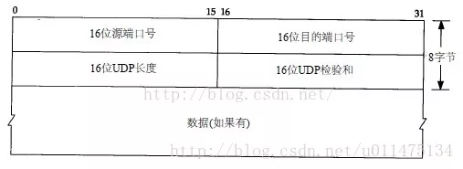
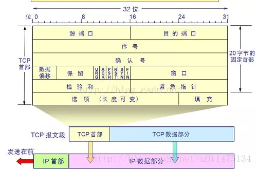
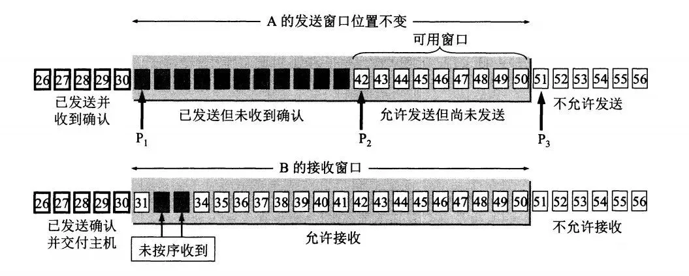
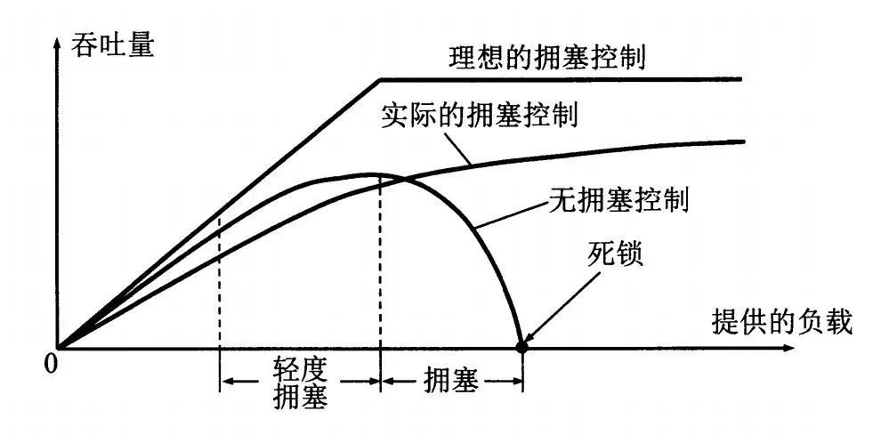
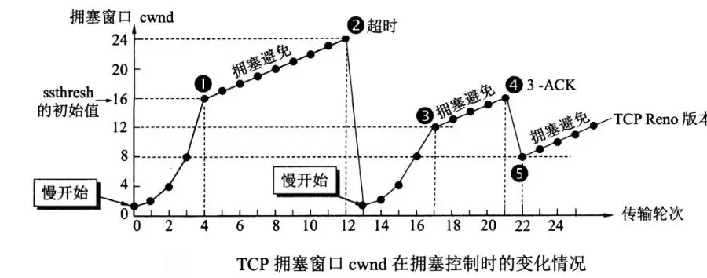
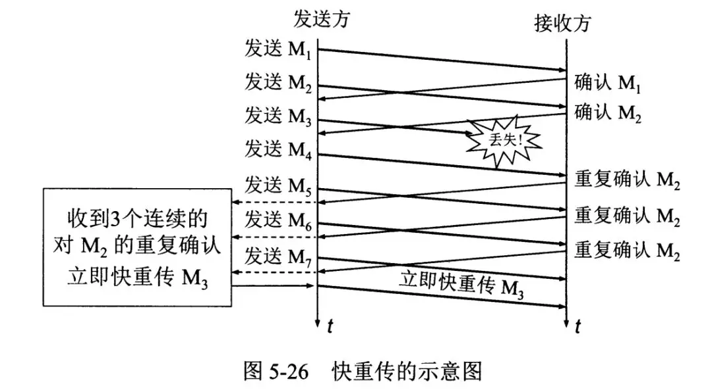

# 网络

网络层只把分组发送到目的主机，但是真正通信的并不是主机而是主机中的进程。传输层提供了进程间的逻辑通信，传输层向高层用户屏蔽了下面网络层的核心细节，使应用程序看起来像是在两个传输层实体之间有一条端到端的逻辑通信信道。

## TCP 和 UDP 的区别，它们各有什么优点

### TCP

TCP（传输控制协议 Transmission Control Protocol）是面向连接的，提供可靠交付，有流量控制，拥塞控制，提供全双工通信，面向字节流（把应用层传下来的报文看成字节流，把字节流组织成大小不等的数据块），每一条 TCP 连接只能是点对点的（一对一）。

**优点：** TCP 在数据传递时，会有三次握手来建立连接，而且在数据传递时，有确认、窗口、重传、拥塞控制机制，在数据传完后，还会断开连接用来节约系统资源，较为可靠。丢包时有重发控制，还可以对次序乱掉的分包进行顺序控制。

> TCP 在数据包接收无序、丢失或在交付期间被破坏时，负责数据恢复。它通过为其发送的每个数据包提供一个序号来完成此恢复。数据包可以沿完全不同的路径发送，即使它们都是同一消息的组成部分。为确保正确地接收数据，TCP 要求在目标计算机成功收到数据时发回一个确认（即 ACK）。如果在某个时限内未收到相应的 ACK，将重新传送数据包。如果网络拥塞，这种重新传送将导致发送的数据包重复。但是，接收计算机可使用数据包的序号来确定它是否为重复数据包，并在必要时丢弃它。

**缺点：** TCP 相对于 UDP 速度慢一点，要求系统资源较多。

### UDP

UDP（用户数据报协议 Transmission Control Protocol）是无连接的，尽最大可能交付，没有拥塞控制，面向报文（对于应用程序传下来的报文不合并也不拆分，只是添加 UDP 首部），支持一对一、一对多、多对一和多对多的交互通信，UDP 数据包括目的端口号和源端口号信息

**优点：** UDP 速度快、操作简单、要求系统资源较少，由于通讯不需要连接，可以实现广播发送

**缺点：** UDP 传送数据前并不与对方建立连接，对接收到的数据也不发送确认信号，发送端不知道数据是否会正确接收，也不重复发送，不可靠

### UDP 、TCP 首部格式

UDP 首部字段只有 8 个字节，包括源端口、目的端口、长度、检验和。12 字节的伪首部是为了计算检验和临时添加的。

TCP 首部格式比 UDP 复杂。

**序号**：用于对字节流进行编号，例如序号为 301，表示第一个字节的编号为 301，如果携带的数据长度为 100 字节，那么下一个报文段的序号应为 401。

**确认号**：期望收到的下一个报文段的序号。例如 B 正确收到 A 发送来的一个报文段，序号为 501，携带的数据长度为 200 字节，因此 B 期望下一个报文段的序号为 701，B 发送给 A 的确认报文段中确认号就为 701。

**数据偏移**：指的是数据部分距离报文段起始处的偏移量，实际上指的是首部的长度。

**控制位**：八位从左到右分别是 CWR，ECE，URG，ACK，PSH，RST，SYN，FIN。

**CWR**：CWR 标志与后面的 ECE 标志都用于 IP 首部的 ECN 字段，ECE 标志为 1 时，则通知对方已将拥塞窗口缩小；

**ECE**：若其值为 1 则会通知对方，从对方到这边的网络有阻塞。在收到数据包的 IP 首部中 ECN 为 1 时将 TCP 首部中的 ECE 设为 1；

**URG**：该位设为 1，表示包中有需要紧急处理的数据，对于需要紧急处理的数据，与后面的紧急指针有关；

**ACK**：该位设为 1，确认应答的字段有效，TCP 规定除了最初建立连接时的 SYN 包之外该位必须设为 1；

**PSH**：该位设为 1，表示需要将收到的数据立刻传给上层应用协议，若设为 0，则先将数据进行缓存；

**RST**：该位设为 1，表示 TCP 连接出现异常必须强制断开连接；

**SYN**：用于建立连接，该位设为 1，表示希望建立连接，并在其序列号的字段进行序列号初值设定；

**FIN**：该位设为 1，表示今后不再有数据发送，希望断开连接。当通信结束希望断开连接时，通信双方的主机之间就可以相互交换 FIN 位置为 1 的 TCP 段。

每个主机又对对方的 FIN 包进行确认应答之后可以断开连接。不过，主机收到 FIN 设置为 1 的 TCP 段之后不必马上回复一个 FIN 包，而是可以等到缓冲区中的所有数据都因为已成功发送而被自动删除之后再发 FIN 包；

**窗口**：窗口值作为接收方让发送方设置其发送窗口的依据。之所以要有这个限制，是因为接收方的数据缓存空间是有限的。

### TCP 的连接

TCP 是一种面向连接的单播协议，在发送数据前，通信双方必须在彼此间建立一条连接。所谓的“连接”，其实是客户端和服务器的内存里保存的一份关于对方的信息，如 IP 地址、端口号等。

TCP 可以看成是一种字节流，它会处理 IP 层或以下的层的丢包、重复以及错误问题。在连接的建立过程中，双方需要交换一些连接的参数。这些参数可以放在 TCP 头部。

TCP 提供了一种可靠、面向连接、字节流、传输层的服务，采用三次握手建立一个连接；采用四次挥手来关闭一个连接。

一个 TCP 连接由一个 4 元组构成，分别是两个 IP 地址和两个端口号。一个 TCP 连接通常分为三个阶段：启动、数据传输、退出（关闭）。

当 TCP 接收到另一端的数据时，它会发送一个确认，但这个确认不会立即发送，一般会延迟一会。

ACK 是累积的，一个确认字节号 N 的 ACK 表示所有直到 N 的字节（不包括 N）已经成功被接收了。这样的好处是如果一个 ACK 丢失，很可能后续的 ACK 就足以确认前面的报文段了。

一个完整的 TCP 连接是双向和对称的，数据可以在两个方向上平等地流动。给上层应用程序提供一种双工服务。一旦建立了一个连接，这个连接的一个方向上的每个 TCP 报文段都包含了相反方向上的报文段的一个 ACK。

序列号的作用是使得一个 TCP 接收端可丢弃重复的报文段，记录以杂乱次序到达的报文段。因为 TCP 使用 IP 来传输报文段，而 IP 不提供重复消除或者保证次序正确的功能。

另一方面，TCP 是一个字节流协议，绝不会以杂乱的次序给上层程序发送数据。因此 TCP 接收端会被迫先保持大序列号的数据不交给应用程序，直到缺失的小序列号的报文段被填满。

### UDP 对 TCP 的优势

UDP 以其简单、传输快的优势，在越来越多场景下取代了 TCP,如实时游戏。

- 网速的提升给 UDP 的稳定性提供可靠网络保障，丢包率很低，如果使用应用层重传，能够确保传输的可靠性。

- TCP 为了实现网络通信的可靠性，使用了复杂的拥塞控制算法，建立了繁琐的握手过程，由于 TCP 内置的系统协议栈中，极难对其进行改进。采用 TCP，一旦发生丢包，TCP 会将后续的包缓存起来，等前面的包重传并接收到后再继续发送，延时会越来越大，基于 UDP 对实时性要求较为严格的情况下，采用自定义重传机制，能够把丢包产生的延迟降到最低，尽量减少网络问题对游戏性造成影响。
- UDP 传输层无法保证数据的可靠传输，只能通过应用层来实现了。实现的方式参照 tcp 可靠性传输的方式，只是实现不在传输层，实现转移到了应用层。实现确认机制、重传机制、窗口确认机制。如支持高速广域网上的海量数据传输的 UDT，互联网上的标准数据传输协议 TCP 在高带宽长距离网络上性能很差，UDT 建于 UDP 之上，并引入新的拥塞控制和数据可靠性控制机制，是面向连接的双向的应用层协议。

### 区别总结

- TCP 对系统资源要求较多，UDP 对系统资源要求较少
- TCP 相对于 UDP 速度慢一点
- TCP 面向连接，UDP 是无连接的，即发送数据之前不需要建立连接
- TCP 保证数据正确性，UDP 可能丢包，TCP 保证数据无差错，不丢失，不重复，且按序到达，UDP 尽最大努力交付，即不保证可靠交付。
- TCP 面向字节流，实际上是 TCP 把数据看成一连串无结构的字节流;UDP 是面向报文的，UDP 没有拥塞控制，因此网络出现拥塞不会使源主机的发送速率降低（对实时应用很有用，如 IP 电话，实时视频会议等）
- 每一条 TCP 连接只能是点到点的;UDP 支持一对一，一对多，多对一和多对多的交互通信
- TCP 首部开销 20 字节;UDP 的首部开销小，只有 8 个字节

### 应用场景

- 比如普通的会议视频图像，当然首选 UDP，毕竟丢几包无所谓。

- 如果传输文件等，不能丢包，用 TCP

## TCP

### TCP 的三次握手和四次挥手

握手过程中使用了 TCP 标志——SYN（synchronize）和 ACK（acknowledgement）；其中**ACK 报文是用来应答的，SYN 报文是用来同步的**

#### 三次握手

- A 向 B 发送连接请求报文，SYN=1，ACK=0，选择一个初始的序号 x。

- B 收到连接请求报文，如果同意建立连接，则向 A 发送连接确认报文，SYN=1，ACK=1，确认号为 x+1，同时也选择一个初始的序号 y。

- A 收到 B 的连接确认报文后，还要向 B 发出确认，确认号为 y+1，序号为 x+1。

- B 收到 A 的确认后，连接建立。

客户端和服务端通信前要进行连接，“3 次握手”的作用就是**双方都能明确自己和对方的收、发能力是正常的**。

#### 四次挥手

为什么建立连接是三次握手，而关闭连接却是四次挥手呢？

这是因为服务端在 LISTEN 状态下，收到**建立连接请求**的 SYN 报文后，把 ACK 和 SYN 放在一个报文里发送给客户端。而**关闭连接**时，当收到对方的 FIN 报文时，仅仅表示对方不再发送数据了但是还能接收数据，己方是否现在关闭发送数据通道，需要上层应用来决定，因此，己方 ACK 和 FIN 一般都会分开发送。等到发送完了所有的数据后，会发送一个 FIN 段来关闭此方向上的连接。接收方发送 ACK 确认关闭连接。

接收到 FIN 报文的一方只能回复一个 ACK, 它是无法马上返回对方一个 FIN 报文段的，因为结束数据传输的“指令”是上层应用层给出的，我只是一个“搬运工”，我无法了解“上层的意志”。

**四次挥手释放连接时，等待 2MSL 的意义**

保证客户端发送的最后一个 ACK 报文段能够到达服务端。
这个 ACK 报文段有可能丢失，使得处于 LAST-ACK 状态的 B 收不到对已发送的 FIN+ACK 报文段的确认，服务端超时重传 FIN+ACK 报文段，而客户端能在 2MSL 时间内收到这个重传的 FIN+ACK 报文段，接着客户端重传一次确认，重新启动 2MSL 计时器，最后客户端和服务端都进入到 CLOSED 状态，若客户端在 TIME-WAIT 状态不等待一段时间，而是发送完 ACK 报文段后立即释放连接，则无法收到服务端重传的 FIN+ACK 报文段，所以不会再发送一次确认报文段，则服务端无法正常进入到 CLOSED 状态。

### TCP 粘包、拆包及解决办法

为什么常说 TCP 有粘包和拆包的问题而不说 UDP ？

UDP 是基于报文发送的，UDP 首部采用了 16bit 来指示 UDP 数据报文的长度，因此在应用层能很好的将不同的数据报文区分开，从而避免粘包和拆包的问题。

而 TCP 是基于字节流的，虽然应用层和 TCP 传输层之间的数据交互是大小不等的数据块，但是 TCP 并没有把这些数据块区分边界，仅仅是一连串没有结构的字节流；另外从 TCP 的帧结构也可以看出，在 TCP 的首部没有表示数据长度的字段，基于上面两点，在使用 TCP 传输数据时，才有粘包或者拆包现象发生的可能。

**什么是粘包、拆包？**

假设 Client 向 Server 连续发送了两个数据包，用 packet1 和 packet2 来表示，那么服务端收到的数据可以分为三种情况，现列举如下：

第一种情况，接收端正常收到两个数据包，即没有发生拆包和粘包的现象。

第二种情况，接收端只收到一个数据包，但是这一个数据包中包含了发送端发送的两个数据包的信息，这种现象即为粘包。这种情况由于接收端不知道这两个数据包的界限，所以对于接收端来说很难处理。

第三种情况，这种情况有两种表现形式，如下图。接收端收到了两个数据包，但是这两个数据包要么是不完整的，要么就是多出来一块，这种情况即发生了拆包和粘包。这两种情况如果不加特殊处理，对于接收端同样是不好处理的。

**为什么会发生 TCP 粘包、拆包？**

- 要发送的数据大于 TCP 发送缓冲区剩余空间大小，将会发生拆包。
- 待发送数据大于 MSS（最大报文长度），TCP 在传输前将进行拆包。
- 要发送的数据小于 TCP 发送缓冲区的大小，TCP 将多次写入缓冲区的数据一次发送出去，将会发生粘包。
- 接收数据端的应用层没有及时读取接收缓冲区中的数据，将发生粘包。

**粘包、拆包解决办法**

由于 TCP 本身是面向字节流的，无法理解上层的业务数据，所以在底层是无法保证数据包不被拆分和重组的，这个问题只能通过上层的应用协议栈设计来解决，根据业界的主流协议的解决方案，归纳如下：

- **消息定长：** 发送端将每个数据包封装为固定长度（不够的可以通过补 0 填充），这样接收端每次接收缓冲区中读取固定长度的数据就自然而然的把每个数据包拆分开来。
- **设置消息边界：** 服务端从网络流中按消息边界分离出消息内容。在包尾增加回车换行符进行分割，例如 FTP 协议。
- **将消息分为消息头和消息体：** 消息头中包含表示消息总长度（或者消息体长度）的字段。
- 更复杂的应用层协议比如 Netty 中实现的一些协议都对粘包、拆包做了很好的处理。

### TCP 可靠传输

TCP 使用超时重传来实现可靠传输：如果一个已经发送的报文段在超时时间内没有收到确认，那么就重传这个报文段。

### TCP 滑动窗口

窗口是缓存的一部分，用来暂时存放字节流。发送方和接收方各有一个窗口，接收方通过 TCP 报文段中的窗口字段告诉发送方自己的窗口大小，发送方根据这个值和其它信息设置自己的窗口大小。

发送窗口内的字节都允许被发送，接收窗口内的字节都允许被接收。如果发送窗口左部的字节已经发送并且收到了确认，那么就将发送窗口向右滑动一定距离，直到左部第一个字节不是已发送并且已确认的状态；接收窗口的滑动类似，接收窗口左部字节已经发送确认并交付主机，就向右滑动接收窗口。

接收窗口只会对窗口内最后一个按序到达的字节进行确认，例如接收窗口已经收到的字节为 {31, 34, 35}，其中 {31} 按序到达，而 {34, 35} 就不是，因此只对字节 31 进行确认。发送方得到一个字节的确认之后，就知道这个字节之前的所有字节都已经被接收。

### TCP 流量控制

流量控制是为了控制发送方发送速率，保证接收方来得及接收。

接收方发送的确认报文中的窗口字段可以用来控制发送方窗口大小，从而影响发送方的发送速率。将窗口字段设置为 0，则发送方不能发送数据。

实际上，为了避免此问题的产生，发送端主机会时不时的发送一个叫做窗口探测的数据段，此数据段仅包含一个字节来获取最新的窗口大小信息。

### TCP 拥塞控制

如果网络出现拥塞，分组将会丢失，此时发送方会继续重传，从而导致网络拥塞程度更高。因此当出现拥塞时，应当控制发送方的速率。这一点和流量控制很像，但是出发点不同。流量控制是为了让接收方能来得及接收，而拥塞控制是为了降低整个网络的拥塞程度。

TCP 主要通过四个算法来进行拥塞控制：

**慢开始、拥塞避免、快重传、快恢复**。

发送方需要维护一个叫做 **拥塞窗口（cwnd）** 的状态变量，注意拥塞窗口与发送方窗口的区别：拥塞窗口只是一个状态变量，**实际决定发送方能发送多少数据的是发送方窗口**。

为了便于讨论，做如下假设：

- 接收方有足够大的接收缓存，因此不会发生流量控制；

- 虽然 TCP 的窗口基于字节，但是这里设窗口的大小单位为报文段。

#### 慢开始与拥塞避免

发送的最初执行慢开始，令 cwnd = 1，发送方只能发送 1 个报文段；当收到确认后，将 cwnd 加倍，因此之后发送方能够发送的报文段数量为：2、4、8 ...

注意到慢开始每个轮次都将 cwnd 加倍，这样会让 cwnd 增长速度非常快，从而使得发送方发送的速度增长速度过快，网络拥塞的可能性也就更高。设置一个**慢开始门限 ssthresh**，当 cwnd >= ssthresh 时，**进入拥塞避免**，每个轮次只将 cwnd 加 1。

如果出现了超时，则令 ssthresh = cwnd / 2，然后重新执行慢开始。

#### 快重传与快恢复

在接收方，要求每次接收到报文段都应该对最后一个已收到的有序报文段进行确认。例如已经接收到 M1 和 M2，此时收到 M4，应当发送对 M2 的确认。

在发送方，**如果收到三个重复确认，那么可以知道下一个报文段丢失，此时执行快重传**，立即重传下一个报文段。例如收到三个 M2，则 M3 丢失，立即重传 M3。

在这种情况下，只是丢失个别报文段，而不是网络拥塞。因此**执行快恢复，令 ssthresh = cwnd / 2 ，cwnd = ssthresh，注意到此时直接进入拥塞避免**。

慢开始和快恢复的快慢指的是 cwnd 的设定值，而不是 cwnd 的增长速率。**慢开始 cwnd 设定为 1，而快恢复 cwnd 设定为 ssthresh。**

### 提供网络利用率

**Nagle 算法**

发送端即使还有应该发送的数据，但如果这部分数据很少的话，则进行延迟发送的一种处理机制。具体来说，就是仅在下列任意一种条件下才能发送数据。如果两个条件都不满足，那么暂时等待一段时间以后再进行数据发送。

- 已发送的数据都已经收到确认应答。

- 可以发送最大段长度的数据时。

**延迟确认应答**

接收方收到数据之后可以并不立即返回确认应答，而是延迟一段时间的机制。

- 在没有收到 2\*最大段长度的数据为止不做确认应答。

- 其他情况下，最大延迟 0.5 秒 发送确认应答。

- TCP 文件传输中，大多数是每两个数据段返回一次确认应答。

**捎带应答**

在一个 TCP 包中既发送数据又发送确认应答的一种机制，由此，网络利用率会提高，计算机的负荷也会减轻，但是这种应答必须等到应用处理完数据并将作为回执的数据返回为止。

> 参考链接
>
> [“三次握手，四次挥手”你真的懂吗？](https://zhuanlan.zhihu.com/p/53374516)
>
> [面试官，不要再问我三次握手和四次挥手](https://segmentfault.com/a/1190000020610336)
>
> [一文搞定 UDP 和 TCP 高频面试题！](https://mp.weixin.qq.com/s/ykVNg9qLBo1H3P1HhW3gFg)

## 网络基础

**MAC 地址**：MAC 地址也叫物理地址、硬件地址，长度为 48 位，一般这样来表示 00-16-EA-AE-3C-40，由网络设备制造商生产时烧录在网卡的 EPROM（一种闪存芯片，通常可以通过程序擦写），其中前 24 位代表网络硬件制造商的编号，后 24 位是该厂家自己分配的，一般表示系列号。只要不更改自己的 MAC 地址，MAC 地址在世界是唯一的。

**集线器**：无脑将电信号转发到所有出口（广播），位于**物理层**

**交换机**：消息只发给目标 MAC 地址，位于**数据链路层**

交换机内部维护一张 MAC 地址表，记录着每一个 MAC 地址的设备，连接在其哪一个端口上。交换机内部通过自己维护的 MAC 地址表进行传输信息，通过这样传输方式而组成的小范围的网络，叫做**以太网**。

当然最开始的时候，MAC 地址表是空的，当在地址表中并没有映射关系，交换机会将数据包发给所有端口，哪个端口做出响应就对应目标 MAC。经过该网络中的机器不断地通信，交换机最终将 MAC 地址表建立完毕

**路由器**：独立的拥有 MAC 地址的设备（路由器的每一个端口，都有独立的 MAC 地址），可以把数据包做一次转发，位于**网络层**

发数据包时怎么知道是否要通过路由器转发呢？

每台电脑会赋给一个**IP 地址**，IP 地址是软件层面上的，可以随时修改，如果源 IP 与目的 IP 处于一个子网，直接将包通过交换机发出去。如果源 IP 与目的 IP 不处于一个子网，就交给路由器去处理。

如何判断是不是在同一个子网？

人们发明了**子网掩码**的概念，将源 IP 与目的 IP 分别同这个子网掩码进行**与运算**，相等则是在一个子网，不相等就是在不同子网

假如某台机器的子网掩码定为 255.255.255.0，

A 电脑：192.168.0.1 & 255.255.255.0 = 192.168.0.0

B 电脑：192.168.1.1 & 255.255.255.0 = 192.168.1.0

设备如何知道路由器的 IP？

设备上要设置**默认网关**，默认网关就是 A 在自己电脑里配置的一个 IP 地址，以便在发给不同子网的机器时，发给这个 IP 地址。

电脑和路由器怎么将 IP 地址和 MAC 地址对应起来？

电脑和路由器中都有 **arp 缓存表**用于缓存 IP 和 MAC 地址的映射关系，一开始的时候这个表是空的，电脑 A 为了知道电脑 B 的 MAC 地址，将会广播一条 arp 请求，B 收到请求后，带上自己的 MAC 地址给 A 一个响应。此时 A 便更新了自己的 arp 表

网络层（IP 协议）本身没有传输包的功能，包的实际传输是委托给数据链路层（以太网中的交换机）来实现的。

**总结**

电脑视角：

- 首先我要知道我的 IP 以及对方的 IP

- 通过子网掩码判断我们是否在同一个子网

- 在同一个子网就通过 arp 获取对方 mac 地址直接扔出去

- 不在同一个子网就通过 arp 获取默认网关的 mac 地址直接扔出去

交换机视角：

- 我收到的数据包必须有目标 MAC 地址

- 通过 MAC 地址表查映射关系

- 查到了就按照映射关系从我的指定端口发出去

- 查不到就所有端口都发出去

路由器视角：

- 我收到的数据包必须有目标 IP 地址

- 通过路由表查映射关系

- 查到了就按照映射关系从我的指定端口发出去（不在任何一个子网范围，走其路由器的默认网关也是查到了）

- 查不到则返回一个路由不可达的数据包

涉及到的三张表分别是

- 交换机中有 MAC 地址表用于映射 MAC 地址和它的端口

- 路由器中有路由表用于映射 IP 地址(段)和它的端口

- 电脑和路由器中都有 arp 缓存表用于缓存 IP 和 MAC 地址的映射关系

这三张表是怎么来的

- MAC 地址表是通过以太网内各节点之间不断通过交换机通信，不断完善起来的。

- 路由表是各种路由算法 + 人工配置逐步完善起来的。

- arp 缓存表是不断通过 arp 协议的请求逐步完善起来的。

> 参考链接
>
> [图解 | 原来这就是网络](https://www.cnblogs.com/flashsun/p/14266148.html)
>
> [图解 | 原来这就是 TCP](https://www.cnblogs.com/flashsun/p/14322660.html)
