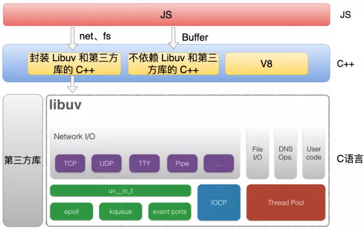

# NodeJs

## 组成

Node.js 主要是由 V8、Libuv 和一些第三方库组成。

- V8 是一个 JS 引擎。但是它不仅实现了 JS 解析和执行，它还是自定义拓展。比如说我们可以通过 V8 提供一些 C++ API 去定义一些全局变量，这样话我们在 JS 里面去使用这个变量了。正是因为 V8 支持这个自定义的拓展，所以才有了 Node.js 等 JS 运行时。

- Libuv 是一个跨平台的异步 IO 库。它主要的功能是它封装了各个操作系统的一些 API， 提供网络还有文件进程的这些功能。我们知道在 JS 里面是没有网络文件这些功能的，在前端时，是由浏览器提供的，而在 Node.js 里，这些功能是由 Libuv 提供的。

- 另外 Node.js 里面还引用了很多第三方库，比如 DNS 解析库，还有 HTTP 解析器等等。

**Node.js 代码整体的架构**

Node.js 代码主要是分为三个部分，分别是 C、C++ 和 JS。

- JS 代码就是我们平时在使用的那些 JS 的模块，比方说像 http 和 fs 这些模块。

- C++ 代码主要分为三个部分，第一部分主要是封装 Libuv 和第三方库的 C++ 代码，比如 net 和 fs 这些模块都会对应一个 C++ 模块，它主要是对底层的一些封装。第二部分是不依赖 Libuv 和第三方库的 C++ 代码，比方像 Buffer 模块的实现。第三部分 C++ 代码是 V8 本身的代码。

- C 语言代码主要是包括 Libuv 和第三方库的代码，它们都是纯 C 语言实现的代码。
