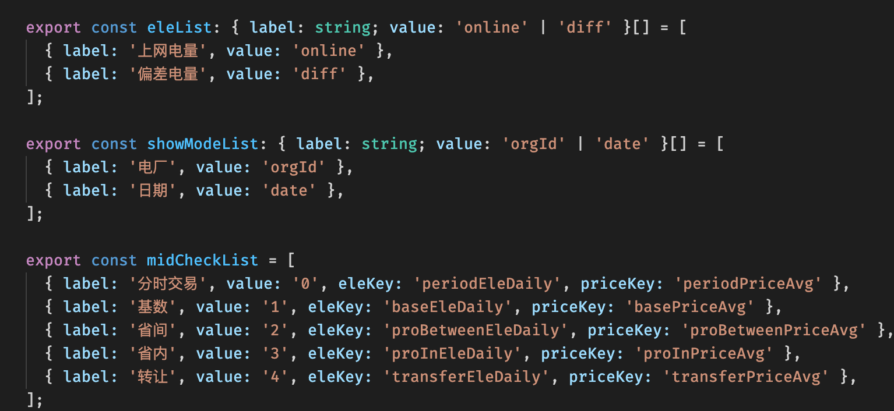
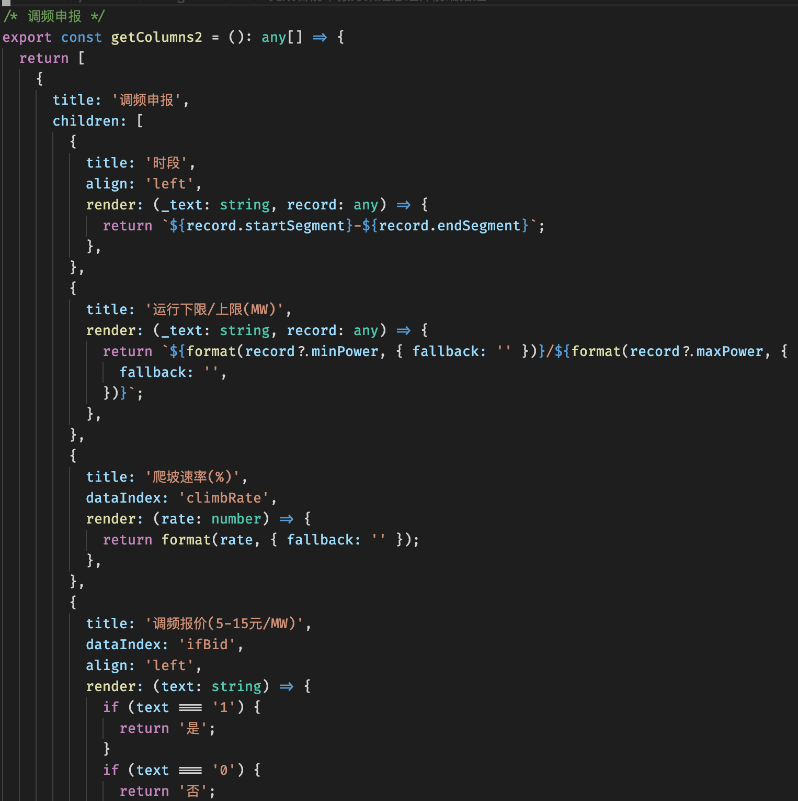
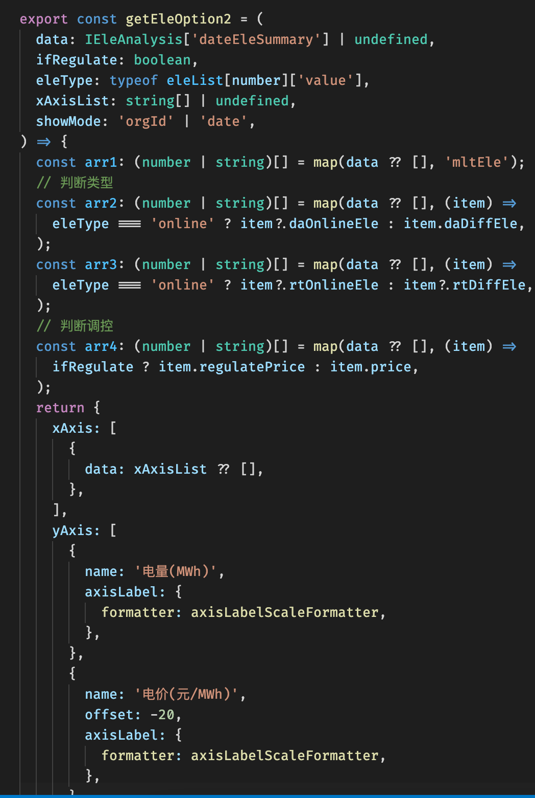
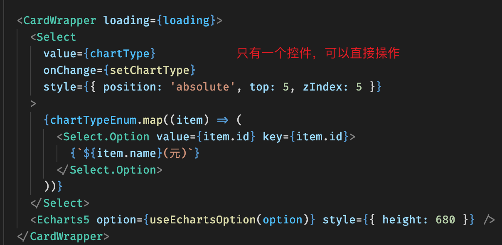
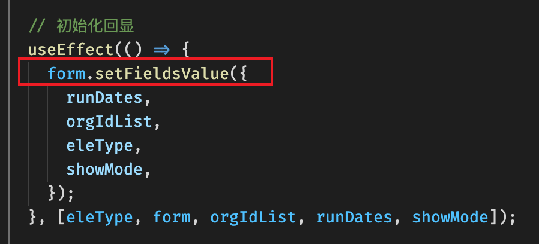
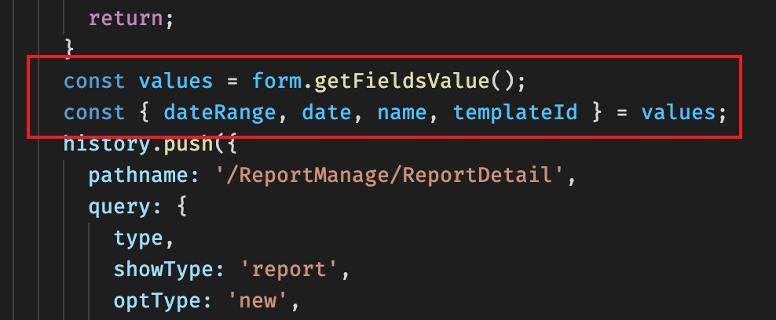
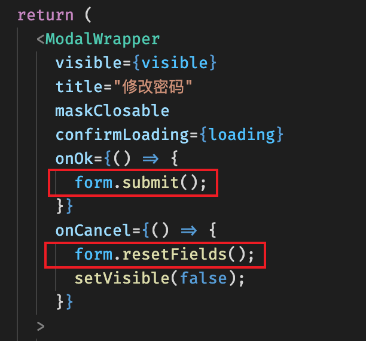
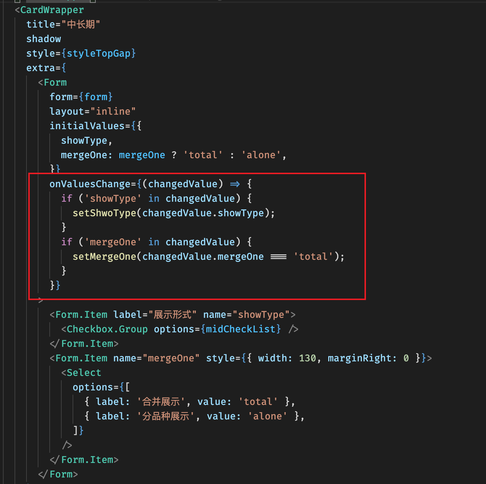
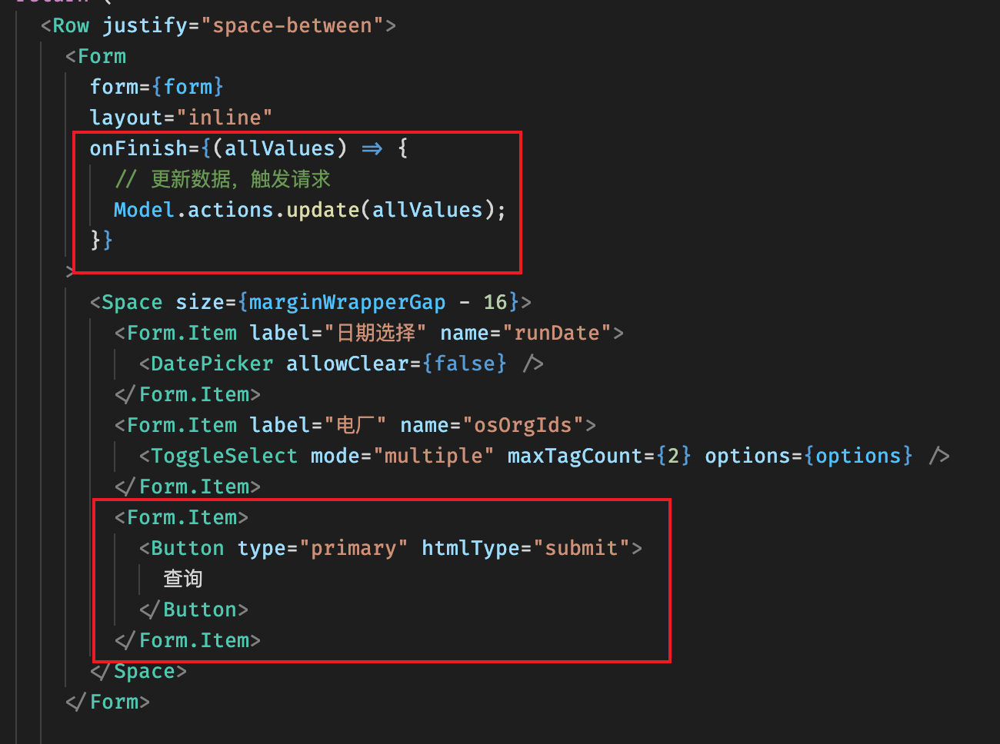
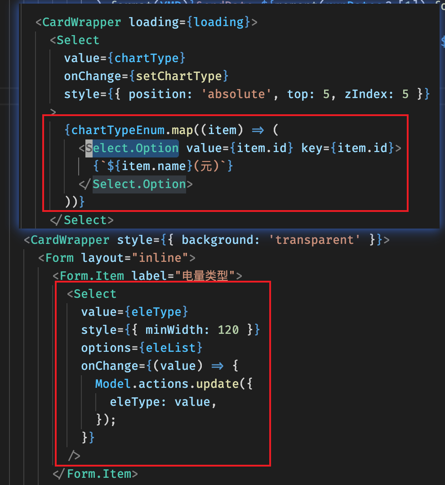

# 代码规范

## React 或组件相关

### 使⽤函数组件，拥抱 Hooks

```js
// 不推荐
class Square extends React.Component {
  render() {
    return <button className="square">{this.props.value}</button>;
  }
}
// 推荐
const Index: FC<{ eleList: number[] }> = ({ eleList }) => {
  // 各种hooks处理
  // JSX处理
  return (
    <>
      <Spin>...</Spin>
      <Space>...</Space>
    </>
  );
};
export default memo(Index); // memo 是可选的，如果组件复杂可以加上
```

### 保证 React 组件的调⽤参数 props 类型声明和注释

```jsx
export const Index: FC<{
  form: any, // 表单对象
  editable: boolean, // 是否可编辑
  setDataSource: (cb: (org: any[]) => any[]) => void,
  columns: any[],
  dataSource: any[],
}> = ({ editable, columns, dataSource, setDataSource, form }) => {
  return <div></div>;
};
```

### props 只传递必要的属性，否则容易混淆，且会造成⼦组件的冗余刷新。

```jsx
(props) => {
  return (
    <>
      /* 需要什么传什么 */
      <Child {...props} />
    </>
  );
};
```

### 如果 JSX 属性值为 true ，可以直接省略，自闭合标签应该简写

```jsx
<Foo hidden={true} />
//改为
<Foo hidden />

<Foo></Foo>
// 改为
<Foo />
```

### React 组件循环时需要唯⼀ key

Key 告诉 React 每个组件对应哪个数组项，唯一标识一个组件，帮助 React 识别哪些元素改变了。如果数组项可以移动（例如由于排序）、被插入或被删除，这将变得很重要。一个好的`key`选择有助于 React 推断到底发生了什么，并对 DOM 树进行正确的更新。

key 规则：

- 同级之间的键必须是唯一的。但是，可以对不同数组中的 JSX 节点使用相同的键。
- 密钥不得更改！不要在渲染时生成它们。这将导致渲染之间的键永远不会匹配，从而导致每次都重新创建所有组件和 DOM。这不仅速度慢，而且还会丢失列表项中的任何用户输入。请使用基于数据的稳定 ID。

**不推荐使⽤ index 作为 key**

元素不进行重新排序时可以使用元素在数组中的下标 index 作为 key。如果循环中出现动态删除、插⼊或重新排序元素，使用 index 会错位，diff 会变慢，导致性能变差，还可能引起组件状态的问题。

由于**组件实例是基于它们的 key 来决定是否更新以及复用**，如果 key 是一个下标，那么修改顺序时会修改当前的 key，导致非受控组件的 state（比如输入框）可能相互篡改，会出现无法预期的变动。

如果循环项中确定没有唯⼀的属性，推荐使⽤ lodash 的 uniqueId()。但是有个注意点，需要稳定 key 的场景，⽐如 Table 涉及到单元格合并，勾选⾏等，需要直接使⽤到 key 的场景，不能使⽤ uniqueId()

### 组件间相互屏蔽隐藏细节，然后选择恰当的通信⽅式

⼦组件需要获取⽗组件的状态，可以通过 `props` 传递，那么反过来该如何获取呢，如果是根据⼦组件触发的某些事件然后获取，⽗组件可以传⼊⼀个回调函数，⼦组件选择在适当的时机调⽤，并将需要的值作为参数传递给⽗组件。

除此之外可以考虑 `useImperativeHandle` 暴露⽅法，如果⽗⼦组件都需要更新该状态(也就是共享)，可以考虑放⼊ `Model` 中。

## Hooks 相关

### 谨慎使⽤ useState，使⽤ useMemo 缓存值

谨慎使⽤ useState ，禁⽌新增变量存储 props model 等数据的中间状态，或者其筛选，格式化的结果。涉及到数据中间状态或者格式化的，应该使⽤ useMemo 来缓存，类似 vue 提供的 computed

```jsx
// 不能直接新增useState来保存，冗余且难以维护
({ eleList }: { eleList: number[] }) => {
    const [total, setTotal] = useState<number>(0);
    const [maxEle, setMaxEle] = useState<number>(0);
    ...
    useEffect(() => {
        setTotalEle(lodash.sum(eleList));
        setMaxEle(lodash.max(eleList));
    }, []);
}
```

```jsx
// 使⽤ useMemo 来缓存
({ eleList }: { eleList: number[] }) => {
  const [total, max, mean] = useMemo(() => {
    return [lodash.sum(eleList), lodash.max(eleList), lodash.mean(eleList)];
  }, [eleList]);
};
```

使⽤ hook 需遵守 **"唯⼀数据源"**准则，避免保存中间状态。不保存冗余状态的同时，不保存中间状态，否则会发现更新时需要更新多处，也会⼤⼤增加流程复杂度。

对于某些状态是单纯依赖更新的，没有事件或副作⽤刷新，你应该使⽤ `useMemo` ⽽⾮ `useState` ，⽐如对于列表的筛选，我们唯⼀的数据源就是请求的返回，筛选的结果应该使⽤ `useMemo` ，⽽不能⽤ `useState` 保存中间状态。

### 使用 ahooks

当我们需要与浏览器 APi 交互时，也就是副作⽤交汇处，我们⾸先想到的是 `ahooks` ，如果 `ahooks` 没有，我们应该⾃定义 hooks 去处理，⽽不应该将副作⽤直接暴露在组件内。

实际上 `ahooks` 已经为我们提供了⼏乎所有场景的 hook，最常⻅的是 `useRequest` `useLocalStorageState` `useDebounce` `useScroll`

### 使⽤更加语义化的 useBoolean

当需要维护⼀个 `boolean` 类型的状态时，推荐使⽤更加语义化的`ahooks`的 `useBoolean` ⽽不是通⽤的 `useState` 。

```jsx
const [visible, { set: setVisible }] = useBoolean(false);
```

## TS 相关

### 类型的精确是有价值的，类型声明是尽量语义化和缩⼩范围

能声明为 type KeyType = 0 | 1 的联合类型，就不要声明为 number ;

能声明为 type DetailType = 'SCAN' | 'EDIT' | 'NEW' 的联合类型，就不要声明为 string ;

能确定为 number | string | undefined 的联合，就不要声明为 any ;

### 避免使⽤ any

除了调⽤其他组件或库的交界处，或者是⼀些繁琐的配置属性使⽤ any，其余在代码流程中，请避免使⽤ any，会影响代码的后续维护和 debug。

### 大量类型声明单独写在 types.ts

⼤量的，多处使⽤到的类型声明，不推荐写在代码流程中，⽽是单独写在 types.ts ⽂件中集中声
明。

### 善⽤ TS ⼯具类型

善⽤ TS ⼯具类型: Pick Record Exclude Omit NonNullable 等，可以灵活实现很多衍⽣类
型

### 引⼊'类型'需要使⽤ import type

```js
import type { Moment } from "moment";
```

### data: OneType | undefined 与 data?: OneType

从语义上来说 `data: OneType | undefined` 与 `data?: OneType` 并不相同，前者是参数必须要传，但是数据可以为 undefined；后者是这个参数可以不传，并不影响组件的使⽤。

如果是⼀般的函数传参，不混产⽣混淆的情况下，可以简单写为后者

### 利⽤ 可辨识联合 + never 类型，实现分⽀流程的完整性检查

例如下面这段代码，根据业务状态类型，调用不同的请求。在此处类型的"保护与自洽"包括几部分:
(这里没有用对象的可辨识属性，而是简单的使用 dataType 这个 number 联合类型，其原理是类似的)

1. 传参时`IDataType`限制`dataType`的范围
2. 其次，当`dataType`不正确时，流程会进入最后分支: 将`IDataType`类型传递给`never`也会报错
3. 最后，当`dataType`不正确时，返回值也会报错`Promise<AjaxRes<IPrivatePower[] | IPrivatesSplit[] | IPrivateDaily[]>>`

```js
export const ReqMergedFn = ({
  dataType,
  osOrgId,
  startDate,
  endDate,
}: {
  dataType: IDataType,
  startDate: Moment,
  endDate: Moment,
  osOrgId: string,
}): Promise<AjaxRes<IPrivatePower[] | IPrivatesSplit[] | IPrivateDaily[]>> => {
  let response: Promise<
    AjaxRes<IPrivatePower[] | IPrivatesSplit[] | IPrivateDaily[]>
  >;
  if (dataType === "3") {
    response = getPrivatePower({ startDate, endDate, osOrgId });
  } else if (dataType === "4") {
    response = getPrivateSplit({ startDate, endDate, osOrgId });
  } else if (dataType === "5") {
    response = getPrivateDaily({ startDate, endDate, osOrgId });
  } else {
    /* 当进入此分支时，类型与never不兼容而报错 */
    ((dt: never) => {
      throw new Error(`Unexpected Value of dataType: ${dt}`);
      /* 抛出错误后，返回值的类型为never，与既定的return类型不符合 */
    })(dataType);
  }
  return response;
};
```

## ECMA,函数相关

### 使用.?和??安全取值

[可选链操作符(Optional_chaining)](https://developer.mozilla.org/zh-CN/docs/Web/JavaScript/Reference/Operators/Optional_chaining) 与 [空值合并运算符(Null 判断运算符)](https://developer.mozilla.org/zh-CN/docs/Web/JavaScript/Reference/Operators/Nullish_coalescing_operator)，我们在对对象和数组取值，在对函数执行时，**可能因为其值不存在而造成报错**，使用以上两种方式再配合上判空，能大大提高我们取值操作的安全性。

仅 `undefined` 才会触发解构和函数传参的默认值；⽽ `undefined`, `null` 能触发可选链和 Null 判断运算符

```js
// 组合使⽤
// 当值为: null 或 undefined时, ?? 才有效
const detailPrice = orgItem?.detail?.price ?? 33;
const price = orgItem ?? { price: 123 };
//尤其是动态的键
const val = obj?.[key] ?? "default";
// 数组类似
const price = arr[9]?.summary?.price ?? 5;
// 函数: 当不存在时，不执⾏
fn?.(...args);
fn?.() ?? fn2?.();

NaN === NaN; // false
-0 === +0; // true
Object.is(NaN, NaN); // true
Object.is(-0, +0); // false
```

### 谨慎对待循环，尤其是嵌套的循环

遍历⼀般采⽤回调式的⾼阶函数，例如 `map forEach filter find findIndex some every reducer` ，使⽤ es6 的 `for...of` 灵活中断循环

此外 lodash 提供了许多便利的遍历⽅法，⽐如 `sumBy sortBy groupBy flatten`

在⼀个作⽤域内，相同的数组尽量只遍历⼀次(除⾮是从代码语义⻆度应该分别循环处理的)，同时完成筛选、匹配、判断等，降低循环对性能的影响，循环的结果也可以使⽤ `useMemo` 缓存下来，防⽌每次都执⾏循环

### 善用结构

在对象只需要⽤到其属性，⽽不需要对象本身时，可以直接解构，忽略掉对象变量

```js
arr.map((item) => <div key={item.id}>{item.name}</div>);
arr.map(({ id, name }) => <div key={id}>{name}</div>);
```

类似的 import 也推荐按需引⼊

```js
import { mean, cloneDeep, isEmpty } from "lodash";
```

数组也推荐直接使⽤解构赋值

```js
const [columns, formObj] = useMemo(() => {
  return mergeColumnsAndFormData(getColumns(mltTradeCycle), dataSource);
}, [dataSource, mltTradeCycle]);
```

### 不要构造成 [''] [undefined] 的结构

很难判断数据的合法性

```jsx
// 初始化
state: {
unitId: '',
}
// 使⽤时
<Child value ={[unitId]}>
// 组件内，判空失误
if (value && value?.length) {...}
```

### 使用“\_”占位无用参数

```js
const {
  data: [_, price, powerData],
} = params?.[0];
```

### 过滤对象中的属性

```js
// 需要过滤掉value和price
const obj = { id: 'all', name: '⼴东⽕电', value: 123,45, price: 888 };
// ⽅案1结构，简单快捷，但是eslint会报警告
const { value, price ,...rest } = obj;
// ⽅案2使⽤omit(类似的还有pick)
const target = lodash.omit(obj, ['value', 'price']);
```

### 善用[lodash](https://www.lodashjs.com/)库

**不要重复手写各种复杂的判断或循环**，涉及到断言或转换(isNumber, isEmpty, toNumber, toArray)，遍历条件查找，排序、分组、交集、去重、复制、数据格式化等，优先想到`lodash`。

### 统⼀函数的 return ⾏为

当需要返回数据时，请确认每个分⽀都返回，并且数据类型相同。不允许部分返回字符串，部分返回数字的情况。

### 函数式编程

"函数式编程"是一种"编程范式"（programming paradigm），也就是如何编写程序的方法论。它属于"结构化编程"的一种，主要思想是把运算过程尽量写成一系列嵌套的函数调用。

函数式编程的核⼼之⼀就是 **纯函数 与 数据不可变**

对参数中引⽤类型的修改，⽐如对数组和对象的合并，需要保证不影响源数据，简单的数组、对象合并可以使⽤展开符。复杂对象可以使⽤ lodash.cloneDeep 进⾏深复制。

```js
// 不推荐，直接修改了原对象
const newObj = obj;
newObj.name = "new name";
// 改为
const newObj = { ...obj, name: "new name" };

// 复杂对象可以使⽤cloneDeep复制后操作
const shadowObj = lodash.cloneDeep(obj);
```

#### 纯函数

纯函数是函数式编程的基石，无副作用的函数

- 函数在相同的输入值时，总是产生相同的输出。函数的输出和当前运行环境的上下文状态无关。
- 函数运行过程不影响运行环境，也就是无副作用（如触发事件、发起 http 请求、打印/log 等）

简单来说，也就是**当一个函数的输出不受外部环境影响，同时也不影响外部环境时，该函数就是纯函数**

纯函数在可缓存性、可移植性、可测试性以及并行计算方面都有着巨大的优势：

- 可以进行缓存。我们就可以采用动态规划的方法保存中间值，用来代替实际函数的执行结果，大大提升效率。
- 可以进行高并发。因为不依赖于环境，可以调度到另一个线程、worker 甚至其它机器上，反正也没有环境依赖。
- 容易测试，容易证明正确性。不容易产生偶现问题，也跟环境无关，非常利于测试。

#### 特点

- 函数是"第一等公民"

  函数与其他数据类型一样，处于平等地位，可以赋值给其他变量，也可以作为参数，传入另一个函数，或者作为别的函数的返回值。

- 只用"表达式"，不用"语句"

  "表达式"（expression）是一个单纯的运算过程，总是有返回值；"语句"（statement）是执行某种操作，没有返回值。函数式编程要求，只使用表达式，不使用语句。也就是说，每一步都是单纯的运算，而且都有返回值。

- 没有"副作用"

  所谓"副作用"（side effect），指的是函数内部与外部互动（最典型的情况，就是修改全局变量的值），函数式编程所有功能就是返回一个新的值，没有其他行为，尤其是不得修改外部变量的值。

- 不修改状态

  变量往往用来保存"状态"（state），不修改状态意味着状态不能保存在变量中。函数式编程使用参数保存状态，最好的例子就是递归。

- 引用透明

  引用透明（Referential transparency），指的是函数的运行不依赖于外部变量或"状态"，只依赖于输入的参数，**任何时候只要参数相同，引用函数所得到的返回值总是相同的。**

  函数的返回值与系统状态有关时，不同的状态之下，返回值是不一样的。这就叫"引用不透明"，很不利于观察和理解程序的行为

#### [为什么不可变性在 React 中非常重要](https://zh-hans.reactjs.org/tutorial/tutorial.html#why-immutability-is-important)

不可变性有以下几点好处

- 简化复杂的功能

  不可变性使得复杂的特性更容易实现，撤销和恢复功能在开发中是一个很常见的需求，不直接在数据上修改可以让我们追溯并复用历史记录。

- 跟踪数据的改变

  可变对象跟踪数据的改变需要整个对象树被遍历一次，跟踪不可变数据的变化相对来说就容易多了。如果发现对象变成了一个新对象，那么我们就可以说对象发生改变了。

- 确定在 React 中何时重新渲染

  不可变性最主要的优势在于它可以帮助我们在 React 中创建 `pure components`。我们可以很轻松的确定不可变数据是否发生了改变，从而确定何时对组件进行重新渲染。

### 错误边界

#### 来由

过去，组件内的 JavaScript 错误会导致 React 的内部状态被破坏，并且在下一次渲染时 产生 可能无法追踪的 错误，React 并没有提供一种在组件中优雅处理这些错误的方式，也无法从错误中恢复。

部分 UI 的 JavaScript 错误不应该导致整个应用崩溃，为了解决这个问题，React 16 引入了一个新的概念 —— **错误边界**。

#### 概念

错误边界是一种 React 组件，这种组件可以捕获发生在整个子组件树的渲染期间、生命周期方法以及构造函数中任何位置的 JavaScript 错误，并打印这些错误，同时展示降级 UI

错误边界的工作方式类似于 JavaScript 的 catch {}，不同的地方在于错误边界只针对 React 组件。**只有 class 组件才可以成为错误边界组件。**

大多数情况下, 你只需要声明一次错误边界组件, 并在整个应用中使用它。

> 错误边界无法捕获以下场景中产生的错误：
>
> - 事件处理
> - 异步代码（例如 setTimeout 或 requestAnimationFrame 回调函数）
> - 服务端渲染
> - 它自身抛出来的错误（并非它的子组件）

如果一个 class 组件中定义了 `static getDerivedStateFromError()` 或 `componentDidCatch()` 这两个生命周期方法中的任意一个（或两个）时，那么它就变成一个错误边界。

当抛出错误后，请使用 `static getDerivedStateFromError()` 渲染备用 UI ，使用 `componentDidCatch()` 打印错误信息。

```jsx
class ErrorBoundary extends React.Component {
  constructor(props) {
    super(props);
    this.state = { hasError: false };
  }

  static getDerivedStateFromError(error) {
    // 更新 state 使下一次渲染能够显示降级后的 UI
    return { hasError: true };
  }

  componentDidCatch(error, errorInfo) {
    // 你同样可以将错误日志上报给服务器
    logErrorToMyService(error, errorInfo);
  }

  render() {
    if (this.state.hasError) {
      // 你可以自定义降级后的 UI 并渲染
      return <h1>Something went wrong.</h1>;
    }
    return this.props.children;
  }
}
```

#### 未捕获错误（Uncaught Errors）的新行为

**自 React 16 起，任何未被错误边界捕获的错误将会导致整个 React 组件树被卸载。**

增加错误边界能够让你在应用发生异常时提供更好的用户体验。

函数组件中在⼀些可能报错的情况(如 JSON 解析、DOM 操作与浏览器 API、`async/await` 等)，可以考虑使⽤ `try...catch...finally `捕获，尽量减少报错的影响，避免错误扩散，导致整个 UI ⻚⾯
崩溃。

## Service 相关

### 关于请求相关的内容需单独写在 services.ts ⽂件，便于维护

```js
// services.ts
import { request } from "umi";
// 登录接口
export const accountLogin = (params: {
  username: string,
  password: string,
}): PromiseRes<string> => {
  return request(`/api/login`, {
    params,
  });
};
```

### 请求参数格式化或处理

⽐如数组的 toString , ⽇期的格式化 format 等，不要再调⽤处处理(除⾮是逻辑紧耦合的判断等)，统⼀在 service ⾥⾯格式化，外⾯不关⼼处理细节，否则每次调⽤都单独处理，冗余且容易造成格式化两次的错误。

### 请求时判断参数避免重复请求

应避免重复请求的现象，明确触发请求的依赖状态，例如当请求参数为空时，应该阻⽌本次请求。

```js
useEffect(() => {
  if (!runDates || !orgId) return;
  runMonth({ runDates, orgId });
}, [runMonth, runDates, orgId]);
```

`runDates` 和 `orgId` 被赋值期间 `useEffect` 可能被触发多次，当都值时再请求

### 完善 Service 文件里请求方法参数类型和返回值类型

请求返回的数据是模块的最重要的数据源，请在 service 完善参数类型和返回值类型，并写明注释。后端的字段很可能有冗余，我们只需要写使⽤到的字段

```js
export const getCaseList = (params: {
  caseName?: string, // 注释
  runDate: Moment, // 注释
}): PromiseRes<ICaseItem[]> => {
  return request(`${API_PREFIX}/api/case/list`, {
    method: "get",
    // 参数处理统一都放在service内部 (除了与逻辑强耦合的情况)
    params: {
      ...params,
      runDate: params?.runDate?.format("YYYY-MM"),
    },
  });
};
```

### ahooks.useRequest

调⽤请求，统⼀使⽤ `ahooks.useRequest` ，这个是 ahooks ⾥最重要的 hook

#### manual

灵活使⽤ `useRequest` 的⾃动请求 `manual` 属性，如果设置了 `options.manual = true`，则 `useRequest` 不会默认执行，需要通过 `run` 来触发执行。

```js
const { loading, run } = useRequest(changeUsername, {
  manual: true,
});

// 下⾯这种⾮常冗余，还会造成重复请求
const { run } = useRequset(getUnitList, { manual: false });
useEffect(() => {
  run();
});
```

#### 轮询请求需要完善 onError 回调函数

请求涉及到轮询的，需要完善 onError 回调函数，并在⾥⾯ cancel 掉轮询，防⽌后端返回错误后继续请求

```js
const { data, loading, run, cancel } = useRequest(getUsername, {
  manual: true,
  onError: () => {
    cancel();
  },
  pollingInterval: 1000,
  pollingWhenHidden: false,
});
```

#### mutate ⽅法

`useRequest` 会返回 `mutate` ⽅法，允许我们变更返回的数据，可以⽤在更新数据提交保存时，提前修改请求数据，或者在调试请求数据时修改为测试数据。

#### 使用 async/await 处理数据源

在 `ahooks@3` 的 `useRequest` 移除了 `formatResult` 属性，请不要再使⽤，如果确定需要在数据源处统⼀格式化处理，可以改为最新的 `async/await` 写法

```js
const {
  run: runList,
  data: caseList,
  loading,
} = useRequest(
  async (params: Parameters<typeof getCaseList>[number]) => {
    const res = await getCaseList(params);
    res.data.forEach((item) => {
      item.sumPower = sum(item.powerList);
    });
    return res;
  },
  {
    manual: true,
    onSuccess: () => {
      message.success("请求成功!", 4);
    },
  }
);
```

#### onSuccess 不处理相应数据

`onSuccess` ⾥⾯不是⽤来处理相应数据的，⾥⾯的 `response` 是只读的，

`onSuccess` 是⽤于触发⼀些事件回调或提示流程，或者根据返回的内容处理其他数据的。(除⾮⼀种情况，请求的数据在⻚⾯上是可修改的，需要在 `onSuccess` 存⼊ `model` 前做处理)

## Model 相关

## 其余代码优化

### 抽离配置代码

与"响应式的状态, hooks"⽆关的许多配置代码，推荐单独抽离放在 `config.ts` 或 `config.tsx` 中，保持主逻辑流程的简洁清晰。如配置列表，Table 的表头配置，
Echarts 的配置等。

注意: 实际情况很多都是动态配置，所以 **⼀般都是写成调⽤函数，通过参数动态控制**。





### [moment](http://momentjs.cn/)

#### 保持 moment 实例

荐在整个代码逻辑或数据流中保持 `moment` 实例对象，⽐如在 `model` 中存储 `moment` 实例对象，⽽⾮⽇期字符串，便于统⼀操作，有需要时才获取其格式化字符串。

```js
state: {
    runDate: '2022-02-22', // 不推荐
    runDate: moment('2022-02-22'), // 推荐
}
```

#### 使⽤更加语义化的⽅法

moment 相关的操作，推荐使⽤更加语义化的⽅法

```js
// 复制⽇期
moment(runDate.format("YYYY-MM-DD"));
// 改为
runDate.clone();
// ⽐较⽇期
startDate <= endDate;
// 改为
startDate.isSameOrBefore(endDate);
// 判断范围
startDate < runDate && endDate > runDate;
// 改为
runDate.isBetween(startDate, endDate);
```

### 命名

- ⽂件命名，函数命名，变量命名等推荐使⽤现有的或习惯的命名，类型的业务场景或者上下⽂使⽤相同的命名或单词。⽐如运⾏⽇⼀般⽤ `runDate` ，运⾏⽇范围⼀般⽤ `runDates` ，就不要新增 `date`, `dateRange`, `caseDates`, `currentDate` 等。

- 复杂的业务⻚⾯不推荐使⽤通⽤的命名，最好与业务绑定，便于 `ctrl + f` 查找或替换; 并且⽗⼦函数中不要出现相同的变量，容易使⽤错

### 字符串硬编码定义为配置

减少魔术数字、魔术字符串、字符串硬编码。多次出现的字⾯量，可以考虑定义为 config ⾥的配置项，或者是配置数组，枚举变量等，也便于声明联合类型

配置数组请使⽤ `{ id: xxx, name: xxx }`的格式

```js
// ⼀次定义，处处引⽤，请注意 'as const'断⾔⽤法
export const menuList = [
{ id: 'overview', name: '持仓总览' },
{ id: 'summary', name: '指标汇总' },
] as const;
if (type === menuList[1].id) {...}
// 获取id的联合类型
type IdType = typeof menuList[number]['id'];
```

### 使⽤ Map 数据结构优化数组查找

对于配置数组的查找，灵活使⽤ Map 数据结构，把多次需要 find some 查找遍历的操作，从 O(n) 优化为 O(1) 。

```js
const unitList = [
  { id: "e4f3431c7e767a41017e9442988401b7", name: "⼴东⽕电" },
  { id: "e4eefea57de69698017e0097c97d03ac", name: "⼭⻄客户5" },
  { id: "e4eefea57de69698017dea0873fd0031", name: "⼭⻄机组#2" },
  { id: "8280818779cb82450179cb8422a30000", name: "⼭⻄" },
];
// ⽣成以id为键的Map结构
const unitMap: Map<string, Record<id | name, string>> = new Map(
  unitList.map((item) => [item.id, item])
);
// 根据id获取电⼚名，不⽤每次都⽤find遍历
const { name } = unitMap.get(unitID);
```

### 定义断⾔函数

⽐较复杂的判断，可以考虑不夹杂在主流程代码中，单独抽出⼀个断⾔函数， `(conditions) => boolean` ，增加代码的可读性可维护性。

使⽤ `includes` 简化多个值⽐较相等或不相等

```js
// 判断相等
if (type === 'a' || type === 'b' || type === 'c')
// 改为
if (['a', 'b', 'c'].includes(type))

// 判断不相等
if (!(type === 'a' || type === 'b' || type === 'c'))
if (type !== 'a' && type !== 'b' && type !== 'c')
// 改为
if (!['a', 'b', 'c'].includes(type))
```

### 提前 return 减少嵌套层级

```js
const meanPrice = useMemo(() => {
  if (!sumEle) return 0;
    ...
  }, []);
```

### 巧⽤柯⾥化函数

巧⽤柯⾥化函数: 拆分传参或缓存部分内容

```js
// 同时处理四份数据, 缓存公共的内容
const { totalIncome, netIncome, onlineEle, mltEle } = useMemo(() => {
// 第⼀次调⽤，处理公共的循环
const middleFn = getDataWithTicks(monthList, runDates);
// 第⼆次调⽤，处理个性内容
return {
  totalIncome: middleFn('totalIncome'),
  netIncome: middleFn('netIncome'),
  onlineEle: middleFn('onlineEle'),
  mltEle: middleFn('mltEle'),
} as const;
}, [monthList, runDates]);
```

## Antd 使⽤相关

### 使⽤⾮受控组件

除了⾃定义组件时，⼤多数时候推荐使⽤⾮受控组件，让组件⾃⾏运⾏，我们**只关⼼最初的初始化数据，以及触发事件等改变的回调函数和返回的最新值**。最典型的就是 `Table` 和 `Form` 组件，及其表单输⼊控件 `Input` `DatePicker` `Checkbox` 等。

### 该使⽤ Form 统⼀操作

#### 单个控件

表单输⼊控件除了确定是唯⼀⼀个时，可以直接操作控件。此外都应该使⽤ Form 来统⼀操作。



#### 多个控件

`Form.useForm()`可创建 form 控制实例，可以⽤于获取或设置表单数据。

- `getFieldValue` ⽤于获取当前表单的数据；
- `setFieldsValue` `setFields` ⽤于设置更新数据，也⽤于初始化回显数据；
- `resetFields`用于重置；
- `submit`用于提交

多个控件应该由 Form 统⼀接管数据初始化( `form.setFieldsValue` )，回调事件 (`onValuesChange` `onFinish`)，⽽不应该直接操作输⼊控件，冗余且不便维护。

在使⽤ FormInstance 后，表单的初始化可以动态进⾏，⼀般不再使⽤ `Form.initialValues` 以及 `Form.Item.initialValue` 的静态初始化





#### 表单响应

Form 的两种⽤法: 实时响应与提交响应。

第⼀种，当我们修改某⼀个输⼊控件时，⽴即做出相应，⽐如直接请求新数据，这种应该使⽤ `onValuesChange` 回调函数；

第⼆种，我们可以修改多个输⼊控件，当⽐如点击提交按钮 `<Button htmlType='submit'>`提交`</Button>` 时，才发出请求，这种"带缓存的状态"，使⽤ `onFinish` 。




### 模态窗 Modal 自己维护状态

模态窗 Modal 控制开关的状态不是调⽤的⽗组件维护的，⽽是⼦组件⾃⼰维护并通过 `useImperativeHandle` 暴露⼀个开关⽅法，这样的好处是数据状态更加清晰，并其复⽤同⼀个模态窗更⽅便；

缺点是写法麻烦，并且 `Modal` 组件在⽗组件初始化时就渲染执⾏了 `useMount` 并发出请求，⽽不是打开模态窗才开始渲染(可以考虑在⼦组件内再套⼀层判断)

```jsx
const Index: FC<{
  mRef: MutableRefObject<{ showModal: (flag: boolean) => void } | null>,
}> = ({ mRef }) => {
  const [visible, { set: setVisible }] = useBoolean(false);

  /* 对外暴露接口 */
  useImperativeHandle(mRef, () => ({
    showModal: (flag: boolean = true) => {
      setVisible(flag);
    },
  }));

  return <>{visible && <RealModal />}</>;
};
```

### disabled 和 loading

Button 或输⼊表单控件，应关注其 disabled 和 loading 属性，尤其是 Button，防⽌重复点击重复请求。

### Select 使⽤ options 配置⼦项

Select 使⽤推荐 options 来配置⼦项，⽽不是遍历` <Select.Option>` ，这样更好维护。


