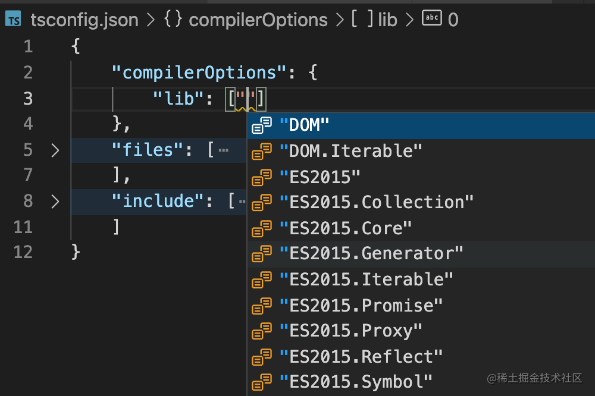
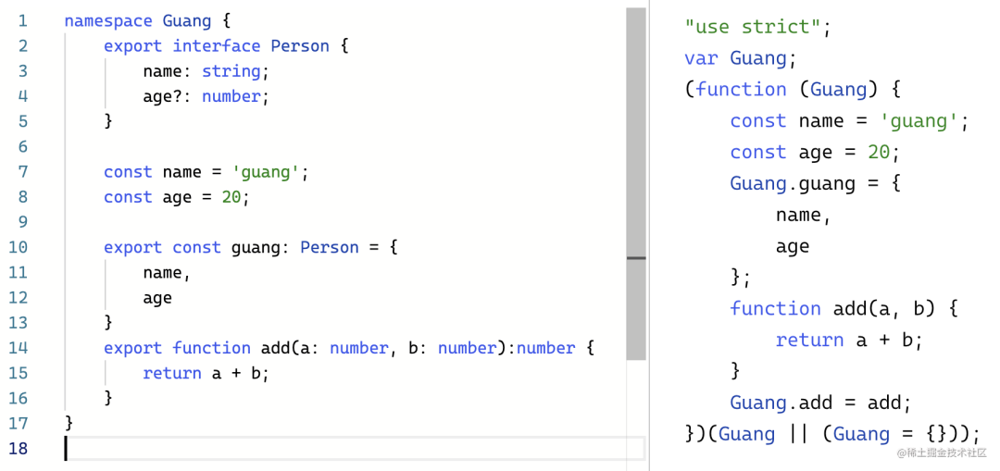

# 如何使用

## Hello TypeScript

```bash
npm install -g typescript
```

以上命令会在全局环境下安装 tsc 命令，安装完成之后，我们就可以在任何地方执行 tsc 命令了。

我们约定使用 TypeScript 编写的文件以 `.ts` 为后缀，用 TypeScript 编写 React 时，以 `.tsx`为后缀。

```ts
//hello.ts
function sayHello(person: string) {
  return "Hello, " + person;
}

let user = "Tom";
console.log(sayHello(user));
```

然后执行

```bash
tsc hello.ts
```

这时候会生成一个编译好的文件 `hello.js`：

```js
//hello.js
function sayHello(person) {
  return "Hello, " + person;
}
var user = "Tom";
console.log(sayHello(user));
```

可以使用 `tsc -w`来启用 TypeScript 编译器的观测模式，在检测到文件改动之后，它将重新编译。

在 TypeScript 中，我们使用 ':' 指定变量的类型，':' 的前后有没有空格都可以。

上述例子中，我们用 ':' 指定 person 参数类型为 string。但是编译为 js 之后，并没有什么检查的代码被插入进来。这是因为 **TypeScript 只会在编译时对类型进行静态检查，如果发现有错误，编译的时候就会报错**。而在运行时，与普通的 JavaScript 文件一样，不会对类型进行检查。

**TypeScript 编译的时候即使报错了，还是会生成编译结果**，我们仍然可以使用这个编译之后的文件。如果要在报错的时候终止 js 文件的生成，可以在 `tsconfig.json` 中配置 `noEmitOnError` 即可

## tsconfig.json

```json
{}
```

在项目的根目录下创建一个空 JSON 文件。通过这种方式，TypeScript 将 会把此目录和子目录下的所有 .ts 文件作为编译上下文的一部分，它还会包含一部分默认的编译选项

可以通过 `compilerOptions` 来定制你的编译选项

```json
{
  "compilerOptions": {
    /* 基本选项 */
    "target": "esnext", // 指定 ECMAScript 目标版本: 'ES3' (default), 'ES5', 'ES6'/'ES2015', 'ES2016', 'ES2017', or 'ESNEXT'
    "module": "esnext", // 指定使用模块: 'commonjs', 'amd', 'system', 'umd' or 'es2015'
    "lib": ["esnext", "dom"], // 指定要包含在编译中的库文件
    "allowJs": true, // 允许编译 javascript 文件
    "checkJs": true, // 报告 javascript 文件中的错误
    "jsx": "preserve", // 指定 jsx 代码的生成: 'preserve', 'react-native', or 'react'
    "declaration": true, // 生成相应的 '.d.ts' 文件
    "sourceMap": true, // 生成相应的 '.map' 文件
    "outFile": "./", // 将输出文件合并为一个文件
    "outDir": "./", // 指定输出目录
    "rootDir": "./", // 用来控制输出目录结构 --outDir.
    "removeComments": true, // 删除编译后的所有的注释
    "noEmit": true, // 不生成输出文件
    "importHelpers": true, // 从 tslib 导入辅助工具函数
    "isolatedModules": true, // 将每个文件作为单独的模块 （与 'ts.transpileModule' 类似）.

    /* 严格的类型检查选项 */
    "strict": true, // 启用所有严格类型检查选项
    "noImplicitAny": true, // 在表达式和声明上有隐含的 any类型时报错
    "strictNullChecks": true, // 启用严格的 null 检查
    "noImplicitThis": true, // 当 this 表达式值为 any 类型的时候，生成一个错误
    "alwaysStrict": true, // 以严格模式检查每个模块，并在每个文件里加入 'use strict'

    /* 额外的检查 */
    "noUnusedLocals": true, // 有未使用的变量时，抛出错误
    "noUnusedParameters": true, // 有未使用的参数时，抛出错误
    "noImplicitReturns": true, // 并不是所有函数里的代码都有返回值时，抛出错误
    "noFallthroughCasesInSwitch": true, // 报告 switch 语句的 fallthrough 错误。（即，不允许 switch 的 case 语句贯穿）

    /* 模块解析选项 */
    "moduleResolution": "node", // 选择模块解析策略： 'node' (Node.js) or 'classic' (TypeScript pre-1.6)
    "baseUrl": "./", // 用于解析非相对模块名称的基目录
    "paths": {}, // 模块名到基于 baseUrl 的路径映射的列表
    "rootDirs": [], // 根文件夹列表，其组合内容表示项目运行时的结构内容
    "typeRoots": [], // 包含类型声明的文件列表
    "types": [], // 需要包含的类型声明文件名列表
    "allowSyntheticDefaultImports": true, // 允许从没有设置默认导出的模块中默认导入。

    /* Source Map Options */
    "sourceRoot": "./", // 指定调试器应该找到 TypeScript 文件而不是源文件的位置
    "mapRoot": "./", // 指定调试器应该找到映射文件而不是生成文件的位置
    "inlineSourceMap": true, // 生成单个 soucemaps 文件，而不是将 sourcemaps 生成不同的文件
    "inlineSources": true, // 将代码与 sourcemaps 生成到一个文件中，要求同时设置了 --inlineSourceMap 或 --sourceMap 属性

    /* 其他选项 */
    "experimentalDecorators": true, // 启用装饰器
    "emitDecoratorMetadata": true // 为装饰器提供元数据的支持
  }
}
```

可以使用 include 和 exclude 选项来指定需要包含的文件和排除的文件

```json
{
  "include": ["./src"],
  "exclude": ["./src/**/*.spec.ts", "./src/someSubFolder"]
}
```

> 使用 globs：`**/*` （一个示例用法：`src/**/*`）意味着匹配所有的文件夹和所有文件（扩展名为 .ts/.tsx，当开启了 allowJs: true 选项时，扩展名可以是 .js/.jsx）。

## [类型声明来源](https://mp.weixin.qq.com/s/AsTrGLhipd32RrNUFHuD5A)

我们平常使用的 HTMLElement、Event 等内置 api 是如何有类型提示的？ts 提供以下几种类型声明的来源

### lib 中内置的类型声明

`TypeScript` 设计了 `declare` 的语法，可以单独声明变量的类型：

```typescript
// 对象
interface Person {
  name: string;
  age?: number;
}
declare const guang: Person;

// 函数
declare function add(num1: number, num2: number): number;
```

这样单独声明了类型，使用这些 api 的时候也就能做类型检查。

像 JS 引擎那些 api，还有浏览器提供的 api，这些基本是必用的，而且都有标准的。所以 `TypeScript` 给内置了它们的类型声明，放在了`TypeScript` 包下的 `lib` 目录，使用的时候在`tsconfig.json` 里配置下 `compilerOptions.lib`，就可以引入对应的 `d.ts` 的类型声明文件。



### @types/xx

ts 内置的类型声明只有 dom 和 es ，node 等环境的 api 因为没有标准而没有被 TS 内置，但 TS 同样也支持了这些环境的类型声明的配置。

方式是通过 `@types/xxx` 的包，TS 会先加载内置的 lib 的类型声明，然后再去查找 @types 包下的类型声明。这样，其他环境的类型声明就可以通过这种方式来扩展。在`tsconfig.json` 里配置 `compilerOptions.typeRoots`，可以修改查找 @types 包的目录

这种方式也可以给 JS 包加上类型声明，js 包如果本身是 ts 写的，编译的时候就可以开启 `compilerOptions.declaration`，来生成 `d.ts` 文件，然后在 `package.json` 里配置 `types` 来指定 `d.ts` 的位置，这样就不需要单独的 `@types` 包了。但如果代码不是用 ts 写的，那可能就需要单独写一个 `@types/xxx` 的包来声明 ts 类型

### include + files

开发者自己写的类型声明可以通过在`tsconfig.json` 里配置 `include`等属性引入

tsc 在编译的时候，会分别加载 `lib` 的，`@types` 下的，还有 `include` 和 `files` 的文件，进行类型检查。

### 总结

除了在变量声明时定义类型外，TS 也支持通过 `declare` 单独声明类型。只存放类型声明的文件后缀是 `d.ts`。

TypeScript 存放类型声明的地方：

- `lib`：内置的类型声明，包含 dom 和 es 的，因为这俩都是有标准的。

- `@types/xx`：其他环境的 api 类型声明，比如 node，还有 npm 包的类型声明

- 开发者写的代码：通过 include + exclude 还有 files 指定

其中，npm 包也可以同时存放 ts 类型，通过 `packages.json` 的 `types` 字段指定路径即可。

常见的是 vue 的类型是存放在 npm 包下的，而 react 的类型是在 `@types/react` 里的。因为源码一个是 ts 写的，一个不是。

## [类型声明方式](https://mp.weixin.qq.com/s/AsTrGLhipd32RrNUFHuD5A)

### namespace

TS 最早支持的模块化方案是 `namespace`

```typescript
namespace Guang {
  export interface Person {
    name: string;
    age?: number;
  }

  const name = "guang";
  const age = 20;

  export const guang: Person = {
    name,
    age,
  };
  export function add(a: number, b: number): number {
    return a + b;
  }
}
```

编译后的代码



### declare module

后来出现了 `CommonJS` 的规范，那种不能叫 `namespace` 了，所以 TS 支持了 `module`

`@types/node` 的 api 定义就是一堆的 `module`

```typescript
declare module 'fs/promises' {
    import { Abortable } from 'node:events';
    import { Stream } from 'node:stream';
    import {
        Stats,
        BigIntStats,
        StatOptions,
        WriteVResult,
        ReadVResult,
        PathLike,
        RmDirOptions,
        RmOptions,
        MakeDirectoryOptions,
        Dirent,
        OpenDirOptions,
        Dir,
        ObjectEncodingOptions,
        BufferEncodingOption,
        OpenMode,
        Mode,
        WatchOptions,
        WatchEventType,
        CopyOptions,
        ReadStream,
        WriteStream,
    } from 'node:fs';
    interface FileChangeInfo<T extends string | Buffer> {
        eventType: WatchEventType;
        filename: T;
    }
    ...
}
```

### es module

后来 JS 有了 `es module` 规范，所以现在推荐直接用 `import` `export` 的方式来声明模块和导入导出了。

有了 `es module` 之后，TS 有了一个单独的设计：`d.ts` 中，**如果没有 `import`、`export` 语法，那所有的类型声明都是全局的，否则是模块内的。**

在模块内如果要定义全局类型，可以使用`declare global`

```typescript
import * as fs from "fs";

declare global {
  const func: () => number;
}
```

不止是 `es module` 的模块里可以用 `global` 声明全局类型，`module` 的方式声明的 `CommonJS` 模块也是可以的

```typescript
declare module "buffer" {
  global {
    type BufferEncoding =
      | "ascii"
      | "utf8"
      | "utf-8"
      | "utf16le"
      | "ucs2"
      | "ucs-2"
      | "base64"
      | "base64url"
      | "latin1"
      | "binary"
      | "hex";
  }
}
```

当需要引入模块，又想类型声明依然是全局的时，可以使用`编译器指令 reference`

```typescript
// Reference required types from the default lib:
/// <reference lib="es2020" />
/// <reference lib="esnext.asynciterable" />
/// <reference lib="esnext.intl" />
/// <reference lib="esnext.bigint" />

// Base definitions for all NodeJS modules that are not specific to any version of TypeScript:
/// <reference path="assert.d.ts" />
/// <reference path="assert/strict.d.ts" />
...
```

这样既可以引入类型声明，又不会导致所有类型声明都变为模块内的

### 总结

TS 声明模块的方式

- `namespace`：最早的实现模块的方式，编译为声明对象和设置对象的属性的 JS 代码，很容易理解

- `module`：和 namespace 的 AST 没有任何区别，只不过一般用来声明 CommonJS 的模块，在 @types/node 下有很多

- `es module`：es 标准的模块语法，ts 额外扩展了 import type

`d.ts` 的类型声明默认是全局的，除非有 `es module` 的 `import`、`export` 的声明，这时候就要手动 `declare global` 了。为了避免这种情况，可以用 `reference` 的编译器指令。

## 模块

### 模块路径动态查找

当导入路径不是相对路径时，模块解析将会模仿 Node 模块解析策略

- 当你使用 `import \* as foo from 'foo'`，将会按如下顺序查找模块：

  `./node_modules/foo`

  `../node_modules/foo`

  直到系统的根目录

- 当你使用 `import \* as foo from 'something/foo'`，将会按照如下顺序查找内容

  `./node_modules/something/foo`

  `../node_modules/something/foo`

  直到系统的根目录

TypeScript 将会检查以下内容

- 路径表示一个文件，如：`foo.ts`
- 路径是一个文件夹，并且存在一个文件 `foo/index.ts`
- 路径是一个文件夹，并且存在一个 `package.json` 文件，在该文件中指定 `types` 的文件存在
- 路径是一个文件夹，并且存在一个 `package.json` 文件，在该文件中指定 `main` 的文件存在

文件类型是指 .ts，.d.ts 或者 .js

### 重写类型的动态查找

可以通过 declare module 'somePath' 声明一个全局模块的方式，来解决查找模块路径的问题。

```javascript
// global.d.ts
declare module 'foo' {
  // some variable declarations
  export var bar: number;
}
```

```javascript
// anyOtherTsFileInYourProject.ts
import * as foo from "foo";
// TypeScript 将假设（在没有做其他查找的情况下）
// foo 是 { bar: number }
```

> 在 d.ts 中，使用 declare 与 declare global 两个作用是相等的。那么什么时候使用 declare, 又什么时候使用 declare global？
>
> 在模块文件中定义 declare，如果想要用作全局就可以使用 declare global 完成该需求。

## 工具类型

### Readonly

Readonly 可以将类型转换为只读对象，使用方式是 `Readonly<T>`。

```javascript
interface Person {
  name: string;
}
type Person2 = Readonly<Person>;

const a: Person2 = {
  name: "wangly19",
};

const b: Person = {
  name: "wangly19",
};

a.name = "wangly19 new"; // 报错
b.name = "wangly19 new";
```

### Record

Record 能够快速创建对象类型。它的使用方式是`Record<K, V>`，能够快速的为 object 创建统一的 key 和 value 类型。

```javascript
const test: Record<string, string> = {
  name: 1, //报错：Type 'number' is not assignable to type 'string'.
};
```

### Pick & Omit

**Pick**：主要作用是从一组属性中拿出某个属性，并将其返回，使用方法是`Pick<P, K>`

```javascript
type Pick<T, K extends keyof T> = {
    [P in K]: T[P];
};
```

```javascript
interface Person {
  name: string
  age: number
}
type test = Pick<Person, 'age'> // type test = {age: number;}
```

**Omit**：主要作用是从一组属性中排除某个属性，并将排除属性后的结果返回。使用方法是`Omit<P, K>`，与 Pick 的结果是相反的，如果说 Pick 是取出，那么 Omit 则是过滤的效果

```javascript
interface Person {
  name: string
  age: number
}
type test = Omit<Person, 'age'> // type test = {name: string;}
type test = Omit<Person, 'age'|'name'> // 去除多个
```

重写原有字段的类型

```javascript
type test = Omit<Person, "age"> & {
  age: string,
};
```

### Exclude & Extract

**Exclude**：从一个联合类型中排除掉属于另一个联合类型的子集，使用形式是`Exclude<T, S>`，如果 T 中的属性在 S 不存在那么就会返回。

```javascript
interface A {
    show: boolean,
    hidden: boolean,
    status: string
}

interface B {
    show: boolean,
    name: string
}
type outPut = Exclude<keyof A, keyof B> // type outPut = "hidden" | "status"
```

**Extract**：跟 Exclude 相反，从一个联合类型中取出属于另一个联合类型的子集

```javascript
interface A {
    show: boolean,
    hidden: boolean,
    status: string
}

interface B {
    show: boolean,
    name: string
}
type outPut = Extract<keyof A, keyof B>// type outPut = "show"
```

### Partial

Partial 是一个将类型转为可选类型的工具，对于不明确的类型来说，需要将所有的属性转化为可选的?.形式，转换成为可选的属性类型。

```javascript
interface Person {
  name: string
  age: number
}
type test = Partial<Person> // {name?: string,age?: number}
```

### Required

将类型中所有选项变为必选，去除所有？

```javascript
interface Person {
  name?: string
  age?: number
}
type test = Person<Person> // {name: string,age: number}
```

### NonNullable

`NonNullable<Type>`会将 `null`、`never `和 `undefined`从 `Type` 中排除掉，不会剔除 `void`、`unknow` 类型，由剩余类型组成一个新的类型

```javascript
type T01 = NonNullable<string | number | undefined>; // string | number

type T02 = NonNullable<(() => string) | string[] | null | undefined>; // (() => string) | string[]
```

### ConstructorParameters

返回 class 中构造函数参数类型组成的 元组类型

定义

```javascript
/**
 * Obtain the parameters of a constructor function type in a tuple
 */
type ConstructorParameters<T extends new (...args: any) => any> = T extends new (...args: infer P) => any ? P : never;
```

使用

```javascript
class Person {
  name: string;
  age: number;
  weight: number;
  gender: "man" | "women";

  constructor(name: string, age: number, gender: "man" | "women") {
    this.name = name;
    this.age = age;
    this.gender = gender;
  }
}

type ConstructorType = ConstructorParameters<typeof Person>; //  [name: string, age: number, gender: "man" | "women"]

const params: ConstructorType = ["Jack", 20, "man"];
```

### InstanceType

获取 class 构造函数的返回类型

定义

```javascript
/**
 * Obtain the return type of a constructor function type
 */
type InstanceType<T extends new (...args: any) => any> = T extends new (...args: any) => infer R ? R : any;
```

使用

```javascript
class Person {
  name: string;
  age: number;
  weight: number;
  gender: "man" | "women";

  constructor(name: string, age: number, gender: "man" | "women") {
    this.name = name;
    this.age = age;
    this.gender = gender;
  }
}

type Instance = InstanceType<typeof Person>; // Person

const params: Instance = {
  name: "Jack",
  age: 20,
  weight: 120,
  gender: "man",
};
```

### Parameters

获取函数的参数类型组成的元组

定义

```javascript
/**
 * Obtain the parameters of a function type in a tuple
 */
type Parameters<T extends (...args: any) => any> = T extends (...args: infer P) => any ? P : never;
```

使用

```javascript
type FunctionType = (name: string, age: number) => boolean;
type FunctionParamsType = Parameters<FunctionType>; // [name: string, age: number]
const params: FunctionParamsType = ["Jack", 20];
```

### ReturnType

获取函数的返回值类型

定义

```javascript
/**
 * Obtain the return type of a function type
 */
type ReturnType<T extends (...args: any) => any> = T extends (...args: any) => infer R ? R : any;
```

使用

```javascript
type FunctionType = (name: string, age: number) => boolean | string;

type FunctionReturnType = ReturnType<FunctionType>; // boolean | string
```

## 高级概念

### 分发

分发的概念和 `Conditional Types`（条件类型） 息息相关

```ts
// 当泛型 T 满足 string 类型的约束时，它会返回 true ，否则则会返回 false 类型
type isString<T> = T extends string ? true : false;

// a 的类型为 true
let a: isString<"a">;
```

条件类型看起来和三元表达式非常相似，甚至你完全可以将它理解成为三元表达式。只不过它接受的是类型以及判断的是类型而已。

> 需要注意的是条件类型 a extends b ? c : d 仅仅支持在 type 关键字中使用

了解了泛型约束之后，我们在回到所谓分发的概念上来

```ts
type GetSomeType<T extends string | number> = T extends string ? "a" : "b";

let someTypeOne: GetSomeType<string>; // someTypeone 类型为 'a'

let someTypeTwo: GetSomeType<number>; // someTypeone 类型为 'b'

let someTypeThree: GetSomeType<string | number>; // someTypeone 类型为'a'|'b'
```

分发简单来说就是**分别使用 string 和 number 这两个类型进入 GetSomeType 中进行判断，最终返回两次类型结果组成的联合类型**

```js
// 伪代码：GetSomeType<string | number> = GetSomeType<string> | GetSomeType<number>
let someTypeThree: GetSomeType<string | number>;
```

**满足分发的条件:**

- 分发一定是需要产生在 extends 产生的类型条件判断中，并且是前置类型
  比如`T extends string | number ? 'a' : 'b';` 产生分发效果的也只有 `extends` 关键字前的 T 类型，`string | number` 仅仅代表一种条件判断。

- 分发一定是要满足联合类型，只有联合类型才会产生分发（其他类型无法产生分发的效果，比如 & 交集中等等）

- 分发一定要满足所谓的裸类型中才会产生效果

  ```js
  // 此时的T并不是一个单独的”裸类型“T 而是 [T]
  type GetSomeType<T extends string | number | [string]> = [T] extends string[]
  ? 'a'
  : 'b';
  // 即使我们修改了对应的类型判断，仍然不会产生所谓的分发效果。因为[T]并不是一个裸类型
  // 只会产生一次判断  [string] | number extends string[]  ? 'a' : 'b'
  // someTypeThree 仍然只有 'b' 类型 ，如果进行了分发的话那么应该是 'a' | 'b'
  let someTypeThree: GetSomeType<[string] | number>;

  ```

**分发的作用：**

实现高级内置类型 `Exclude`

```ts
// 当满足条件时会得到 never。never 代表的是一个无法达到的类型，不会产生任何效果
type MyExclude<T, K> = T extends K ? nerve : T;

type TypeA = string | number | boolean | symbol;

type ExcludeSymbolType = MyExclude<TypeA, symbol | boolean>;
```

### 循环

TypeScript 中同样存在对于类型的循环语法(Mapping Type)，我们可以通过 `in` 关键字配合联合类型来对于类型进行迭代。

```ts
interface IProps {
  name: string;
  age: number;
  highSchool: string;
  university: string;
}

// IPropsKey类型为
// type IPropsKey = {
//  name: boolean;
//  age: boolean;
//  highSchool: boolean;
//  university: boolean;
//  }
type IPropsKey = { [K in keyof IProps]: boolean };
```

循环只能对对象进行一层的转化，并不能递归处理

我们可以通过条件判断和循环进行结合

```ts
type deepPartial<T> = {
  [K in keyof T]?: T[K] extends object ? deepPartial<T[K]> : T[K];
};
```

**循环的作用：**

实现高级内置类型 `Partial`

```ts
interface IInfo {
  name: string;
  age: number;
}

type MyPartial<T> = { [K in keyof T]?: T[K] };

type OptionalInfo = MyPartial<IInfo>;
```

### 协变与逆变

在了解协变与逆变之前我们需要知道一个概念——子类型。我们前面提到过 string 可以赋值给 unknown 那么就可以理解为 string 是 unknown 的子类型。正常情况下这个关系即子类型可以赋值给父类型是不会改变的我们称之为**协变**，但是在某种情况下两者会出现颠倒我们称这种关系为**逆变**。

```javascript
interface Animal {
  name: string;
}

interface Cat extends Animal {
  catBark: string;
}

interface OrangeCat extends Cat {
  color: "orange";
}

// 以上从属关系
// OrangeCat 是 Cat 的子类型
// Cat 是 Animal 的子类型
// 同理 OrangeCat 也是 Animal 的子类型

const cat: Cat = {
  name: "猫猫",
  catBark: "喵~~",
};
const animal: Animal = cat; // no error
```

上述代码因为 Cat 的类型定义中完全包括 Animal 的类型定义，所以 Cat 类型完全是可以赋值给 Animal 类型，这被称为**类型兼容性**。通俗来说也就是多的可以赋值给少的

再看一种情况，假设我有类型 `type FnCat = (value: Cat) => Cat;` 请问下面四个谁是它的子类型，即以下那个类型可以赋值给它。

```javascript
type FnAnimal = (value: Animal) => Animal;
type FnOrangeCat = (value: OrangeCat) => OrangeCat;
type FnAnimalOrangeCat = (value: Animal) => OrangeCat;
type FnOrangeCatAnima = (value: OrangeCat) => Animal;

type RES1 = FnAnimal extends FnCat ? true : false; // false
type RES2 = FnOrangeCat extends FnCat ? true : false; // false
type RES3 = FnAnimalOrangeCat extends FnCat ? true : false; // true
type RES4 = FnOrangeCatAnima extends FnCat ? true : false; // false
```

**返回值：** 假设使用了 FnCat 返回值的 cat.catBark 属性，如果返回值是 Animal 则不会有这个属性，会导致调用出错。估计返回值只能是 OrangeCat。

**参数：** 假设传入的函数中使用了 orangeCat.color 但是，对外的类型参数还是 Cat 没有 color 属性，就会导致该函数运行时内部报错。

**故可以得出结论：返回值是协变，入参是逆变。**

#### 逆变

```ts
let fn1!: (a: string, b: number) => void;
let fn2!: (a: string, b: number, c: boolean) => void;

fn1 = fn2; // TS Error: 不能将fn2的类型赋值给fn1

fn2 = fn1; // 正确，被允许
```

fn1 在执行时仅仅需要两个参数`a: string, b: number`，显然 fn2 的类型定义中是满足这个条件的（当然它还多传递了第三个参数 `c:boolean`，在 JS 中对于函数而言调用时的参数个数大于定义时的参数个数是被允许的）。

就比如上述函数的参数类型赋值就被称为**逆变**，参数少（父）的可以赋给参数多（子）的那一个。看起来和类型兼容性（多的可以赋给少的）相反，但是通过调用的角度来考虑的话恰恰满足多的可以赋给少的兼容性原则。

再来看一个稍微复杂点的例子来加深所谓逆变的理解:

```ts
class Parent {}

// Son继承了Parent 并且比parent多了一个实例属性 name
class Son extends Parent {
  public name: string = "19Qingfeng";
}

// GrandSon继承了Son 在Son的基础上额外多了一个age属性
class Grandson extends Son {
  public age: number = 3;
}

// 分别创建父子实例
const son = new Son();

function someThing(cb: (param: Son) => any) {
  // do some someThing
  // 注意：这里调用函数的时候传入的实参是Son
  cb(Son);
}

someThing((param: Grandson) => param); // error
someThing((param: Parent) => param); // correct
```

刚才我们提到过函数的参数的方式被称为逆变，所以当我们调用 someThing 时传递的 callback 需要赋给定义 something 函数中的 cb 。

换句话说类型 `(param: Grandson) => param` 需要赋给 `cb: (param: Son) => any`，这显然是不被允许的。

相反，第二个`someThing((param: Parent) => param);`相当于函数参数重将 Parent 赋给 Son 将少的赋给多的满足逆变，所以是正确的。

从另一个角度解释，someThing 会在 cb 函数调用时传入一个 Son 参数的实参。所以当我们传入 `someThing((param: Parent) => param)` 时，相当于在 something 函数内部调用 `(param: Parent) => param` 时会根据 someThing 中 callback 的定义传入一个 Son 。Son 是 Parent 的子类，涵盖所有 Parent 的公共属性方法，自然也是满足条件的。

#### 协变

函数类型赋值兼容时函数的返回值就是典型的协变场景

```ts
let fn1!: (a: string, b: number) => string;
let fn2!: (a: string, b: number) => string | number | boolean;

fn2 = fn1; // correct
fn1 = fn2; // error: 不可以将 string|number|boolean 赋给 string 类型
```

显然 `string | number | boolean` 是无法分配给 `string` 类型的，但是 `string` 类型是满足 `string | number | boolean` 其中之一，所以自然可以赋值给 `string | number | boolean` 组成的联合类型。

### 待推断类型 infer

`infer` 代表待推断类型，它的必须和 `extends` 条件约束类型一起使用。

在条件类型约束中为我们提供了 `infer` 关键字来提供实现更多的类型可能，它表示我们可以在条件类型中推断一些暂时无法确定的类型

```ts
type Flatten<Type> = Type extends Array<infer Item> ? Item : Type;

type SubType = Flatten<string>; // string
type SubType = Flatten<[string, number]>; // string|number
```

其中 `Item` 取决于传进来的 `Type`，我们类型定义时并不能立即确定某些类型，而是在使用类型时来根据条件来推断对应的类型。

因为数组中的元素可能为 `string` 也可能为 `number`，自然在使用类型时 `infer Item` 会将待推断的 Item 推断为 `string | number` 联合类型。

> 需要注意的是 `infer` 关键字类型，必须结合 `Conditional Types` 条件判断来使用。

**infer 的使用：**

在 TS 中存在一个内置类型 `Parameters` ，它接受传入一个函数类型作为泛型参数并且会返回这个函数所有的参数类型组成的元祖。

```ts
// 定义函数类型
interface IFn {
  (age: number, name: string): void;
}

type FnParameters = Parameters<IFn>; // [age: number, name: string]

let a: FnParameters = [25, "test"];
```

实现如下

```ts
type MyParameters<T extends (...args: any) => any> = T extends (
  ...args: infer R
) => any
  ? R
  : never;
```

> 参考链接：
> [如何进阶 TypeScript 功底？一文带你理解 TS 中各种高级语法](https://juejin.cn/post/7089809919251054628)

## 小技巧

### 使用模板字符串重映射键名

当我们期望复制一个接口，并让生成接口在键名上做变更时，我们可以基于模板字面量类型修改键名。

```ts
interface Raw {
  type: string;
  content: string;
  result: string;
}

type Processor<R extends Raw> = {
  [K in keyof R as `processed${Capitalize<string & K>}`]: R[K];
};

type Processed = Processor<Raw>;

interface Tmp {
  processedType: string;
  processedContent: string;
  processedResult: string;
}
```

### 使用映射类型（keyof）对索引类型做变换

```ts
type SplitObj<Obj> = {
  [Key in keyof Obj]: {
    [Key2 in Key]: Obj[Key2];
  };
}[keyof Obj];

// 使用
type Obj = {
  name: string;
  age: number;
  height: number;
};
// type res = {name:string}|{age:number}|{height:number}
type splitobj<Obj>
```

### 使用 extends 做类型判断

`Key extends string` 可判断 key 是否是 string 类型

```ts
type DFS<Obj> = {
  [Key in keyof Obj]: Key extends string
    ? Obj[Key] extends Record<string, any>
      ? Key | `${Key}.${DFS<Obj[Key]>}`
      : Key
    : never;
}[keyof Obj];

// 使用
type Template = {
  aaa: string;
  bbb: {
    cc: {
      dd: string;
    };
  };
  eee: {
    ff: string;
    gg: number;
  };
};
// "aaa" | "bbb" | "eee" | "bbb.cc" | "bbb.cc.dd" | "eee.ff"| "eee.gg"
type res = DFS<Template>;
```
