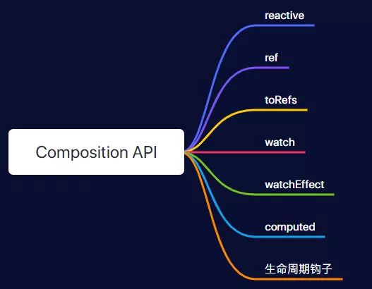
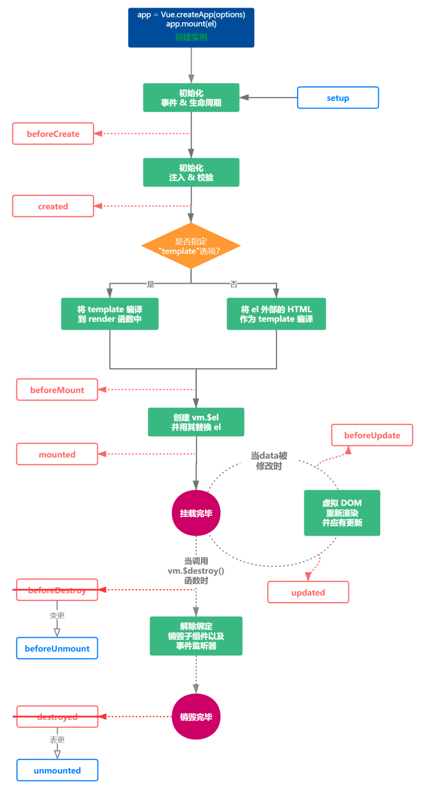
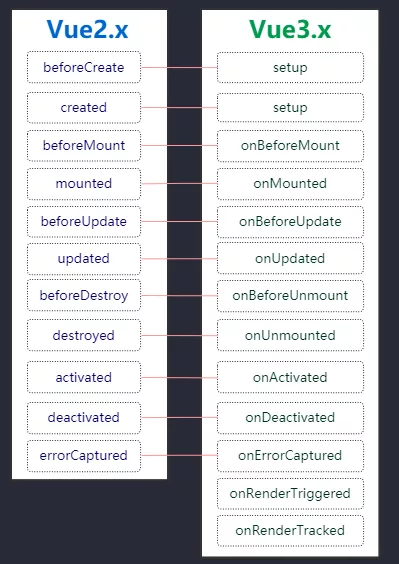
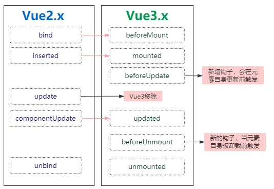

# 与 Vue2 不同点

## 组合式 API

### 为什么要用组合式 api?

虽然创建 Vue 组件，我们可以将界面中重复的部分连同其功能一起提取为可重用的代码段，但还不够，在大型项目中共享和重用代码变得尤为重要。

使用 (`data`、`computed`、`methods`、`watch`) 组件选项来组织逻辑通常都很有效。然而，当我们的组件开始变得更大时，**逻辑关注点**的列表也会增长。尤其对于那些一开始没有编写这些组件的人来说，这会导致组件难以阅读和理解。在处理单个逻辑关注点时，我们必须不断地“跳转”相关代码的选项块。

**vue2.x**版本给出的解决方案就是`Mixin`, 但是使用`Mixin`也会遇到让人苦恼的问题：

- 命名冲突问题
- 不清楚暴露出来的变量的作用
- 逻辑重用到其他 component 经常遇到问题

如果能够将同一个逻辑关注点相关代码收集在一起会更好。而这正是组合式 API 使我们能够做到的。

### 如何使用组合式 api?



为了开始使用组合式 API，我们首先需要一个可以实际使用它的地方。在 Vue 组件中，我们将此位置称为 `setup`。

> 在 `setup` 中你应该避免使用 `this`，因为它不会找到组件实例。`setup` 的调用发生在 `data` property、`computed` property 或 `methods` 被解析之前，所以它们无法在 `setup` 中被获取。

#### 带 `ref` 的响应式变量

在 Vue 3.0 中，我们可以通过一个新的 `ref` 函数使任何响应式变量在任何地方起作用，如下所示：

```js
import { ref } from "vue";
const counter = ref(0);
console.log(counter); // { value: 0 }
```

将值封装在一个对象中，这样我们就可以在整个应用中安全地传递它，而不必担心在某个地方失去它的响应性。`Number` 或 `String` 等基本类型是通过值而非引用传递的。换句话说，`ref` 为我们的值创建了一个**响应式引用**。

#### 在 `setup` 内使用 computer

```js
const multiple = computed(() => value * 2);
```

#### 在 `setup` 内使用 watch

```js
watch(user, getUserRepositories);
```

#### 在 `setup` 内注册生命周期钩子

为了使组合式 API 的功能和选项式 API 一样完整，我们还需要一种在 `setup` 中注册生命周期钩子的方法。组合式 API 上的生命周期钩子与选项式 API 的名称相同，但前缀为 `on`：即 `mounted` 看起来会像 `onMounted`。

```js
onMounted(getUserRepositories);
```

> 因为 `setup` 是在 `beforeCreate` 和 `created` 生命周期钩子之前运行的，所以不需要显式地定义它们。换句话说，在这些钩子中编写的任何代码都应该直接在 `setup` 函数中编写。

#### 使用示例

```js
// src/components/UserRepositories.vue `setup` function
import { fetchUserRepositories } from '@/api/repositories'
import { ref, onMounted, watch, toRefs,computed  } from 'vue'

export default {
  components: { RepositoriesFilters, RepositoriesSortBy, RepositoriesList },
  props: {
    user: {
      type: String,
      required: true
    }
  },
  setup (props) {
      // 使用 `toRefs` 创建对prop的 `user` property 的响应式引用,这是为了确保我们的侦听器能够根据 user prop 的变化做出反应。
      const { user } = toRefs(props)

      const repositories = ref([])
      const getUserRepositories = async () => {
        // 更新 `prop.user` 到 `user.value` 访问引用值
        repositories.value = await fetchUserRepositories(user.value)
      }

      onMounted(getUserRepositories)

      // 在 user prop 的响应式引用上设置一个侦听器
      watch(user, getUserRepositories)

      //computed输出的是一个只读的响应式引用。为了访问新创建的计算变量的 value，我们需要像 ref 一样使用 .value property。
      const searchQuery = ref('')
      const repositoriesMatchingSearchQuery = computed(() => {
        return repositories.value.filter(
          repository => repository.name.includes(searchQuery.value)
        )
      })

      return {
        repositories,
        getUserRepositories,
        searchQuery,
    	repositoriesMatchingSearchQuery
      }
   },
  data () {
    return {
      filters: { ... }, // 3
      searchQuery: '' // 2
    }
  },
  computed: {
    filteredRepositories () { ... }, // 3
    repositoriesMatchingSearchQuery () { ... }, // 2
  },
  watch: {
    user: 'getUserRepositories' // 1
  },
  methods: {
    updateFilters () { ... }, // 3
  },
  mounted () {
    this.getUserRepositories() // 1
  }
}
```

这样子我们只是把代码移到 `setup` 选项并使它变得非常大，我们还要将上述代码提取到一个独立的**组合式函数**中

更新功能

```js
// src/composables/useUserRepositories.js

import { fetchUserRepositories } from "@/api/repositories";
import { ref, onMounted, watch } from "vue";

export default function useUserRepositories(user) {
  const repositories = ref([]);
  const getUserRepositories = async () => {
    repositories.value = await fetchUserRepositories(user.value);
  };

  onMounted(getUserRepositories);
  watch(user, getUserRepositories);

  return {
    repositories,
    getUserRepositories,
  };
}
```

然后是搜索功能：

```js
// src/composables/useRepositoryNameSearch.js

import { ref, computed } from "vue";

export default function useRepositoryNameSearch(repositories) {
  const searchQuery = ref("");
  const repositoriesMatchingSearchQuery = computed(() => {
    return repositories.value.filter((repository) => {
      return repository.name.includes(searchQuery.value);
    });
  });

  return {
    searchQuery,
    repositoriesMatchingSearchQuery,
  };
}
```

现在我们有了两个单独的功能模块，接下来就可以开始在组件中使用它们了

```js
// src/components/UserRepositories.vue
import useUserRepositories from '@/composables/useUserRepositories'
import useRepositoryNameSearch from '@/composables/useRepositoryNameSearch'
import { toRefs } from 'vue'

export default {
  components: { RepositoriesFilters, RepositoriesSortBy, RepositoriesList },
  props: {
    user: {
      type: String,
      required: true
    }
  },
  setup (props) {
    const { user } = toRefs(props)

    const { repositories, getUserRepositories } = useUserRepositories(user)

    const {
      searchQuery,
      repositoriesMatchingSearchQuery
    } = useRepositoryNameSearch(repositories)

    // 在component API中使用computed示例
    const multiple = computed(() => repositories.value *2 )

    return {
      // 因为我们并不关心未经过滤的仓库
      // 我们可以在 `repositories` 名称下暴露过滤后的结果
      repositories: repositoriesMatchingSearchQuery,
      getUserRepositories,
      searchQuery,
    }
  },
  data () {
    return {
      filters: { ... }, // 3
    }
  },
  computed: {
    filteredRepositories () { ... }, // 3
  },
  methods: {
    updateFilters () { ... }, // 3
  }
}
```

### reactive、ref 、toRef 与 toRefs

在 vue2.x 中， 定义数据都是在 data 中， 但是 Vue3.x 可以使用 reactive、ref 、toRef 与 toRefs 来进行数据定义。

**reactive**

用于处理对象的双向绑定（不能用于基本类型）

**ref**

一般用于处理 js 基础类型的双向绑定（也可用于对象，对于基本数据类型，ref 是自己的实现方式且性能优于 reactive，而对于对象类型，ref 仍然是通过 reactive 包装实现的），ref 的本质是拷贝，与原始数据没有引用关系，因此当用于对象时，改变创建的响应式数据，原始数据并不会改变

```js
 setup() {
    const obj = {count:1, name:"张三"}
    const newObj = reactive({count:1, name:"张三"})
    const age = ref(0)
    const _count = ref(obj.count)
    setTimeout(() =>{
      newObj.name = "李四"
      age.value = 18
      _count.value = 2
    }, 1000)
    return{
      newObj,
      age
    }
  }
```

`ref(obj.count)`相当于 `ref(1)`相当于 `reactive({value:1})`，所以在修改数据时，是修改 `_count.value=xxx`

**toRef**

toRef 接收两个参数：源响应式对象和属性名， 将源响应式对象中的属性变成响应式数据，修改响应式数据是会影响到原始数据的，但是需要注意，**toRef 的本质是引用，与原始数据有关联**，且如果修改通过 toRef 创建的响应式数据，**并不会触发 UI 界面的更新。**

```js
import {toRef} from 'vue';
export default {
  name:'App'
  setup(){
    let obj = {name : 'alice', age : 12};
    let newObj= toRef(obj, 'name');
    function change(){
      newObj.value = 'Tom';
      console.log(obj,newObj)
    }
    return {newObj,change}
  }
}
```

上述代码，当 change 执行的时候，响应式数据发生改变，原始数据 obj 会改变，但是 UI 界面不会更新

`ref` 和 `toRef` 的区别

- ref 本质是拷贝，修改响应式数据不会影响原始数据；toRef 的本质是引用关系，修改响应式数据会影响原始数据
- ref 数据发生改变，界面会自动更新；toRef 当数据发生改变时，界面不会自动更新
- toRef 传参与 ref 不同；toRef 接收两个参数，第一个参数是哪个对象，第二个参数是对象的哪个属性

**toRefs**

toRefs 用于批量设置多个数据为响应式数据(toRef 一次仅能设置一个数据)，toRefs 接收一个对象作为参数，它会遍历对象身上的所有属性，然后挨个调用 toRef 执行。常用于 es6 的解构赋值操作，因为在对一个响应式对象直接解构时解构后的数据将不再有响应式，而使用 toRefs 可以方便解决这一问题。

之前代码中，我们绑定到页面是通过`obj.name`，`obj.count`，这样写很繁琐，我们能不能直接将 user 中的属性解构出来使用呢？答案是不能直接对 user 进行结构， 这样会消除它的响应式，解决办法就是使用 toRefs

```vue
<template>
  <div class="homePage">
    <p>第 {{ year }} 年</p>
    <p>姓名： {{ nickname }}</p>
    <p>年龄： {{ age }}</p>
  </div>
</template>

<script>
import { defineComponent, reactive, ref, toRefs } from "vue";
export default defineComponent({
  setup() {
    const year = ref(0);
    const user = reactive({ nickname: "xiaofan", age: 26, gender: "女" });
    setInterval(() => {
      year.value++;
      user.age++;
    }, 1000);
    return {
      year,
      // 使用reRefs
      ...toRefs(user),
    };
  },
});
</script>
```

**总结**

|          | 处理数据类型       | 获取数据值方式 | 原始数据变化 | 模板变化 |
| -------- | ------------------ | -------------- | ------------ | -------- |
| ref      | 主要是基本数据类型 | .value         | 无           | 有       |
| reactive | 对象，数组         | 无需加.value   | 有           | 有       |
| toRef    | 对象属性           | .value         | 有           | 无       |
| toRefs   | 对象               | .value         | 有           | 无       |

- setup 里定义数据时推荐优先使用 ref，方便逻辑拆分和业务解耦。

### 生命周期

Vue3.0 新增了`setup`，然后是将 Vue2.x 中的`beforeDestroy`名称变更成`beforeUnmount`; `destroyed` 表更为 `unmounted`，作者说这么变更纯粹是为了更加语义化，因为一个组件是一个`mount`和`unmount`的过程。其他 Vue2 中的生命周期仍然保留。



所有生命周期钩子如下



Vue3 中仍然可以使用`beforeCreate`和`created`， 因为 Vue3 是向下兼容的， 也就是你实际使用的是 vue2 的。其次，钩子命名都增加了`on`；Vue3.x 还新增用于调试的钩子函数`onRenderTriggered`和`onRenderTricked`

其中需要注意的是

- Vue3.x 中的钩子是需要从 vue 中导入的
- vue3.x 生命周期写在 setup 中

```js
import {
  defineComponent,
  onBeforeMount,
  onMounted,
  onBeforeUpdate,
  onUpdated,
  onBeforeUnmount,
  onUnmounted,
  onErrorCaptured,
  onRenderTracked,
  onRenderTriggered,
} from "vue";

export default defineComponent({
  // beforeCreate和created是vue2的
  beforeCreate() {
    console.log("------beforeCreate-----");
  },
  created() {
    console.log("------created-----");
  },
  setup() {
    console.log("------setup-----");

    // vue3.x生命周期写在setup中
    onBeforeMount(() => {
      console.log("------onBeforeMount-----");
    });
    onMounted(() => {
      console.log("------onMounted-----");
    });
    // 调试哪些数据发生了变化
    onRenderTriggered((event) => {
      //状态触发，它不会跟踪每一个值，而是给你变化值的信息，并且新值和旧值都会给你明确的展示出来。
      // event 对象属性
      //- key 那边变量发生了变化
      //- newValue 更新后变量的值
      //- oldValue 更新前变量的值
      //- target 目前页面中的响应变量和函数
      console.log("------onRenderTriggered-----", event);
    });
    onRenderTracked((event) => {
      //状态跟踪,它会跟踪页面上所有响应式变量和方法的状态，也就是我们用return返回去的值，它都会跟踪
      console.log("------onRenderTracked -----", event);
    });
  },
});
```

### watch 与 watchEffect 的用法

#### watch

watch 函数用来侦听特定的数据源，并在回调函数中执行副作用。默认情况是惰性的，也就是说仅在侦听的源数据变更时才执行回调。

```js
watch(source, callback, [options]);
```

参数说明：

- source:可以支持 `string`，`Object`，`Function`，`Array`; 用于指定要侦听的响应式变量
- callback: 执行的回调函数
- options：支持 ` deep`、`immediate ` 和 `flush` 选项。

```js
import { defineComponent, ref, reactive, toRefs, watch } from "vue";
export default defineComponent({
  setup() {
    const state = reactive({ nickname: "xiaofan", age: 20 });
    const year = ref(0);
    const state2 = reactive({
      room: {
        id: 100,
        attrs: {
          size: "140平方米",
          type: "三室两厅",
        },
      },
    });

    setTimeout(() => {
      state.age++;
      year.value++;
    }, 1000);

    //侦听reactive定义的数据
    watch(
      () => state.age,
      (curAge, preAge) => {
        console.log("新值:", curAge, "老值:", preAge);
      }
    );
    //侦听ref定义的数据
    watch(year, (newVal, oldVal) => {
      console.log("新值:", newVal, "老值:", oldVal);
    });
    //侦听多个数据
    watch([() => state.age, year], ([curAge, preAge], [newVal, oldVal]) => {
      console.log("新值:", curAge, "老值:", preAge);
      console.log("新值:", newVal, "老值:", oldVal);
    });
    //侦听复杂的嵌套对象,传递第三个参数
    const stopWatchRoom = watch(
      () => state.room,
      (newType, oldType) => {
        console.log("新值:", newType, "老值:", oldType);
      },
      { deep: true, immediate: true }
    );

    // 停止监听
    setTimeout(() => {
      stopWatchRoom();
    }, 3000);

    return {
      year,
      ...toRefs(state),
    };
  },
});
```

可以调用`watch()`函数的返回值停止掉某个监听，如上面最后一个 watch 监听器

#### watchEffect

`watchEffect`会自动收集依赖, 只要指定一个回调函数。在组件初始化时， 会先执行一次来收集依赖， 然后当收集到的依赖中数据发生变化时， 就会再次执行回调函数。所以总结对比如下：

- watchEffect 不需要手动传入依赖
- watchEffect 会先执行一次用来自动收集依赖
- watchEffect 无法获取到变化前的值， 只能获取变化后的值

```js
import { defineComponent, ref, reactive, toRefs, watchEffect } from "vue";
export default defineComponent({
  setup() {
    const state = reactive({ nickname: "xiaofan", age: 20 });
    let year = ref(0);

    setInterval(() => {
      state.age++;
      year.value++;
    }, 1000);

    watchEffect(() => {
      console.log(state);
      console.log(year);
    });

    return {
      ...toRefs(state),
    };
  },
});
```

### setup

使用 `setup` 函数时，它将接收两个参数：

1. `props`
2. `context`

在创建组件实例时，在初始 prop 解析之后立即调用 `setup`。在生命周期方面，它是在 [beforeCreate](https://www.vue3js.cn/docs/zh/api/options-lifecycle-hooks.html#beforecreate) 钩子之前调用的。如果 `setup` 返回一个对象，则该对象的属性将合并到组件模板的渲染上下文中：

**prop**

`props` 是响应式的，当传入新的 prop 时，它将被更新，并且可以通过使用 `watchEffect` 或 `watch` 进行观测和响应。使用 ES6 解构会消除 prop 的响应性。如果需要解构 prop，可以在 `setup` 函数中使用 [toRefs](https://v3.cn.vuejs.org/guide/reactivity-fundamentals.html#响应式状态解构) 函数来完成此操作：

```js
import { toRefs } from 'vue'

setup(props) {
  const { title } = toRefs(props)

  console.log(title.value)
}
```

如果 `title` 是可选的 prop，则传入的 `props` 中可能没有 `title` 。在这种情况下，`toRefs` 将不会为 `title` 创建一个 ref 。你需要使用 `toRef` 替代它：

```js
// MyBook.vue
import { toRef } from 'vue'
setup(props) {
  const title = toRef(props, 'title')
  console.log(title.value)
}
```

**Context**

`context` 是一个普通的 JavaScript 对象，它暴露组件的三个 property，它们不是响应式的，这意味着你可以安全地对 `context` 使用 ES6 解构。

```js
export default {
  setup(props, context) {
    // Attribute (非响应式对象)
    console.log(context.attrs)

    // 插槽 (非响应式对象)
    console.log(context.slots)

    // 触发事件 (方法)
    console.log(context.emit)
  }
}

export default {
  setup(props, { attrs, slots, emit }) {
    ...
  }
}
```

> **`attrs` 和 `slots` 是有状态的对象，它们总是会随组件本身的更新而更新**，是内部组件实例上相应值的代理。这样可以确保它们即使在更新后也始终会显示最新值。这意味着你应该避免对它们进行解构，并始终以 `attrs.x` 或 `slots.x` 的方式引用 property。请注意，与 `props` 不同，`attrs` 和 `slots` 是**非**响应式的。如果你打算根据 `attrs` 或 `slots` 更改应用副作用，那么应该在 `onUpdated` 生命周期钩子中执行此操作。

**访问组件的 property**

执行 `setup` 时，组件实例尚未被创建。因此，你只能访问以下 property：

- `props`
- `attrs`
- `slots`
- `emit`

换句话说，你**将无法访问**以下组件选项：

- `data`
- `computed`
- `methods`

如果`setup` 返回一个对象，那么该对象的 property 以及传递给 `setup` 的 `props` 参数中的 property 就都可以在模板中访问到

> setup 返回的 refs 在模板中访问时是被自动浅解包的，因此不应在模板中使用 .value

## Teleport

有时组件模板的一部分逻辑上属于该组件，而从技术角度来看，最好将模板的这一部分移动到 DOM 中 Vue app 之外的其他位置。

一个常见的场景是创建一个包含全屏模式的组件。在大多数情况下，你希望模态框的逻辑存在于组件中，但是模态框的快速定位就很难通过 CSS 来解决，或者需要更改组件组合。

从 dom 结构应该完全剥离 Vue 顶层组件挂载的 DOM；同时还可以使用到 Vue 组件内的状态（`data`或者`props`）的值。简单来说就是,**即希望继续在组件内部使用,又希望渲染的 DOM 结构不嵌套在组件的 DOM 中**。

**Teleport** 提供了一种干净的方法，允许我们控制在 DOM 中哪个父节点下渲染了 HTML，而不必求助于全局状态或将其拆分为两个组件。

```vue
app.component('modal-button', { template: `
<button @click="modalOpen = true">
        Open full screen modal! (With teleport!)
    </button>

<teleport to="body">
      <div v-if="modalOpen" class="modal">
        <div>
          I'm a teleported modal! 
          (My parent is "body")
          <button @click="modalOpen = false">
            Close
          </button>
        </div>
      </div>
    </teleport>
`, data() { return { modalOpen: false } } })
```

`teleport`将被渲染在 body 下

## 片段

Vue 3 现在正式支持了多根节点的组件，但要求开发者显式定义 attribute 应该分布在哪里

```html
<!-- Layout.vue -->
<template>
  <header>...</header>
  <main v-bind="$attrs">...</main>
  <footer>...</footer>
</template>
```

## 自定义事件

### 事件名

不同于组件和 prop，事件名不存在任何自动化的大小写转换。而是触发的事件名需要完全匹配监听这个事件所用的名称。举个例子，如果触发一个 camelCase 名字的事件：

```js
this.$emit("myEvent");
```

则监听这个名字的 kebab-case 版本是不会有任何效果的：

```html
<!-- 没有效果 -->
<my-component @my-event="doSomething"></my-component>
```

推荐始终使用 **kebab-case 的事件名**。

### 定义自定义事件

#### 验证抛出的事件

```js
const Comp = {
  emits: {
    submit: (payload) => {
      // validate payload by returning a boolean
    },
  },

  created() {
    this.$emit("submit", {
      /* payload */
    });
  },
};
```

vue3 中可以显示声明 emits，这对于其他开发人员立即了解该组件应该发出什么事件可能很有用。

对于简单的用例，选项值可以是包含字符串事件名称的 Array：

```js
{
  emits: [
    'eventA',
    'eventB'
  }
}
```

或者它可以是一个以事件名作为键的对象。每个属性的值可以是 null，也可以是 validator 函数。验证函数将接收传递给$emit 调用的附加参数。验证器函数应该返回一个布尔值来指示事件参数是否有效。

```js
{
  emits: {
    // no validation
    click: null,

    // with validation
    //
    submit: payload => {
      if (payload.email && payload.password) {
        return true
      } else {
        console.warn(`Invalid submit event payload!`)
        return false
      }
    }
  }
}
```

当在 `emits` 选项中定义了原生事件 (如 `click`) 时，将使用组件中的事件**替代**原生事件侦听器。

#### `v-model` 参数

**v-model 在 vue2.x 中的使用方式**

```html
<ChildComponent v-model="title" />
```

它实际上是下面这种写法的简写：

```html
<ChildComponent :value="title" @input="title = $event" />
```

也就是说，它实际上是传递一个属性`value`，然后接收一个`input`事件。但是它存在一个问题：那就是**传递下去的必须是`value`值，接收的也必须是`input`事件**

为了解决这个问题，在 Vue2.2 中引入了 model 组件选项，也即是说你可以通过 model 来指定`v-model`绑定的值和属性

```js
<ChildComponent v-model="title" />
```

在子组件中这样设置：

```js
export default {
  model: {
    prop: "title", // v-model绑定的属性名称
    event: "title-change", // v-model绑定的事件
  },
  props: {
    value: String, // value跟v-model无关
    title: {
      // title是跟v-model绑定的属性
      type: String,
      default: "Default title",
    },
    methods: {
      changeTitle() {
        this.$emit("title-change", "111");
      },
    },
  },
};
```

通过上面的代码，我们可以看到通过设置 model 选项，我们就可以直接使用指定的属性和事件，而不需要必须使用`value`和`input`了，`value`和`input`可以另外它用了。

---

**v-model 在 vue3 中的使用方式**

默认情况下，组件上的 `v-model` 使用 `modelValue` 作为 prop 和 `update:modelValue` 作为事件。

```js
<ChildComponent v-model = "title">
```

它是下面这种写法的简写：

```js
<ChildComponent :modelValue = "title" @update:modelValue = "title = $event">
```

```js
export default defineComponent({
    name:"ValidateInput",
    props:{
        modelValue:String,   // v-model绑定的属性值
    },
    setup(){
        const updateValue = (e: KeyboardEvent) => {
          context.emit("update:modelValue",targetValue);   // 传递的方法
        }
    }
}
```

但是`modelValue`不太具备可读性，在子组件的`props`中看到这个都不知道是什么。 因此，我们希望能够更加见名知意。我们可以通过向 `v-model` 传递参数来修改这些名称：

```html
<my-component v-model:foo="bar"></my-component>
```

```vue
const app = Vue.createApp({})

app.component('my-component', {
  props: {
    foo: String
  },
  template: `
    <input
      type="text"
      :value="foo"
      @input="$emit('update:foo', $event.target.value)">
  `
})
```

**Vue3 中用 v-model 替代了.sync 修饰符和组件的 model 选项，`v-bind` 的 `.sync` 修饰符和组件的 `model` 选项已移除，可用 `v-model` 作为代替；**

#### 多个 `v-model` 绑定

```html
<user-name
  v-model:first-name="firstName"
  v-model:last-name="lastName"
></user-name>
```

```vue
const app = Vue.createApp({})

app.component('user-name', {
  props: {
    firstName: String,
    lastName: String
  },
  template: `
    <input
      type="text"
      :value="firstName"
      @input="$emit('update:firstName', $event.target.value)">

    <input
      type="text"
      :value="lastName"
      @input="$emit('update:lastName', $event.target.value)">
  `
})
```

#### 处理 `v-model` 修饰符

在 **2.x** 中，我们对组件 `v-model` 上的 `.trim` 等修饰符提供了硬编码支持。在 **3.x** 中，组件可以支持自定义修饰符，添加到组件 `v-model` 的修饰符将通过 `modelModifiers` prop 提供给组件：

当我们学习表单输入绑定时，我们看到 `v-model` 有[内置修饰符](https://vue3js.cn/docs/zh/guide/forms.html#modifiers)——`.trim`、`.number` 和 `.lazy`。但是，在某些情况下，你可能还需要添加自己的自定义修饰符。

```html
<div id="app">
  <my-component v-model.capitalize="myText"></my-component>
  {{ myText }}
</div>
```

```vue
const app = Vue.createApp({
  data() {
    return {
      myText: ''
    }
  }
})

app.component('my-component', {
  props: {
    modelValue: String,
    modelModifiers: {
      default: () => ({})
    }
  },
  methods: {
    emitValue(e) {
      let value = e.target.value
      if (this.modelModifiers.capitalize) {
        value = value.charAt(0).toUpperCase() + value.slice(1)
      }
      this.$emit('update:modelValue', value)
    }
  },
  template: `<input
    type="text"
    :value="modelValue"
    @input="emitValue">`
})

app.mount('#app')
```

当组件的 `created` 生命周期钩子触发时，`modelModifiers` prop 包含 `capitalize`，其值为 `true`——因为它被设置在 `v-model` 绑定`v-model.capitalize="bar"`。

上面代码通过检查 `modelModifiers` 对象键并编写一个处理器来更改发出的值。每当 `<input/>` 元素触发 input 事件时，我们都将字符串大写。

对于带参数的 `v-model` 绑定，生成的 prop 名称将为 `arg + "Modifiers"`：

```html
<my-component v-model:foo.capitalize="bar"></my-component>
```

```vue
app.component('my-component', {
  props: ['foo', 'fooModifiers'],
  template: `
    <input type="text"
      :value="foo"
      @input="$emit('update:foo', $event.target.value)">
  `,
  created() {
    console.log(this.fooModifiers) // { capitalize: true }
  }
})
```

## 全局 API

**Vue 2.x** 有许多全局 API 和配置，这些 API 和配置可以全局改变 Vue 的行为。例如，要创建全局组件，可以使用 `Vue.component` 这样的 API：

```js
Vue.component("button-counter", {
  data: () => ({
    count: 0,
  }),
  template: '<button @click="count++">Clicked {{ count }} times.</button>',
});
```

类似地，使用全局指令的声明方式如下：

```js
Vue.directive("focus", {
  inserted: (el) => el.focus(),
});
```

虽然这种声明方式很方便，但它也会导致一些问题。从技术上讲，Vue 2 没有“app”的概念，我们定义的应用只是通过 `new Vue()` 创建的根 Vue 实例。从同一个 Vue 构造函数**创建的每个根实例共享相同的全局配置**

```vue
new Vue( { components: { App }, router, store, template: '
<App />
' }).$mount('#app');
```

**vue3 有了一个新的全局 API：`createApp`**

调用 `createApp` 返回一个应用实例，这是 Vue 3 中的新概念：

```js
import { createApp } from "vue";

const app = createApp({});
```

应用实例暴露当前全局 API 的子集，经验法则是，**任何全局改变 Vue 行为的 API 现在都会移动到应用实例上**

所有其他不全局改变行为的全局 API 现在被命名为 exports，文档见[全局 API Treeshaking](https://vue3js.cn/docs/zh/guide/migration/global-api-treeshaking.html)。

| 2.x 全局 API               | 3.x 实例 API (`app`)                                                                                                                                  |
| -------------------------- | ----------------------------------------------------------------------------------------------------------------------------------------------------- |
| Vue.config                 | app.config                                                                                                                                            |
| Vue.config.productionTip   | _removed_ ([见下方](https://vue3js.cn/docs/zh/guide/migration/global-api.html#config-productiontip-removed))                                          |
| Vue.config.ignoredElements | app.config.isCustomElement ([见下方](https://vue3js.cn/docs/zh/guide/migration/global-api.html#config-ignoredelements-is-now-config-iscustomelement)) |
| Vue.component              | app.component                                                                                                                                         |
| Vue.directive              | app.directive                                                                                                                                         |
| Vue.mixin                  | app.mixin                                                                                                                                             |
| Vue.use                    | app.use ([见下方](https://vue3js.cn/docs/zh/guide/migration/global-api.html#a-note-for-plugin-authors))                                               |

**`config.productionTip` 移除**

在 Vue 3.x 中，“使用生产版本”提示仅在使用“dev + full build”(包含运行时编译器并有警告的构建) 时才会显示。

**use**

`use` 全局 API 在 Vue 3 中不再使用，此方法将停止工作并停止调用 `Vue.use()` 现在将触发警告，于是，开发者必须在应用程序实例上显式指定使用此插件：

```js
const app = createApp(MyApp);
app.use(VueRouter);
```

**挂载 App 实例**

使用 `createApp(/* options */)` 初始化后，应用实例 `app` 可用于挂载具有 `app.mount(domTarget)`：

```js
import { createApp } from "vue";
import MyApp from "./MyApp.vue";

const app = createApp(MyApp);
app.mount("#app");
```

**提供/注入 (Provide / Inject)**

与在 2.x 根实例中使用 `provide` 选项类似，Vue 3 应用实例还可以提供可由应用内的任何组件注入的依赖项(vue2 中将`provide`写在组件中的方式依然可以使用)：

```js
// 在入口
app.provide("guide", "Vue 3 Guide");

// 在子组件
export default {
  inject: {
    book: {
      from: "guide",
    },
  },
  //或者inject: ['guide'],
  template: `<div>{{ book }}</div>`,
};
```

**在应用之间共享配置**

在应用之间共享配置 (如组件或指令) 的一种方法是创建工厂功能，如下所示：

```js
import { createApp } from "vue";
import Foo from "./Foo.vue";
import Bar from "./Bar.vue";

const createMyApp = (options) => {
  const app = createApp(options);
  app.directive("focus" /* ... */);

  return app;
};

createMyApp(Foo).mount("#foo");
createMyApp(Bar).mount("#bar");
```

现在，Foo 和 Bar 实例及其后代中都可以使用 `focus` 指令。

## 全局 API Treeshaking

**2.x 语法**

如果你曾经在 Vue 中手动操作过 DOM，你可能会遇到以下模式：

```js
import Vue from "vue";

Vue.nextTick(() => {
  // 一些和DOM有关的东西
});
```

`Vue.nextTick()` 是一个全局的 API 直接暴露在单个 Vue 对象上——事实上，实例方法 `$nextTick()` 只是一个方便的包装 `Vue.nextTick()` 。为方便起见，回调的 `this` 上下文自动绑定到当前实例。

模块捆绑程序，如 [webpack](https://webpack.js.org/) 支持 [tree-shaking](https://vue3js.cn/docs/zh/guide/migration/网址：https:/webpack.js/webpack/js/)，这是“死代码消除”的一个花哨术语。不幸的是，由于代码是如何在以前的 Vue 版本中编写的，全局 API `Vue.nextTick()` 不可摇动，将包含在最终捆绑中不管它们实际在哪里使用。

**3.x 语法**

在 Vue 3 中，全局和内部 API 都经过了重构，并考虑到了 tree-shaking 的支持。因此，全局 API 现在只能作为 ES 模块构建的命名导出进行访问。例如，我们之前的片段现在应该如下所示：

```js
import { nextTick } from "vue";

nextTick(() => {
  // 一些和DOM有关的东西
});
```

**受影响的 API**

Vue 2.x 中的这些全局 API 受此更改的影响：

- `Vue.nextTick`
- `Vue.observable` (用 `Vue.reactive` 替换)
- `Vue.version`
- `Vue.compile` (仅全构建)
- `Vue.set` (仅兼容构建)
- `Vue.delete` (仅兼容构建)

除了公共 api，许多内部组件/帮助器现在也被导出为命名导出，只有当编译器的输出是这些特性时，才允许编译器导入这些特性

```html
<transition>
  <div v-show="ok">hello</div>
</transition>
```

被编译为类似于以下的内容：

```js
import { h, Transition, withDirectives, vShow } from "vue";

export function render() {
  return h(Transition, [withDirectives(h("div", "hello"), [[vShow, this.ok]])]);
}
```

这实际上意味着只有在应用程序实际使用了 `Transition` 组件时才会导入它。换句话说，如果应用程序没有任何 `Transition` 组件，那么支持此功能的代码将不会出现在最终的捆绑包中。随着全局 tree-shaking，，框架大小在将来已经不再是其他核心功能的考虑因素了，如果有的话，可选特性不会增加不使用它们的应用程序的捆绑包大小

## key attribute

- 对于 `v-if`/`v-else`/`v-else-if` 的各分支项 `key` 将不再是必须的，因为现在 Vue 会自动生成唯一的 `key`。如果你手动提供 `key`，那么每个分支必须使用唯一的 `key`。你不能通过故意使用相同的 `key` 来强制重用分支

- `<template v-for`> 的 key 应该设置在 `<template>` 标签上 (而不是设置在它的子节点上)。

**Vue 2.x**

Vue 2.x 建议在 `v-if`/`v-else`/`v-else-if` 的分支中使用 `key`。

```html
<!-- Vue 2.x -->
<div v-if="condition" key="yes">Yes</div>
<div v-else key="no">No</div>
```

这个示例在 Vue 3.x 中仍能正常工作。但是不再建议继续使用 `key` attribute，因为没有为条件分支提供 `key` 时，也会自动生成唯一的 `key`。

在 Vue 2.x 中 `<template>` 标签不能拥有 key。不过你可以为其每个子节点分别设置 key

```html
<!-- Vue 2.x -->
<template v-for="item in list">
  <div :key="item.id">...</div>
  <span :key="item.id">...</span>
</template>
```

在 Vue 3.x 中 key 则应该被设置在 `<template>` 标签上。

```html
<!-- Vue 3.x -->
<template v-for="item in list" :key="item.id">
  <div>...</div>
  <span>...</span>
</template>
```

## v-if 与 v-for 的优先级对比

**3.x** 两者作用于同一个元素上时，`v-if` 会拥有比 `v-for` 更高的优先级。即`v-if`中不能使用到`v-for`中的数据

**2.x** 版本中在一个元素上同时使用 `v-if` 和 `v-for` 时，`v-for` 会优先作用

由于语法上存在歧义，建议**避免**在同一元素上同时使用两者。比起在模板层面管理相关逻辑，更好的办法是**通过创建计算属性筛选出列表**，并以此创建可见元素。

## v-bind 合并行为

**2.x 语法**

在 2.x，如果一个元素同时定义了 `v-bind="object"` 和一个相同的单独的 property，那么这个单独的 property 总是会覆盖 `object` 中的绑定。

```html
<!-- template -->
<div id="red" v-bind="{ id: 'blue' }"></div>
<!-- result -->
<div id="red"></div>
```

**3.x 语法**

绑定的顺序决定了它们如何合并

```html
<!-- template -->
<div id="red" v-bind="{ id: 'blue' }"></div>
<!-- result -->
<div id="blue"></div>

<!-- template -->
<div v-bind="{ id: 'blue' }" id="red"></div>
<!-- result -->
<div id="red"></div>
```

## v-for 中的 Ref 数组

在 Vue 2 中，在 `v-for` 里使用的 `ref` attribute 会用 ref 数组填充相应的 `$refs` property。当存在嵌套的 `v-for` 时，这种行为会变得不明确且效率低下。

在 Vue 3 中，这样的用法将不再在 `$ref` 中自动创建数组。要从单个绑定获取多个 ref，请将 `ref` 绑定到一个更灵活的函数上 (这是一个新特性)：

```html
<div v-for="item in list" :ref="setItemRef"></div>
```

```js
export default {
  data() {
    return {
      itemRefs: [],
    };
  },
  methods: {
    setItemRef(el) {
      this.itemRefs.push(el);
    },
  },
  beforeUpdate() {
    this.itemRefs = [];
  },
  updated() {
    console.log(this.itemRefs);
  },
};
```

## [函数式组件](https://vue3js.cn/docs/zh/guide/migration/functional-components.html#%E6%A6%82%E8%A7%88)

## 异步组件

- 新的 `defineAsyncComponent` 助手方法，用于显式地定义异步组件
- `component` 选项重命名为 `loader`
- Loader 函数本身不再接收 `resolve` 和 `reject` 参数，且必须返回一个 Promise

**vue2 用法**

```js
const asyncPage = () => import("./NextPage.vue");
```

或者，对于带有选项的更高阶的组件语法：

```js
const asyncPage = {
  component: () => import("./NextPage.vue"),
  delay: 200,
  timeout: 3000,
  error: ErrorComponent,
  loading: LoadingComponent,
};
```

**3.x 语法**

在 Vue 3 中，由于函数式组件被定义为纯函数，因此异步组件的定义需要通过将其包装在新的 `defineAsyncComponent` 助手方法中来显式地定义

```js
import { defineAsyncComponent } from "vue";
import ErrorComponent from "./components/ErrorComponent.vue";
import LoadingComponent from "./components/LoadingComponent.vue";

// 不带选项的异步组件
const asyncPage = defineAsyncComponent(() => import("./NextPage.vue"));

// 带选项的异步组件
const asyncPageWithOptions = defineAsyncComponent({
  loader: () => import("./NextPage.vue"),
  delay: 200,
  timeout: 3000,
  errorComponent: ErrorComponent,
  loadingComponent: LoadingComponent,
});
```

其中`component` 选项现在被重命名为 `loader`。与 2.x 不同，loader 函数不再接收 `resolve` 和 `reject` 参数，且必须始终返回 Promise。

```js
// 2.x 版本
const oldAsyncComponent = (resolve, reject) => {
  /* ... */
};

// 3.x 版本
const asyncComponent = defineAsyncComponent(
  () =>
    new Promise((resolve, reject) => {
      /* ... */
    })
);
```

## 自定义指令

- API 已重命名，以便更好地与组件生命周期保持一致
- 自定义指令将由子组件通过 `v-bind="$attrs"`

**2.x 语法**

在 Vue 2，自定义指令是通过使用下面列出的钩子来创建的，这些钩子都是可选的

- **bind** - 指令绑定到元素后发生。只发生一次。
- **inserted** - 元素插入父 DOM 后发生。
- **update** - 当元素更新，但子元素尚未更新时，将调用此钩子。
- **componentUpdated** - 一旦组件和子级被更新，就会调用这个钩子。
- **unbind** - 一旦指令被移除，就会调用这个钩子。也只调用一次。

```js
Vue.directive("highlight", {
  bind(el, binding, vnode) {
    el.style.background = binding.value;
  },
});
```

**3.x 语法**



- bind → **beforeMount**
- inserted → **mounted**
- **beforeUpdate**：新的！这是在元素本身更新之前调用的，很像组件生命周期钩子。
- update → 移除！有太多的相似之处要更新，所以这是多余的，请改用 `updated`。
- componentUpdated → **updated**
- **beforeUnmount**：新的！与组件生命周期钩子类似，它将在卸载元素之前调用。
- unbind -> **unmounted**

```js
const app = Vue.createApp({});

app.directive("highlight", {
  beforeMount(el, binding, vnode) {
    el.style.background = binding.value;
  },
});
```

---

在 Vue 3 中，我们现在支持片段，这允许我们为每个组件返回多个 DOM 节点，我们可能会遇到一个定制指令的问题，它可能有多个根节点。

因此，自定义指令现在作为虚拟 DOM 节点数据的一部分包含在内。当在组件上使用自定义指令时，钩子作为无关的 prop 传递到组件，并以 `this.$attrs` 结束。

```html
<template>
  <li>Hello</li>
  <li>Vue</li>
  <li>Devs!</li>
</template>
```

也意味着可以像这样在模板中直接挂接到元素的生命周期中，这在涉及到自定义指令时非常方便：

```html
<div @vnodeMounted="myHook" />
```

这与属性 fallthrough 行为是一致的，因此，当子组件在内部元素上使用 `v-bind="$attrs"` 时，它也将应用对其使用的任何自定义指令。

## 渲染函数 API

- `h` 现在全局导入，而不是作为参数传递给渲染函数
- 渲染函数参数更改为在有状态组件和函数组件之间更加一致
- vnode 现在有一个扁平的 prop 结构

### Render 函数参数

在 2.x 中，e `render` 函数将自动接收 `h` 函数 (它是 `createElement` 的常规别名) 作为参数：

```js
// Vue 2 渲染函数示例
export default {
  render(h) {
    return h("div");
  },
};
```

在 3.x 中，`h` 现在是全局导入的，而不是作为参数自动传递。

```js
// Vue 3 渲染函数示例
import { h } from "vue";

export default {
  render() {
    return h("div");
  },
};
```

在 3.x 中，由于 `render` 函数不再接收任何参数，它将主要用于 `setup()` 函数内部。这还有一个好处：可以访问作用域中声明的响应式状态和函数，以及传递给 `setup()` 的参数。

```js
import { h, reactive } from "vue";

export default {
  setup(props, { slots, attrs, emit }) {
    const state = reactive({
      count: 0,
    });

    function increment() {
      state.count++;
    }

    // 返回render函数
    return () =>
      h(
        "div",
        {
          onClick: increment,
        },
        state.count
      );
  },
};
```

### VNode Props 格式化

在 2.x 中，`domProps` 包含 VNode props 中的嵌套列表

```js
// 2.x
{
  class: ['button', 'is-outlined'],
  style: { color: '#34495E' },
  attrs: { id: 'submit' },
  domProps: { innerHTML: '' },
  on: { click: submitForm },
  key: 'submit-button'
}
```

在 3.x 中，整个 VNode props 结构是扁平的，使用上面的例子，下面是它现在的样子

```js
// 3.x 语法
{
  class: ['button', 'is-outlined'],
  style: { color: '#34495E' },
  id: 'submit',
  innerHTML: '',
  onClick: submitForm,
  key: 'submit-button'
}
```

## Slot 统一

- `this.$slots` 现在将 slots 作为函数公开
- **非兼容**：移除 `this.$scopedSlots`

当使用渲染函数时，即 `h`，2.x 用于在内容节点上定义 `slot` data property。

```js
// 2.x 语法
h(LayoutComponent, [
  h("div", { slot: "header" }, this.header),
  h("div", { slot: "content" }, this.content),
]);
```

此外，在引用作用域 slot 时，可以使用以下方法引用它们：

```js
// 2.x 语法
this.$scopedSlots.header;
```

在 3.x 中，插槽被定义为当前节点的子对象：

```js
// 3.x Syntax
h(
  LayoutComponent,
  {},
  {
    header: () => h("div", this.header),
    content: () => h("div", this.content),
  }
);
```

当你需要以编程方式引用作用域 slot 时，它们现在被统一到 `$slots` 选项中。

```js
// 2.x 语法
this.$scopedSlots.header;

// 3.x 语法
this.$slots.header;
```

## $watch 不再支持点分隔字符串路径

[组件 watch 选项](https://vue3js.cn/docs/zh/api/options-data.html#watch)和[实例方法 `$watch`](https://vue3js.cn/docs/zh/api/instance-methods.html#watch) 不再支持点分隔字符串路径，请改用计算函数作为参数

## 生成 prop 默认值的工厂函数不再能访问 `this`

替代方案：

- 把组件接收到的原始 prop 作为参数传递给默认函数；
- [注入](https://vue3js.cn/docs/zh/guide/composition-api-provide-inject.html) API 可以在默认函数中使用。

```js
import { inject } from "vue";

export default {
  props: {
    theme: {
      default(props) {
        // `props` 是传递给组件的原始值。
        // 在任何类型/默认强制转换之前
        // 也可以使用 `inject` 来访问注入的 property
        return inject("theme", "default-theme");
      },
    },
  },
};
```

## `data` 应始终声明为函数

在 2.x 中，开发者可以定义 `data` 选项是 `object` 或者是 `function`

```html
<!-- Object 声明 -->
<script>
  const app = new Vue({
    data: {
      apiKey: "a1b2c3",
    },
  });
</script>

<!-- Function 声明 -->
<script>
  const app = new Vue({
    data() {
      return {
        apiKey: "a1b2c3",
      };
    },
  });
</script>
```

虽然这对于具有共享状态的根实例提供了一些便利，但是由于只有在根实例上才有可能，这导致了混乱。

在 **3.x**，`data` 选项已标准化为只接受返回 `object` 的 `function`。

使用上面的示例，代码只有一个可能的实现：

```html
<script>
  import { createApp } from "vue";

  createApp({
    data() {
      return {
        apiKey: "a1b2c3",
      };
    },
  }).mount("#app");
</script>
```

## Mixin 合并行为变更

当来自组件的 `data()` 及其 mixin 或 extends 基类被合并时，现在将*浅层次*执行合并

```js
const Mixin = {
  data() {
    return {
      user: {
        name: "Jack",
        id: 1,
      },
    };
  },
};
const CompA = {
  mixins: [Mixin],
  data() {
    return {
      user: {
        id: 2,
      },
    };
  },
};
```

在 **Vue 2.x**中，生成的 `$data` 是：

```json
{
  "user": {
    "id": 2,
    "name": "Jack"
  }
}
```

mixin 的深度合并非常隐式，这让代码逻辑更难理解和调试。

在 **3.0** 中，其结果将会是：

```json
{
  "user": {
    "id": 2
  }
}
```

## vue2.x 与 vue3.x 响应式

**Vue3.x** 使用`Proxy` 取代**Vue2.x** 版本的 `Object.defineProperty`。

1. `Object.defineProperty`只能劫持对象的属性， 而 Proxy 是直接代理对象

由于`Object.defineProperty`只能劫持对象属性，需要遍历对象的每一个属性，如果属性值也是对象，就需要递归进行深度遍历。但是 Proxy 直接代理对象， 不需要遍历操作

1. `Object.defineProperty`对新增属性需要手动进行`Observe`

因为`Object.defineProperty`劫持的是对象的属性，所以新增属性时，需要重新遍历对象， 对其新增属性再次使用`Object.defineProperty`进行劫持。也就是 Vue2.x 中给数组和对象新增属性时，需要使用`$set`才能保证新增的属性也是响应式的, `$set`内部也是通过调用`Object.defineProperty`去处理的。

## slot 具名插槽语法变更

**Vue2.x 中**

```vue
<!--  子组件中：-->
<slot name="title"></slot>

<!--  在父组件中使用：-->
<template slot="title">
  <h1>歌曲：成都</h1>
  <template></template>
</template>
```

在**Vue2.x**中具名插槽和作用域插槽分别使用`slot`和`slot-scope`来实现

```vue
// 子组件
<slot name="content" :data="data"></slot>
export default { data(){ return{
data:["走过来人来人往","不喜欢也得欣赏","陪伴是最长情的告白"] } } }

<!-- 父组件中使用 -->
<template slot="content" slot-scope="scoped">
  <div v-for="item in scoped.data">{{ item }}</div>
  <template></template>
</template>
```

**Vue3.x 中**

在 Vue3.0 中将`slot`和`slot-scope`进行了合并统一使用。

```html
<!-- 父组件中使用 -->
<template v-slot:content> content </template>

<template v-slot:content="scoped">
  <div v-for="item in scoped.data">{{item}}</div>
</template>

<!-- 也可以简写成： -->
<template #content="{data}">
  <div v-for="item in data">{{item}}</div>
</template>
```

## vue3 移除的 API

### **Vue3**不再支持使用数字 (即键码) 作为 `v-on` 修饰符

**2.x 语法**

```html
<!-- 键码版本 -->
<input v-on:keyup.13="submit" />

<!-- 别名版本 -->
<input v-on:keyup.enter="submit" />
```

**3.x 语法**

从[`KeyboardEvent.keyCode` has been deprecated](https://developer.mozilla.org/en-US/docs/Web/API/KeyboardEvent/keyCode) 开始，Vue 3 继续支持这一点就不再有意义了。因此，现在建议对任何要用作修饰符的键使用 kebab-cased (短横线) 大小写名称。

```html
<!-- Vue 3 在 v-on 上使用 按键修饰符 -->
<input v-on:keyup.delete="confirmDelete" />
```

### Vue3 实例不再实现事件触发接口。

`$on`，`$off` 和 `$once` 实例方法已被移除，应用实例不再实现事件触发接口。(eventBus 方式不可用)

### Vue3 过滤器已删除

从 Vue 3.0 开始，过滤器已删除，不再支持。

**2.x 语法**

```vue
<template>
  <h1>Bank Account Balance</h1>
  <p>{{ accountBalance | currencyUSD }}</p>
</template>

<script>
export default {
  props: {
    accountBalance: {
      type: Number,
      required: true,
    },
  },
  filters: {
    currencyUSD(value) {
      return "$" + value;
    },
  },
};
</script>
```

过滤器需要一个自定义语法，打破大括号内表达式是“只是 JavaScript”的假设，这不仅有学习成本，而且有实现成本

**3.x 更新**

在 3.x 中用方法调用或计算属性替换

```vue
<template>
  <h1>Bank Account Balance</h1>
  <p>{{ accountInUSD }}</p>
</template>

<script>
export default {
  props: {
    accountBalance: {
      type: Number,
      required: true,
    },
  },
  computed: {
    accountInUSD() {
      return "$" + this.accountBalance;
    },
  },
};
</script>
```

**全局过滤器**

可以通过[全局属性](https://vue3js.cn/docs/zh/api/application-config.html#globalproperties)在所有组件中使用它:

```javascript
// main.js
const app = createApp(App);

app.config.globalProperties.$filters = {
  currencyUSD(value) {
    return "$" + value;
  },
};
```

然后，你可以通过 `$filters` 对象修改所有的模板，像下面这样：

```html
<template>
  <h1>Bank Account Balance</h1>
  <p>{{ $filters.currencyUSD(accountBalance) }}</p>
</template>
```

注意，这种方式只能用于方法中，不可以在**计算属性**中使用，因为**后者只有在单个组件的上下文中定义时才有意义。**

### Vue3 移除$destroy

用户不应再手动管理单个 Vue 组件的生命周期

### Vue3 移除$children

在 2.x 中，开发者可以使用 `this.$children` 直接访问当前实例的子组件，在 3.x 中，`$children` property 已移除，不再支持。如果你需要访问子组件实例，我们建议使用 [$refs](https://v3.cn.vuejs.org/guide/component-template-refs.html#模板引用)。

### Vue3 移除 set 和 delete

全局函数 `set` 和 `delete` 以及实例方法 `$set` 和 `$delete`。基于代理的变化检测不再需要它们了

## 相对于 vue2 的小改变

- 在 Vue 2.x 中，应用根容器的 `outerHTML` 将替换为根组件模板 (如果根组件没有模板/渲染选项，则最终编译为模板)。VUE3.x 现在使用应用程序容器的 `innerHTML`。
- `destroyed` 生命周期选项被重命名为 `unmounted`
- `beforeDestroy` 生命周期选项被重命名为 `beforeUnmount`
