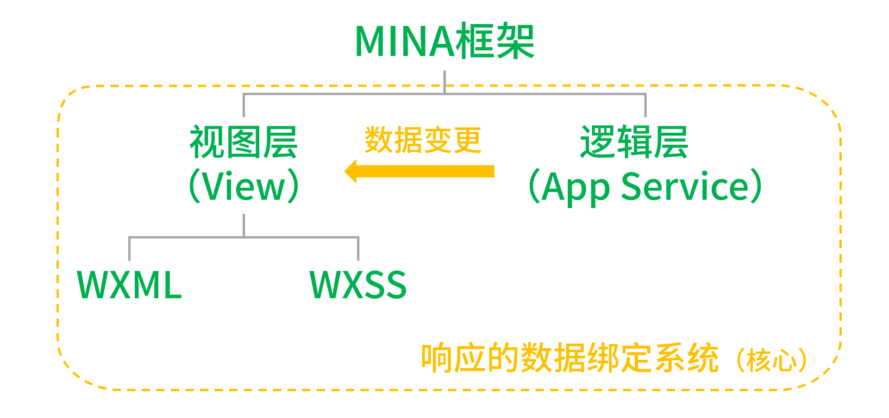
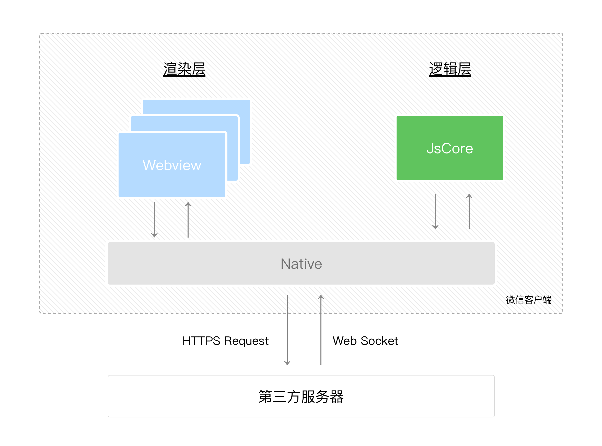
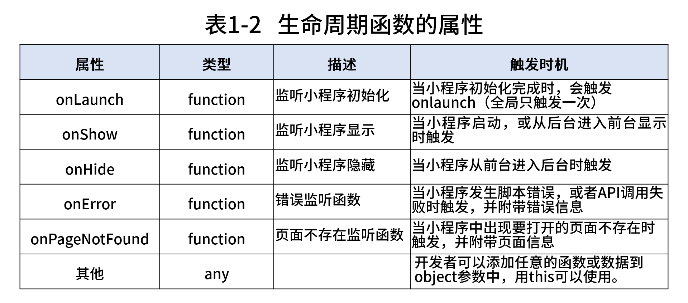

# 介绍

## 小程序与普通网页开发的区别

- ​ 网页开发渲染线程和脚本线程是互斥的，长时间的脚本运行可能会导致页面失去响应，而在小程序中，二者是分开的，分别运行在不同的线程中。

- 网页开发者可以使用到各种浏览器暴露出来的 DOM API，进行 DOM 选中和操作。小程序的逻辑层和渲染层是分开的，逻辑层运行在 JSCore 中，并没有一个完整浏览器对象，因而缺少相关的 DOM API 和 BOM API

- JSCore 的环境同 NodeJS 环境也是不尽相同，所以一些 NPM 的包在小程序中也是无法运行的

- 网页开发者需要面对的环境是各式各样的浏览器，而小程序开发过程中需要面对的是两大操作系统 iOS 和 Android 的微信客户端

  小程序的运行环境

  | 运行环境         | 逻辑层         | 渲染层            |
  | ---------------- | -------------- | ----------------- |
  | iOS              | JavaScriptCore | WKWebView         |
  | 安卓             | V8             | chromium 定制内核 |
  | 小程序开发者工具 | NWJS           | Chrome WebView    |

## 微信小程序的基础框架

小程序开发使用的框架叫 `MINA` 框架。`MINA` 框架通过封装微信客户端提供的文件系统、网络通信、任务管理、数据安全等基础功能，对上层提供一整套 JavaScript API，让开发者能够非常方便地使用微信客户端提供的各种基础功能与能力，快速构建应用，并具有原生 App 体验的服务。

整个系统分为视图层（View）和逻辑层（App Service）两部分。视图层由 `WXML`(WeiXin Mark Language)和 `WXSS`（WeiXin Style Sheet）组成。逻辑层是 `MINA` 的服务中心，由 JavaScript 来编写完成。

MINA 框架的核心是一个响应的数据绑定系统，它让数据与视图非常简单地保持同步。当作数据修改的时候，只需要在逻辑层修改数据，视图层就会做相应的更新



小程序的运行环境分成渲染层和逻辑层，其中 WXML 模板和 WXSS 样式工作在渲染层，JS 脚本工作在逻辑层。

小程序的渲染层和逻辑层分别由2个线程管理：渲染层的界面使用了WebView 进行渲染；逻辑层采用JsCore线程运行JS脚本。一个小程序存在多个界面，所以渲染层存在多个WebView线程，这两个线程的通信会经由微信客户端做中转，逻辑层发送网络请求也经由Native转发

小程序的通信模型下图所示



微信客户端在打开小程序之前，会把整个小程序的代码包下载到本地，通过 app.json 的 pages 字段就可以知道你当前小程序的所有页面路径

小程序启动之后，在 app.js 定义的 App 实例的 onLaunch 回调会被执行，整个小程序只有一个 App 实例，是全部页面共享的

## 文件目录

通过开发者工具生成的微信小程序目录一般分为**全局配置文件、页面文件和工具类文件**三部分

### 配置文件

小程序全局配置页面主体部分由三个文件组成，**并且必须放在项目的根目录**

**小程序逻辑文件（app.js）**

app.js 文件是必需配置文件，不仅可以定义全局函数和数据，还可以注册小程序。


**小程序公共配置文件（app.json）**

app.json 也是必需配置文件，它包含的是当前小程序的全局配置，包括了小程序的所有页面路径、界面表现、网络超时时间、底部 tab 等。

完整配置项说明请参考[小程序全局配置](https://developers.weixin.qq.com/miniprogram/dev/reference/configuration/app.html)

```json
{
  // 用于描述当前小程序所有页面路径，这是为了让微信客户端知道当前你的小程序页面定义在哪个目录
  "pages": ["pages/index/index", "pages/logs/logs"],
  // 定义小程序所有页面的顶部背景颜色，文字颜色定义等
  "window": {
    "backgroundTextStyle": "light",
    "navigationBarBackgroundColor": "#fff",
    "navigationBarTitleText": "Weixin",
    "navigationBarTextStyle": "black"
  }
}
```

每一个小程序页面也可以使用同名 .json 文件来对本页面的窗口表现进行配置，页面中配置项会覆盖 app.json 的 window 中相同的配置项。

> 注：并不是所有 app.json 中的配置都可以在页面覆盖或单独指定，具体参考[小程序页面配置](https://developers.weixin.qq.com/miniprogram/dev/reference/configuration/page.html)

**小程序公共样式文件（app.wxss）**

app.wxss 文件可配置也可不配置，是针对所有页面定义的全局样式

**工具配置 project.config.json**

小程序开发者工具在每个项目的根目录都会生成一个 project.config.json，你在工具上做的任何配置都会写入到这个文件，当你重新安装工具或者换电脑工作时，你只要载入同一个项目的代码包，开发者工具就自动会帮你恢复到当时你开发项目时的个性化配置，其中会包括编辑器的颜色、代码上传时自动压缩等等一系列选项。

# 参考资料

[小程序官方文档](https://developers.weixin.qq.com/miniprogram/dev/framework/)

[从 0 到 1 开发小程序](https://developers.weixin.qq.com/community/business/course/00084edfb7c020caa70015b166b40d)
